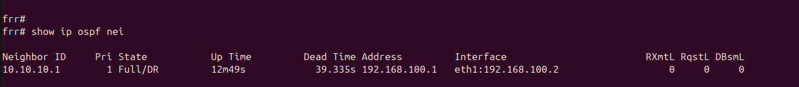

# Hybrid Physical/Virtual Enterprise Lab

A multi-vendor, multi-VLAN enterprise network built by bridging real Cisco and TP-Link switching hardware into a GNS3 virtual routing environment — simulating a two-site enterprise (HQ + Branch) with inter-VLAN routing and OSPF.

Unlike a pure Packet Tracer simulation, this lab uses **physical switching hardware** (Cisco Catalyst 2950, TP-Link SG105E) bridged via a Linux host into **virtual FRR routers in GNS3**, proving real Layer 2 trunking and mixed-vendor interoperability alongside dynamic routing.

## Why this lab

Most CCNA-level portfolios stop at Packet Tracer. This one goes further:
- Real hardware, real cabling, real console access — not just simulated devices
- Mixed-vendor trunking (Cisco IOS ↔ TP-Link web-managed switch) — a common real-world integration challenge
- A physical-to-virtual bridge (Linux host NIC → GNS3 Cloud node) connecting hardware to virtual routers
- Full OSPF multi-site design, consistent with a broader 4-site Calgary enterprise topology built in Packet Tracer ([link to that repo])

## Topology

```
                    [R1 - HQ]                        [R2 - BRANCH]
                   FRR Router                          FRR Router
                        |                                   |
              eth0 (802.1Q trunk)              eth1 (WAN, 192.168.100.0/30)
                        |                                   |
                        |___________________________________|
                        |                                   |
                  [GNS3 Cloud Node]                     eth2 (LAN)
                   (USB NIC bridge)                          |
                        |                              [VPCS Client]
                   Fa0/24 (trunk)                      10.20.10.10/24
                        |
              [Catalyst 2950-CORE]
               VLAN 10 - DATA
               VLAN 20 - VOICE
               VLAN 30 - BRANCH
                        |
               Fa0/23 (trunk, VLAN 30)
                        |
                [TP-Link SG105E]
              Port 5 (tagged) --- Port 1 (untagged, VLAN 30)
```

### IP addressing

| Segment | Subnet | Gateway |
|---|---|---|
| VLAN 10 - DATA | 10.10.10.0/24 | 10.10.10.1 (R1) |
| VLAN 20 - VOICE | 10.10.20.0/24 | 10.10.20.1 (R1) |
| VLAN 30 - BRANCH | 10.10.30.0/24 | 10.10.30.1 (R1) |
| R1-R2 WAN link | 192.168.100.0/30 | — |
| R2 Branch LAN | 10.20.10.0/24 | 10.20.10.1 (R2) |

## Hardware & software

- Cisco Catalyst 2950-24 (IOS 12.1(22)EA2)
- TP-Link SG105E (hardware v5, web-managed easy smart switch)
- Acer Aspire A515-54 running Ubuntu 24.04 LTS, as GNS3 host + physical bridge
- GNS3 with FRRouting (FRR 8.2.2) virtual routers
- USB-to-Ethernet adapter, used as the physical/virtual bridge NIC

## Build stages

1. **Physical setup** — console cable to the 2950, Cat6 trunk between switches
2. **Terminal access** — serial console via `screen`, `dialout` group permissions
3. **Cisco config** — hostname, VLANs, trunk ports on the 2950
4. **TP-Link config** — 802.1Q VLAN + PVID setup on the SG105E
5. **GNS3 bridge** — Cloud node bound to a USB NIC, linking real hardware into the virtual topology
6. **Router-on-a-stick** — 802.1Q subinterfaces on R1 for inter-VLAN routing
7. **OSPF** — single-area (Area 0) adjacency between R1 and R2, tying HQ and Branch together
8. **End-to-end verification** — physical host pings across VLANs and across OSPF to the branch site

## Verification

**VLAN 10 (DATA) gateway reachability**
Physical host → 2950 Fa0/1 (access) → R1 eth0.10


**VLAN 20 (VOICE) gateway reachability**
Physical host → 2950 Fa0/2 (access) → R1 eth0.20


**VLAN 30 (BRANCH) gateway reachability**
Physical host → TP-Link port 1 (access) → TP-Link port 5 (trunk) → 2950 Fa0/23 (trunk) → R1 eth0.30


**TP-Link 802.1Q VLAN configuration**
VLAN 30 created, port 5 tagged (trunk to 2950), port 1 untagged (access)


**TP-Link PVID setting**
Port 1 set to PVID 30, matching its untagged VLAN membership


**OSPF adjacency between R1 and R2**
Full/DR state confirms a stable, fully-formed neighbor relationship over the WAN link (192.168.100.0/30)


**Full end-to-end verification**
Physical host → TP-Link/2950 switching → GNS3 bridge → OSPF (R1↔R2) → branch VPCS. TTL=62 confirms two router hops traversed.


## Troubleshooting log

Real issues hit and resolved during the build — included because diagnosing them is as valuable as the working end state.

| Symptom | Root cause | Resolution |
|---|---|---|
| `dmesg: read kernel buffer failed: Operation not permitted` | Unprivileged user reading kernel ring buffer | Used `ls /dev/ttyUSB*` or `sudo dmesg` instead |
| Permission denied opening `/dev/ttyUSB0` | User not in `dialout` group | `sudo usermod -aG dialout $USER`, applied with `newgrp dialout` |
| `show interfaces trunk` returned no output for a configured trunk port | Command only lists ports with an active link partner | Verified config instead with `show interfaces <port> switchport`, which shows administrative state regardless of link |
| VLAN 30 traffic failed to cross from TP-Link into GNS3 | Fa0/24 (2950 → GNS3 trunk) didn't have VLAN 30 in its allowed list — only added when VLAN 30 was created, trunk wasn't updated | `switchport trunk allowed vlan add 30` (note: `add`, not a full replace, to avoid dropping VLANs 10/20) |
| Ping to branch LAN (10.20.10.10) returned "Destination Net Unreachable" from a public IP | Two default routes existed on the Linux host (WiFi + lab NIC); lower-metric WiFi route won for any subnet not directly local | Added an explicit static route for the target subnet via the lab NIC's gateway |
| Ping briefly failed with "Destination Host Unreachable" from the host's own IP right after adding the route | ARP/L2 convergence delay | Resolved on its own after a few seconds — confirmed via `ip neigh show` and switch port status before assuming a config fault |
| TP-Link web UI became unreachable after re-cabling, despite ping succeeding | Browser-level issue (cache/cert), not a network fault | Confirmed reachability with `curl -v http://<ip>` first, then resolved via browser cache clear |
| GNS3 Cloud node didn't list a newly-connected USB NIC | GNS3 only enumerates host interfaces present at application launch | Restarted GNS3 after bringing the NIC up |
| After closing/reopening GNS3, pings across VLANs and to the branch site failed again despite routers showing "started" | Live interface config (VLAN subinterfaces, IPs on router/VPCS nodes) is applied directly via Linux shell commands and does not persist across a node restart — only FRR routing config saved with `write memory` survives | Recreated `ip link`/`ip addr` commands on R1, R2, and VPCS after every GNS3 restart before re-testing |

## GNS3 Project File

The `.gns3` topology file is included in [`/gns3-project`](./gns3-project) — open it in GNS3 to see the exact node layout, links, and Cloud node NIC binding used in this build. Note: router disk images are not included; you'll need your own FRR appliance image to run the topology yourself.

## Configs

Full device configurations are in [`/configs`](./configs):
- [`2950-core-config.txt`](./configs/2950-core-config.txt) — Catalyst 2950 running-config
- `tplink-sg105e-vlan-settings.md` — TP-Link VLAN/PVID settings (screenshot-based, no CLI export available)
- `r1-hq-config.txt` — R1 interface + OSPF config
- `r2-branch-config.txt` — R2 interface + OSPF config

## Related

- [Calgary Multi-Site OSPF WAN Lab](#) — the 4-site Packet Tracer design this lab's OSPF area structure is modeled on
- [Campus Topology Lab](#) — HSRP/VLAN/STP campus design (Packet Tracer)
