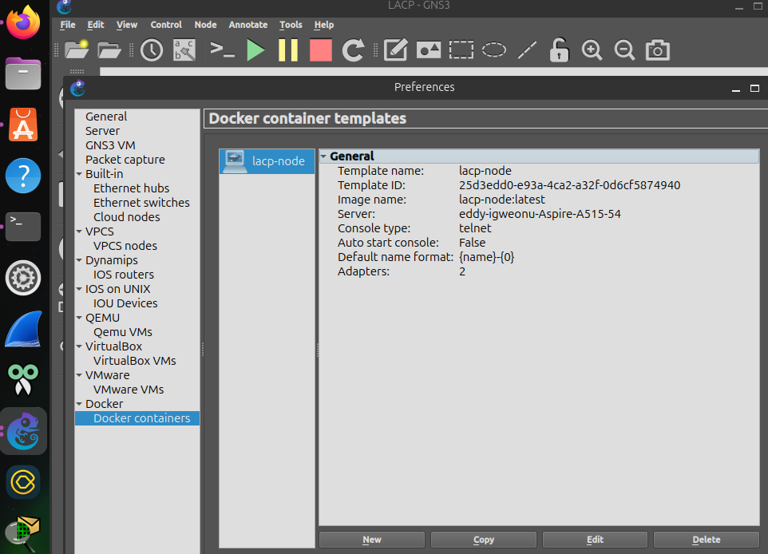
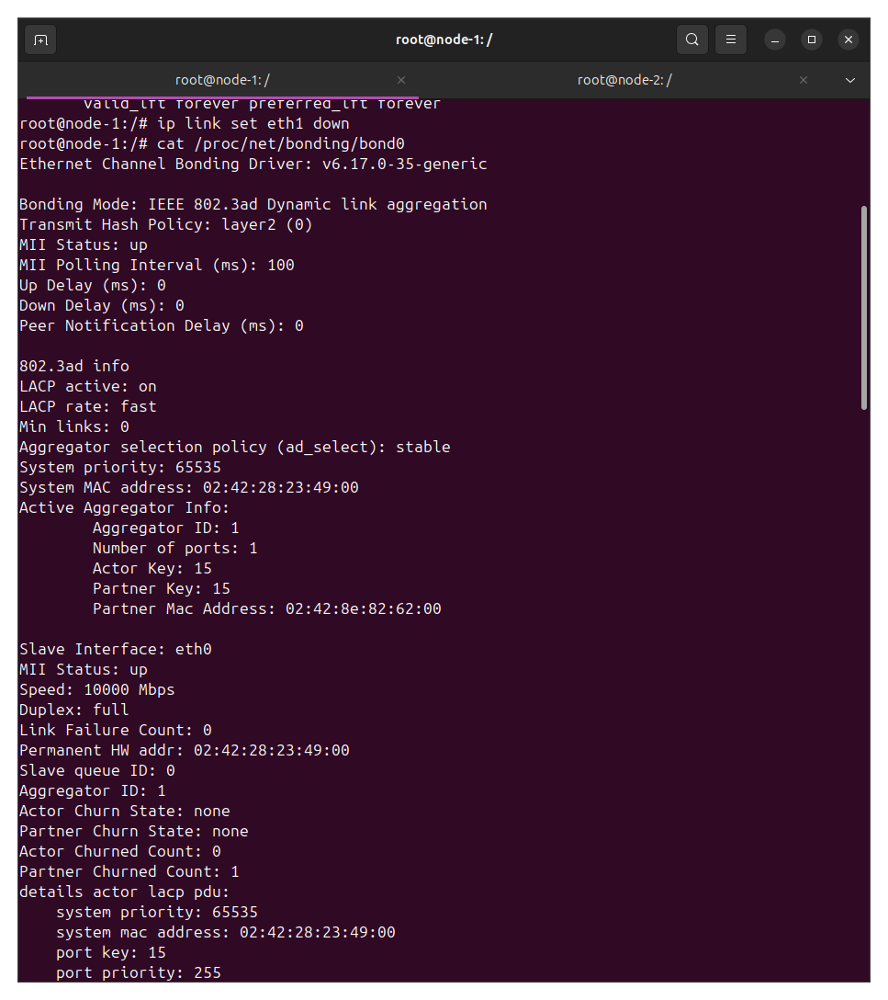
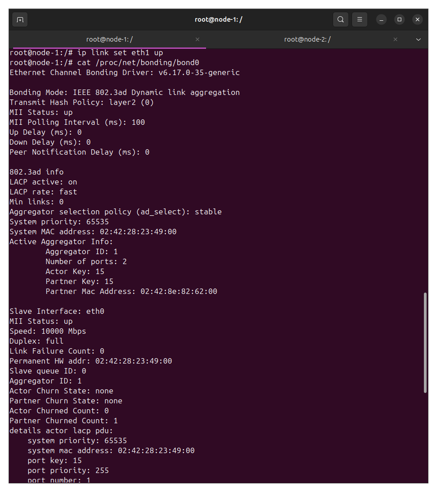
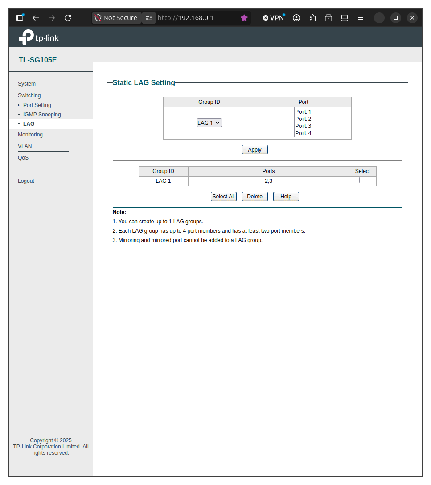
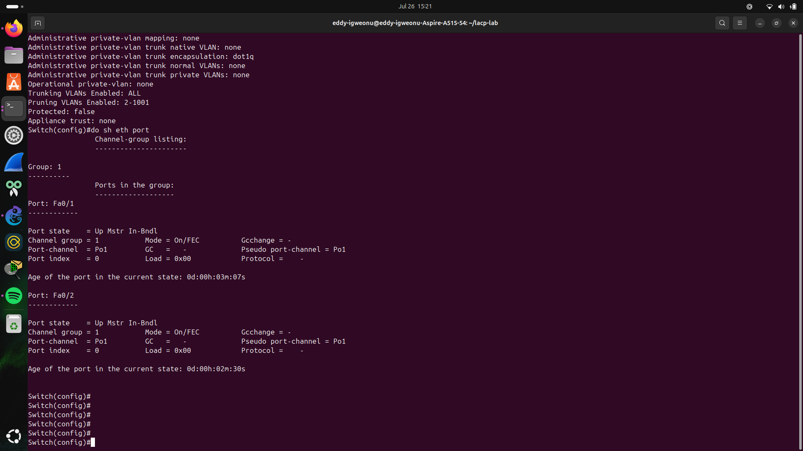
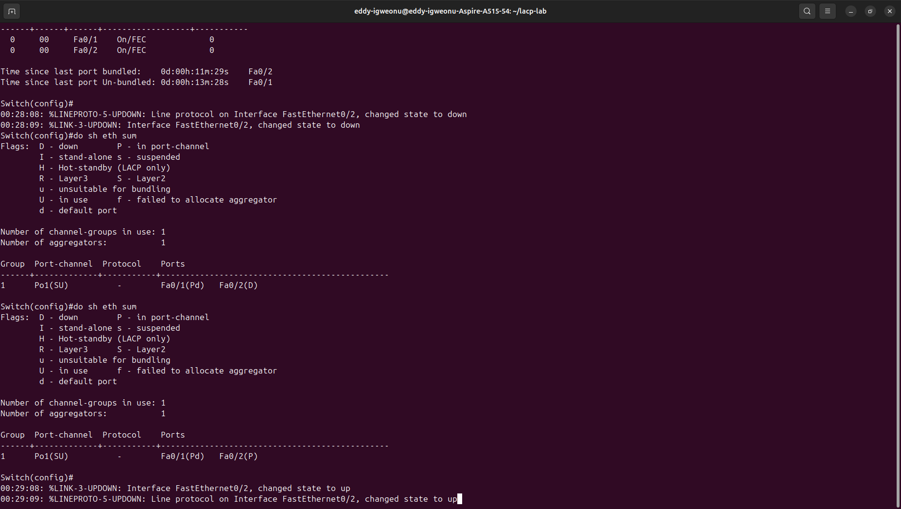

# LACP vs. Static EtherChannel: A Comparative Lab

## Overview

This lab compares two ways of bundling links into a single logical
connection: dynamic LACP (802.3ad), negotiated between two Linux
hosts in a fully virtual GNS3 topology, and static EtherChannel,
built on physical gear (a Cisco Catalyst 2950 and a TP-Link
SG105E). The two labs exist side by side because the SG105E turned
out not to support LACP at all — only static link aggregation —
which made it a natural point of comparison rather than a dead end.

The question this lab answers: what do you actually give up when a
device can't negotiate?

## Part 1: Dynamic LACP (GNS3 / Docker, all-virtual)

### Topology

Two Docker nodes (`node1`, `node2`) built from a custom `lacp-node`
image — Ubuntu 24.04 with `iproute2`, `ifenslave`, and `tcpdump`
installed — each configured with 2 network adapters in GNS3.
The nodes are connected by two separate point-to-point links
(`eth0↔eth0`, `eth1↔eth1`), with no switch between them.



### Configuration

On both nodes:

```bash
ip link set eth0 down
ip link set eth1 down
ip link add bond0 type bond mode 802.3ad lacp_rate fast
ip link set eth0 master bond0
ip link set eth1 master bond0
ip link set bond0 up
ip addr add 10.0.0.1/24 dev bond0   # .2 on node2
```

### Verification

`cat /proc/net/bonding/bond0` confirmed full negotiation:

- `Aggregator selected`, 2 ports in the aggregator
- `port state: 63` on both slaves — every LACP flag (Activity,
  Timeout, Aggregation, Synchronization, Collecting, Distributing)
  set, indicating a fully synced, operational bond
- Partner MAC address matched node1/node2's actual bond0 MACs,
  confirming each side was negotiating with its real partner and
  not just running two independent links

### Failover test

- `ip link set eth1 down` mid-ping → zero packets lost, bond0
  shifted traffic entirely onto the surviving `eth0`
- `/proc/net/bonding/bond0` showed the aggregator drop to 1 port
- `ip link set eth1 up` → interface rejoined, aggregator returned
  to 2 ports

Node-1's own bond0 dropped to a single active port immediately
after `ip link set eth1 down`, confirming the surviving eth0 kept
the aggregator up:



After `ip link set eth1 up` on the same terminal, bond0 shows the
aggregator recovered to 2 ports, LACP fully re-synced with the
partner:



### Key finding

LACP gives full negotiation and partner synchronization. Both
sides actively confirm each other's state via LACPDU exchange, so
failure detection isn't purely dependent on physical link-state —
it can catch problems physical link-state alone would miss (e.g. a
port that's physically up but not actually passing traffic
correctly).

## Part 2: Static EtherChannel (Cisco 2950 + TP-Link SG105E)

### Constraint discovered

The TP-Link SG105E supports only **static** Link Aggregation (one
group, up to 4 ports) — no LACP/802.3ad. This is the reason this
half of the lab exists as a separate, deliberately non-negotiated
comparison rather than a second LACP test.

### Topology

Two direct Ethernet cables: 2950 `Fa0/1` + `Fa0/2` to SG105E
ports 2 + 3.

### Configuration

**2950:**

```
interface range fa0/1 - 2
 switchport trunk encapsulation dot1q
 switchport mode trunk
 channel-group 1 mode on
 no shutdown
```

First attempt hit a real error worth documenting — the two ports
started on different access VLANs (10 and 20), which EtherChannel
won't tolerate:

```
%EC-5-CANNOT_BUNDLE2: Fa0/2 is not compatible with Fa0/1
and will be suspended (access vlan of Fa0/2 is 20, Fa0/1 is 10)
```

Bundled member ports must match on VLAN/trunk config before
`channel-group` will accept them — fixed by trunking both ports
identically before bundling.

**SG105E (web GUI → Switching → LAG):**




### Verification

`show etherchannel port-channel` on the 2950 confirmed the bundle:



Both `Fa0/1` and `Fa0/2` showed `Port state = Up Mstr In-Bndl`,
`Mode = On/FEC` — fully bundled, no negotiation protocol involved.

### Failover test

Unplugging the cable on Fa0/2 produced an immediate response:

```
00:28:08: %LINEPROTO-5-UPDOWN: ... FastEthernet0/2, changed state to down
00:28:09: %LINK-3-UPDOWN: Interface FastEthernet0/2, changed state to down
```

`show etherchannel summary` immediately reflected `Fa0/2(D)` —
dropped from the bundle in about a second, driven purely by
physical link-state, with no protocol handshake involved.

Reconnecting the cable produced the mirror-image result — link up,
line protocol up, `Fa0/2(P)` rejoined the bundle just as fast.



### Key finding

Static EtherChannel converged just as fast as LACP in this simple
case, because Ethernet link-state detection itself is nearly
instant on a direct point-to-point link. But there's no
negotiation and no partner synchronization — the switch has no way
to confirm the other end agrees it's part of a bundle, and no
protection against a port that stays physically up but is
otherwise silently broken. LACP's timeout/Ack mechanism is
specifically designed to catch that failure mode; static
EtherChannel simply can't see it.

## Comparison

| | LACP (virtual) | Static EtherChannel (physical) |
|---|---|---|
| Negotiation | Yes (LACPDU exchange) | None |
| Partner awareness | Yes | No |
| Failure detection | Protocol timeout + link-state | Link-state only |
| Hardware requirement | Any LACP-capable device | Works even on budget switches without LACP support (e.g. SG105E) |

## Conclusion

Both approaches bundled links successfully and both failed over
without meaningful packet loss in this lab's simple point-to-point
scenario. The real difference is what happens when a failure isn't
a clean link-down — LACP's negotiated heartbeat gives it a way to
detect a partner that's gone unresponsive without the physical
link dropping, while static EtherChannel has no visibility into
that at all. In practice, static bundling is a reasonable choice
between trusted, directly-connected devices where both ends are
under your control and hardware doesn't support LACP; LACP matters
more as soon as failure detection beyond raw physical link-state
becomes important.
