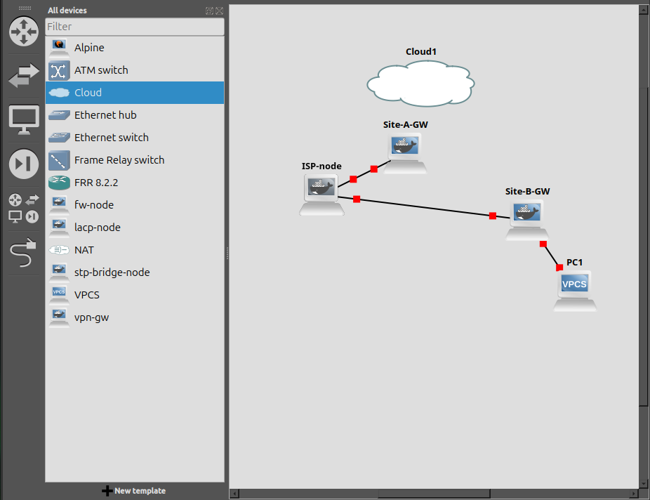
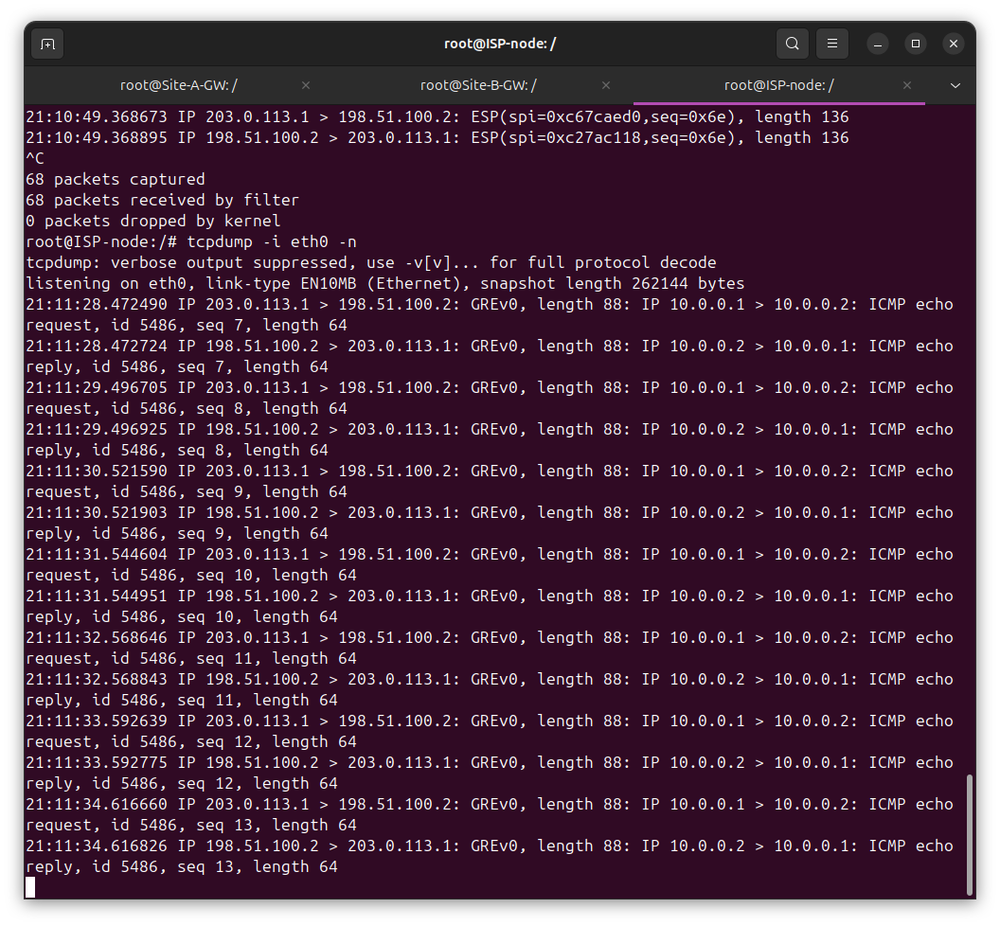
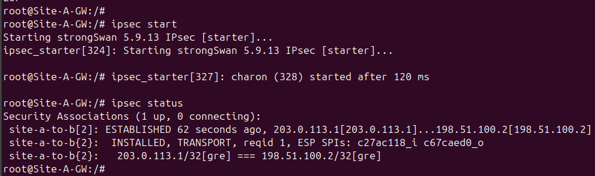
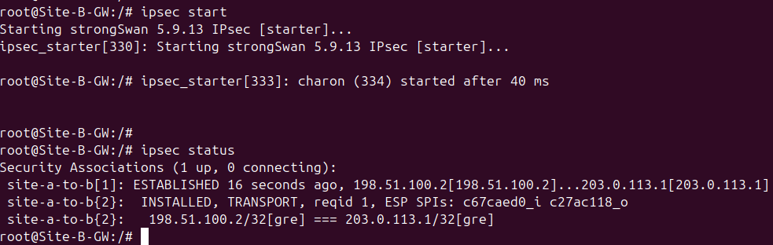
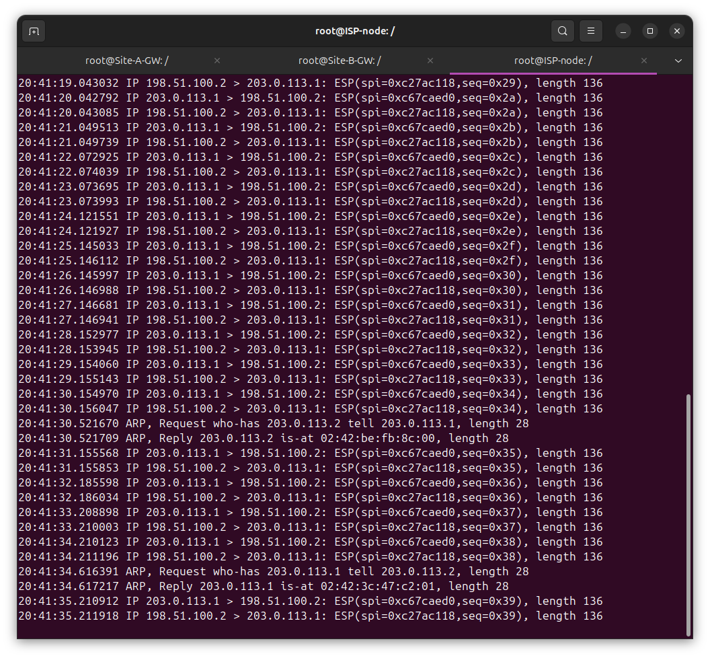
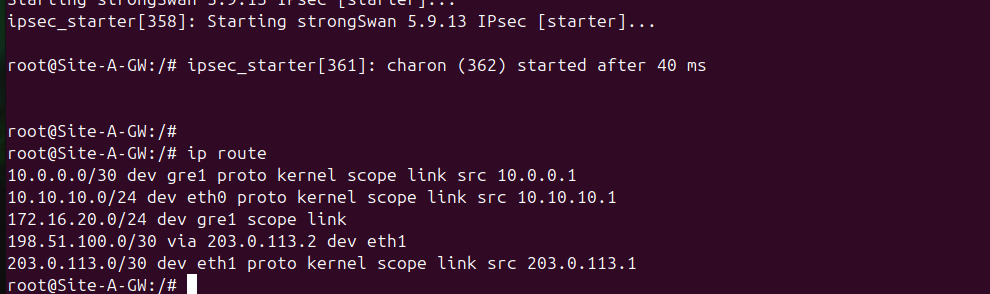
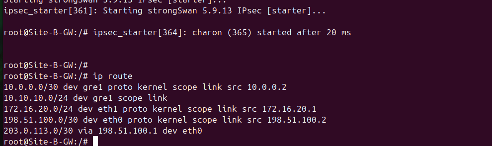
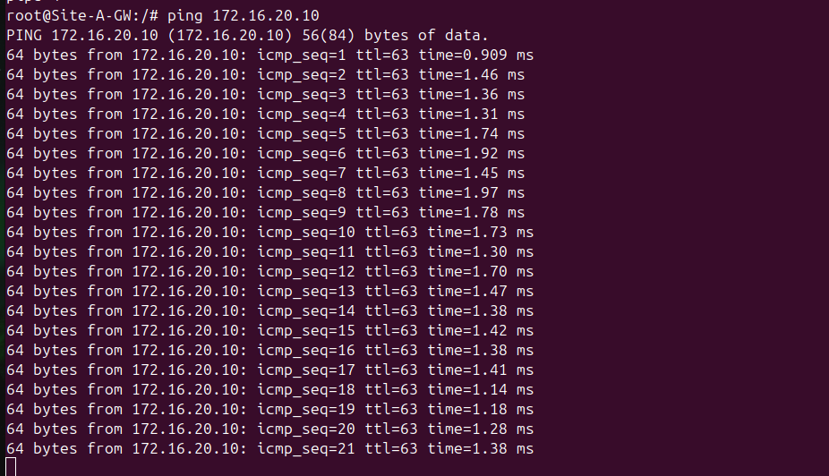
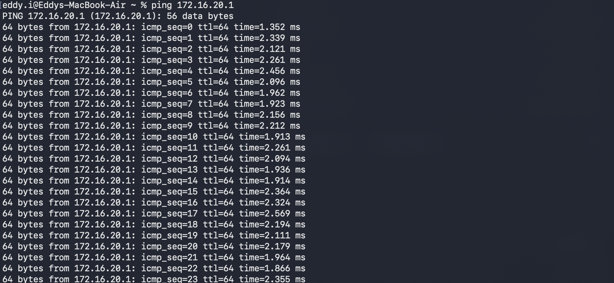

# Site-to-Site GRE over IPsec VPN

## Overview

This lab builds a site-to-site VPN between two simulated locations, using a GRE tunnel for routing and strongSwan (IPsec, transport mode) to encrypt the GRE traffic as it crosses a routed transit hop. The goal was to confirm the full chain works end to end and to prove, at the packet level, that traffic crossing the transit link is actually encrypted rather than just routed through a tunnel interface.

Everything runs in GNS3 on the Acer lab machine, with the Acer itself acting as the physical client on the Site A side via a Cloud node bound to its onboard NIC. Site B's client is a virtual VPCS node. A dedicated "ISP" node sits between the two VPN gateways and does plain IP routing only, so the tunnel has to cross a real routed hop instead of a direct link.

## Topology

```
Acer (physical) --- Cloud1 --- Site-A-GW --- ISP-node --- Site-B-GW --- PC1 (VPCS)
                                 eth0/eth1                  eth0/eth1
```

Addressing:

| Node | Interface | Address | Purpose |
|---|---|---|---|
| Site-A-GW | eth0 (LAN, to Cloud1) | 10.10.10.1/24 | Site A LAN gateway |
| Site-A-GW | eth1 (to ISP) | 203.0.113.1/30 | Public-facing transit |
| ISP-node | eth0 (to Site-A-GW) | 203.0.113.2/30 | Transit routing only |
| ISP-node | eth1 (to Site-B-GW) | 198.51.100.1/30 | Transit routing only |
| Site-B-GW | eth0 (to ISP) | 198.51.100.2/30 | Public-facing transit |
| Site-B-GW | eth1 (LAN, to PC1) | 172.16.20.1/24 | Site B LAN gateway |
| PC1 (VPCS) | eth0 | 172.16.20.10/24 | Virtual test host |

GRE tunnel endpoints ride on the two public-facing addresses (203.0.113.1 and 198.51.100.2), with an inner /30 of 10.0.0.1/10.0.0.2 for the tunnel itself.



## Build

### Docker capability check

The lab's previous VRRP and STP work both hit a wall where GNS3's Docker node template schema doesn't expose extra capabilities like NET_ADMIN, which silently broke vrrpd and mstpd. Since GRE tunnels and IPsec SAs also need NET_ADMIN, I tested both before committing to the design, using a throwaway container built from the existing `fw-node` image:

```
ip tunnel add test0 mode gre remote 203.0.113.2 local 203.0.113.1
ip xfrm state add src 203.0.113.1 dst 203.0.113.2 proto esp spi 0x1000 enc "aes" 0x0123456789abcdef0123456789abcdef
```

Both succeeded, and `ip xfrm state show` confirmed the SA actually stuck rather than silently failing. This meant the VPN gateways could stay as GNS3 Docker nodes instead of needing a QEMU VM workaround.

### Image

Extended the existing `fw-node` Dockerfile with strongSwan, built as a separate `vpn-gw` image so the original `fw-node` image stays intact for the firewall lab:

```
FROM ubuntu:24.04
RUN apt-get update && apt-get install -y \
    iptables iproute2 iputils-ping tcpdump curl net-tools python3 \
    strongswan strongswan-pki libcharon-extra-plugins \
    && rm -rf /var/lib/apt/lists/*
CMD ["/bin/bash"]
```

### GRE tunnel (baseline, no encryption)

Configured on Site-A-GW and Site-B-GW, with the ISP-node doing plain forwarding between the two transit /30s. Confirmed connectivity between tunnel endpoints before adding any encryption:

```
root@Site-A-GW:/# ping 10.0.0.2
64 bytes from 10.0.0.2: icmp_seq=1 ttl=64 time=0.303 ms
```

A capture on the ISP-node during this test shows the GRE header and the inner ICMP payload in the clear:



### IPsec (strongSwan, transport mode)

Configured strongSwan on both gateways to protect the GRE traffic specifically (`leftprotoport=gre` / `rightprotoport=gre`), using a pre-shared key for authentication:

```
conn site-a-to-b
    left=203.0.113.1
    right=198.51.100.2
    type=transport
    leftprotoport=gre
    rightprotoport=gre
    authby=secret
    ike=aes128-sha256-modp2048!
    esp=aes128-sha256!
    auto=start
```

`ipsec status` on both sides shows the SA established with matching SPIs:




## Verification

With IPsec running, the same ping and the same capture point on the ISP-node now show ESP only. No GRE header, no ICMP payload, matching sequence numbers incrementing in both directions:



Routing tables on both gateways confirm each site can reach the other's LAN through the tunnel interface rather than a static hop-by-hop path:




## Result

Full chain confirmed working: Acer (physical, Site A) through Site-A-GW, across the ISP-node's routed transit hop, through Site-B-GW, to the virtual Site B client. The before/after capture pair is the key evidence here, plain GRE headers and visible ICMP payload with IPsec down, ESP-only traffic with matching SPIs once it's up. Same LAN and tunnel routes work in both states, so the encryption is transparent to the traffic it's protecting rather than changing what's reachable.

## Hybrid physical extension

The build above uses a virtual VPCS node as the Site B client. To get a fully physical test on both ends, the Acer's second NIC (unused in the base build) was bound to a second Cloud node and wired into Site-B-GW's LAN leg in place of PC1, with a MacBook cabled directly to that adapter and addressed at 172.16.20.10/24.

Ping confirmed in both directions through the encrypted tunnel:




This confirms the tunnel and encryption work identically with a real physical host on the Site B side, not just a virtual test node. Gateways and the ISP-node remain virtual GNS3 Docker nodes.

## Notes / possible extensions

- Currently using static routes on each gateway pointing LAN subnets at the tunnel interface. Running OSPF over the GRE tunnel instead would be a natural next step and would also test how the routing protocol behaves once IPsec is added on top.
- Worth testing MTU and fragmentation behavior with larger pings, since GRE plus ESP overhead eats into the usable MTU and this wasn't stress-tested here.
- The ISP-node currently has no knowledge of either LAN subnet, which is intentional and mirrors a real provider not knowing your internal addressing.
