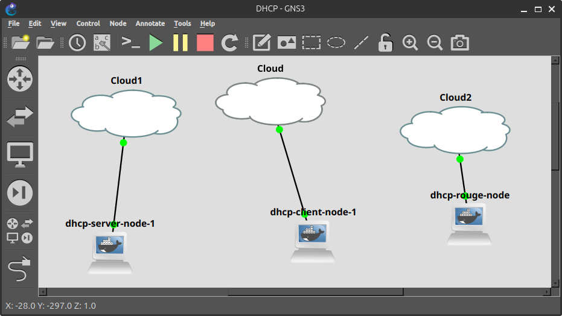
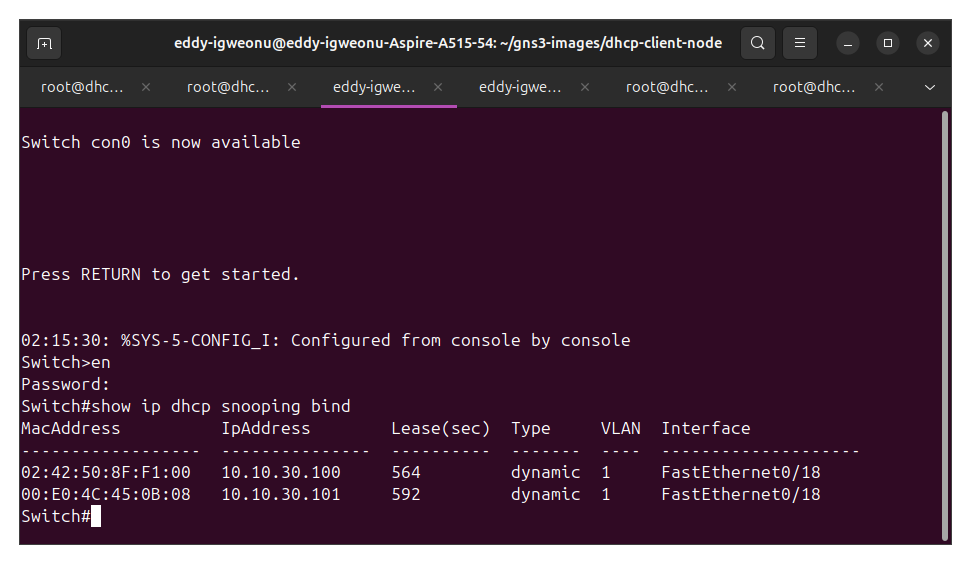
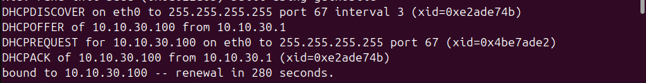
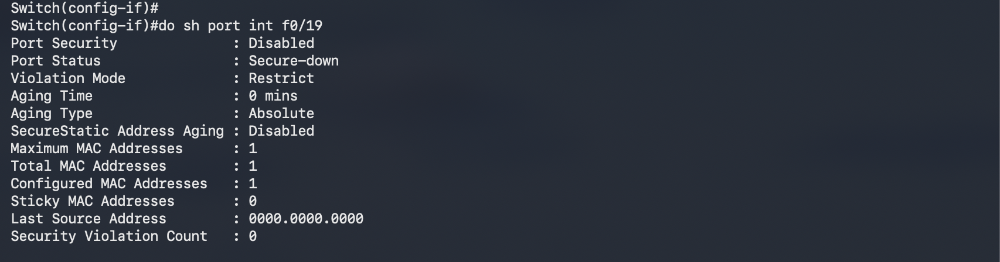
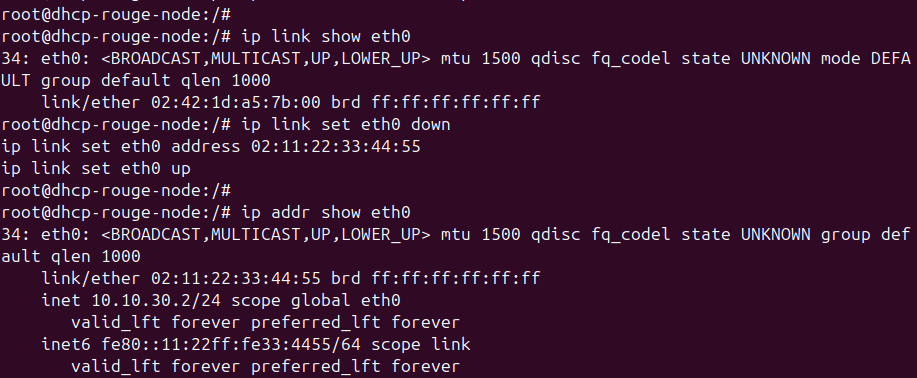
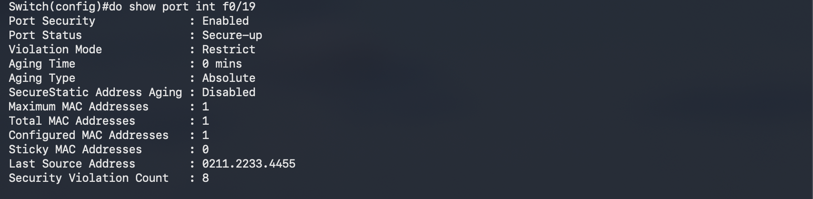
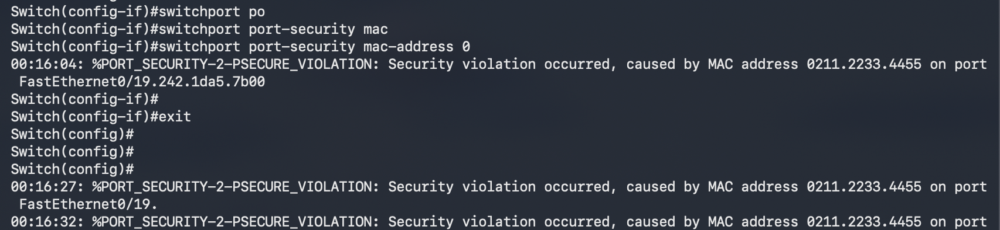
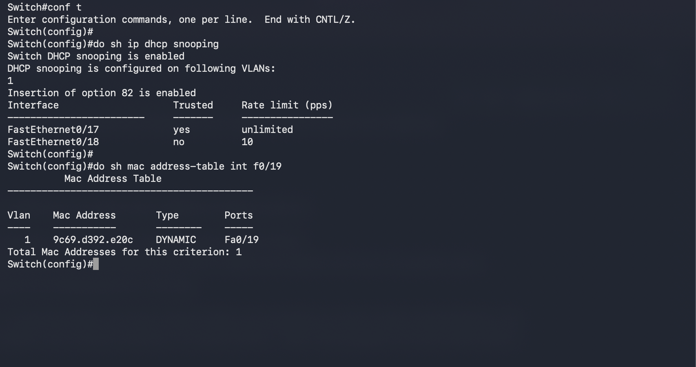
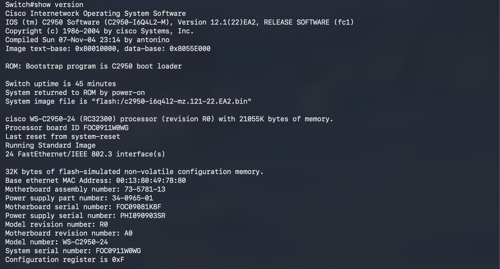

# Layer 2 Security Suite: DHCP Snooping + Port Security

This lab builds on the hybrid physical/virtual pattern from the rest of this repo. A physical Cisco Catalyst 2950 switch anchors the topology, with three GNS3 Docker nodes attached through dedicated USB-to-Ethernet adapters and the Acer's onboard NIC, each wired to its own switchport. The goal was to demonstrate two of the more common Layer 2 access-layer defenses NOC and junior network admin roles expect: DHCP snooping and port security. A third feature, Dynamic ARP Inspection, turned out not to be supported on this switch's IOS image, and that limitation is documented below rather than faked with a substitute platform.

## Topology

- **2950 Fa0/17** (trusted) → Cloud node bound to the Acer's onboard NIC → `dhcp-server-node`, a Docker container running isc-dhcp-server on 10.10.30.0/24
- **2950 Fa0/18** (untrusted) → Cloud node bound to the first USB-to-Ethernet adapter → `dhcp-client-node`, a Docker container running isc-dhcp-client
- **2950 Fa0/19** (untrusted) → Cloud node bound to a second USB-to-Ethernet adapter → `dhcp-rogue-node`, reused across both stages of the lab: first as a rogue DHCP server, then as the MAC-spoofing "attacker" for the port security test

All three Docker images are custom builds on Ubuntu 24.04, following the same pattern as the firewall and LACP labs elsewhere in this repo: a minimal base plus whatever tooling the test actually needs (isc-dhcp-server, isc-dhcp-client, iproute2, tcpdump).



One design decision worth calling out: early attempts to save NICs by connecting multiple containers through a single GNS3 built-in Ethernet switch node failed silently. That switch node forwards traffic locally between attached devices without sending it out its uplink, so from the 2950's point of view, the rogue and client traffic never existed. DHCP snooping (and port security, later) needs to actually see traffic cross a snooping-enabled port to do anything, so every role in this lab ended up needing its own dedicated physical port and Cloud node. This is the same lesson learned the hard way in the earlier port-mirroring lab with OSPF traffic, just showing up again in a different context.

## DHCP Snooping

With snooping enabled on VLAN 1, Fa0/17 trusted, and Fa0/18 and Fa0/19 untrusted with a 10 pps rate limit, the baseline test was straightforward: bring up the legit server, confirm the client gets a lease from it, check the binding table.



There's a second entry in that table worth explaining rather than hiding: `00:e0:4c:45:0b:08` is the USB-to-Ethernet adapter's own hardware MAC, not a container. Turns out the Acer's own OS grabs a DHCP lease on that interface too once it's up, independent of anything happening inside GNS3. Harmless for the test, but a good reminder that a "clean" lab segment can still have host-level noise on it if you're not paying attention.

The real test came once the rogue server went live on Fa0/19 with a deliberately different pool (10.10.30.200-210, wrong gateway, wrong DNS). With both servers running, releasing and renewing the client's lease should only ever pull from the legit range if snooping is doing its job. The client log confirms it:



No offer from 10.10.30.2 (the rogue) ever shows up in the log, and the rogue's range never appears in the switch's binding table. The rogue's DHCPOFFER gets silently dropped at the untrusted port before it ever reaches the client, which is exactly what snooping is supposed to do.

## Port Security

Fa0/19 (the same rogue node's port) was reconfigured for this stage, with the rogue's dhcpd process killed first so it wasn't doing double duty.

```
interface FastEthernet0/19
 switchport mode access
 switchport port-security
 switchport port-security maximum 1
 switchport port-security violation restrict
 switchport port-security mac-address 0242.1da5.7b00
```

A quick note on the config here: the initial plan was to use sticky learning rather than a hardcoded MAC. In practice, the physical USB-to-Ethernet adapter behind this port generates its own low-level traffic independent of whatever the Docker container is doing, and it consistently won the race to be the first (and therefore sticky-locked) MAC on the port. Every legitimate packet from the container itself then got flagged as the violation, which is backwards from what the test was supposed to show. Switching to a manually configured MAC address sidesteps the race condition entirely and gives a deterministic, repeatable test, so that's what's reflected in the final config.

With the container's real MAC (0242.1da5.7b00) statically authorized, traffic passes cleanly and the violation counter stays at zero.



Bringing the interface down, changing its MAC to something unauthorized, and bringing it back up immediately trips the restriction:



```
Switch#show port int f0/19
Port Security              : Enabled
Port Status                : Secure-up
Violation Mode             : Restrict
Maximum MAC Addresses      : 1
Configured MAC Addresses   : 1
Sticky MAC Addresses       : 0
Last Source Address        : 0211.2233.4455
Security Violation Count   : 8
```



The syslog backs this up with a running count of PSECURE_VIOLATION messages, all pointing at the spoofed MAC:



## Dynamic ARP Inspection: not supported

The original plan included DAI as a third layer, tying into the same snooping binding table already built for the DHCP stage. Trying to enable it turned up nothing:



Checking `show version` confirms this 2950 is running `c2950-i6q4l2-mz.121-22.EA2`, an older Layer 2-only image.

 DAI didn't become a standard, reliably available feature until later switch families and enhanced images, and this particular combination of hardware and IOS just doesn't have it. Rather than fake the feature on a virtual switch that isn't actually part of this physical topology, this lab stops at two confirmed, working defenses and calls out the third as a hardware limitation. Knowing where a platform's feature ceiling is, and being able to prove it rather than assume it, is its own useful skill.

## Takeaways

- DHCP snooping and port security both work as expected on this hardware, with clean evidence trails (binding tables, syslog, violation counters) for both.
- GNS3 built-in switch nodes are convenient but will silently hide traffic from a shared uplink. Anything that needs to be visible to a switch-side security feature needs its own dedicated port.
- Sticky MAC learning assumes the first frame on a port is the "right" one. When a port has more than one traffic source (a physical adapter plus a container riding on top of it, for example), sticky learning can lock onto the wrong device. A statically configured MAC removes the ambiguity.
- Not every feature exists on every platform. The 2950's lack of DAI support wasn't a config mistake, it was a hardware ceiling, and confirming that directly was more useful than assuming.
