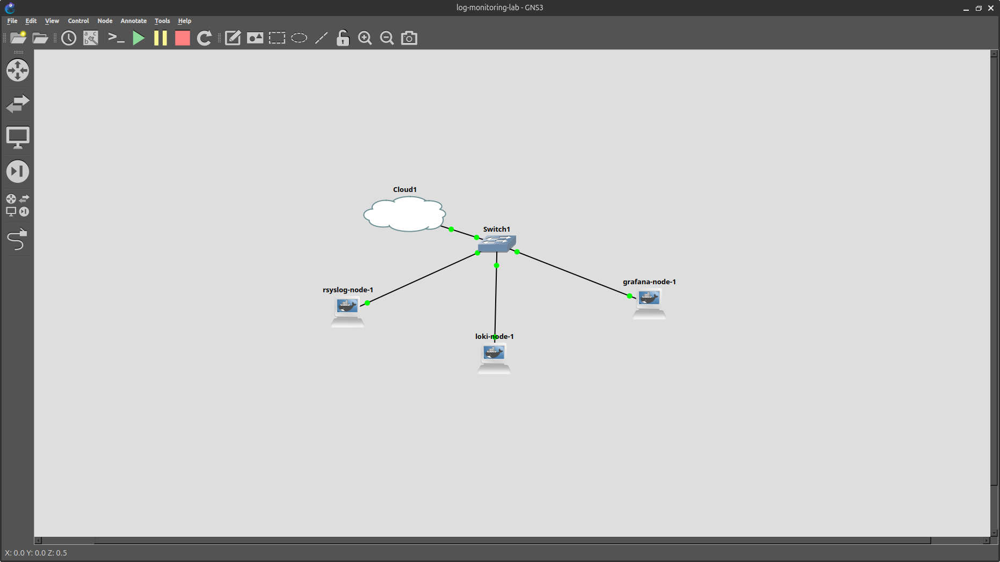

# Centralized logging lab

A syslog collection pipeline for the hybrid lab: the Catalyst 2950 forwards its logs to a self-hosted rsyslog collector, which ships them into Loki, queried through Grafana. Built as a separate GNS3 project so I could break it freely without touching the working lab.

## Status

**Phase 1** (2950 to rsyslog to Loki to Grafana) is complete and verified end to end. Real syslog events from the physical 2950 flow through the whole pipeline and are queryable out of Loki (see Verify below).

**Phase 2** (bringing frr1/frr2 in) is planned but not started. They currently live in the main hybrid-physical-virtual-lab GNS3 project and aren't reachable from this one yet, either the two projects need bridging or these nodes need merging into that project. Leaving that for a follow-up rather than holding this commit for it.

## Topology



    2950 (physical)
      |
    Cloud1  (bound to the Acer's onboard NIC, bridges the physical link in)
      |
    Switch1  (GNS3 built-in switch, flat L2 segment)
      |-- rsyslog-node-1  10.10.30.241
      |-- loki-node-1     10.10.30.242
      |-- grafana-node-1  10.10.30.243

2950 sends syslog, rsyslog-node writes it to disk and forwards via Promtail, loki-node stores and indexes it, grafana-node queries Loki for display. Addressing matches the 2950's existing Vlan1 SVI (10.10.30.10) rather than routing between subnets.

All three nodes run custom Ubuntu 24.04 images rather than the stock grafana/loki and grafana/grafana images. Reason's in Known issues below.

## Build order

1. Build the three images

    ```
    cd rsyslog-node && docker build -t rsyslog-node .
    cd ../loki-node && docker build -t loki-node .
    cd ../grafana-node && docker build -t grafana-node .
    ```

2. Create GNS3 templates for each, pointing at the locally-built tags (`rsyslog-node:latest`, `loki-node:latest`, `grafana-node:latest`) rather than the stock grafana/* images, which show up in the same picker since Docker has them cached. One adapter each. Console type `http` for loki-node (port 3100) and grafana-node (port 3000), telnet is fine for rsyslog-node.

3. IPs are self-assigned on boot. Each entrypoint.sh sets its own IP from a `NODE_IP` env var (defaulting to the addresses above), so nothing needs manual re-IPing after a restart. Override `NODE_IP` on the GNS3 template if a node needs a different address.

4. Point the 2950 at the collector:

    ```
    conf t
    logging host 10.10.30.241
    logging trap informational
    logging facility local0
    end
    write memory
    ```

    `logging trap informational` covers interface up/down, STP changes, and config changes without flooding on debug noise.

5. Skipped the SG105E deliberately, same call as the STP/DAI limitations documented in 05-l2-security-suite: it has no syslog support consistent with everything else it can't do.

## Verify

```
curl -s -G "http://10.10.30.242:3100/loki/api/v1/query_range" \
  --data-urlencode 'query={job="syslog"}' \
  --data-urlencode "start=$(date -d '1 hour ago' +%s%N)" \
  --data-urlencode "end=$(date +%s%N)"
```

Returns real 2950 log lines labeled by host, job, and filename. This is the reliable way to confirm the pipeline is working, since Grafana's UI has a bug in this environment (see below).

## Known issues

- GNS3 wraps every container's startup in `/gns3/init.sh` regardless of console type, which needs a working `/bin/bash` and a sane account setup. The stock `grafana/loki` (Alpine, no bash) and `grafana/grafana` images don't have that, which is why both got rebuilt on Ubuntu instead.
- Loki's ring lifecycler crashes on boot if `eth0` has no IP yet when it starts, since it tries to autodetect an address on eth0/en0/lo. Fixed by setting `instance_addr: 127.0.0.1` explicitly under `common.ring` in loki-config.yaml.
- The apt-installed Grafana binary lives at `/usr/sbin/grafana-server`, not `/usr/share/grafana/bin/grafana-server` (that path's only correct for the tarball release).
- rsyslogd leaves a stale `/run/rsyslogd.pid` behind on an unclean restart, so the next `rsyslogd -n` fails thinking another instance is already running. Fixed with `rm -f /run/rsyslogd.pid` at the top of the entrypoint.
- Every recreated container gets a new MAC, and the 2950 caches ARP. Deleting and recreating a node can leave the switch sending syslog to a dead MAC with no error on either side. `clear arp-cache` on the 2950 after recreating any node fixes it. This was the hardest bug to pin down: confirmed via a GNS3 per-link Wireshark capture that packets really were leaving the switch and reaching rsyslog-node's eth0, before finding the switch's ARP table was the actual block.
- Grafana's Explore view won't honor Loki as the selected data source in this environment, tried through every entry point (the picker, the per-query selector, Loki's own Explore button, a hand-built URL with the datasource UID, a fresh incognito session). The data source itself is registered correctly (visible under Connections, `Save & test` passes). Root cause undetermined, possibly a Grafana version quirk or an interaction with GNS3's HTTP console proxy. Workaround is querying Loki's API directly.
- The Acer itself has no clean route into 10.10.30.0/24 since that subnet only exists inside GNS3's Cloud node bridge, not as a real host interface. Adding `10.10.30.250/24` to enp1s0 works but isn't persistent and still hits intermittent ARP failures from the host. Easier to run curl/exec commands from inside one of the lab containers instead.
- Grafana's provisioned datasource only inserts once on first boot, editing the provisioning YAML afterward doesn't trigger a re-insert. Fixed drift with a direct API call (`curl -X PUT .../api/datasources/uid/<uid>`) instead.
- Grafana's own data source search comes back empty since this instance has no internet access to the plugin catalog. Adding or updating data sources goes through the REST API instead of the UI search.

## Out of scope

rsyslog accepts UDP/TCP 514 with no authentication, and Grafana's still on a default account with the password just changed once. Fine for a lab, not something I'd call production-ready, same spirit as the STP/DAI gaps noted in 05-l2-security-suite.

## Later

The AD lab's KVM NAT network (192.168.122.0/24) doesn't currently route to this GNS3 network. When that gets picked up it's its own phase: either a routed leg between the two networks, or Windows Event Forwarding pointed at rsyslog-node once reachability exists.
