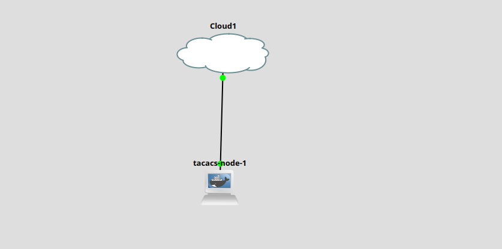
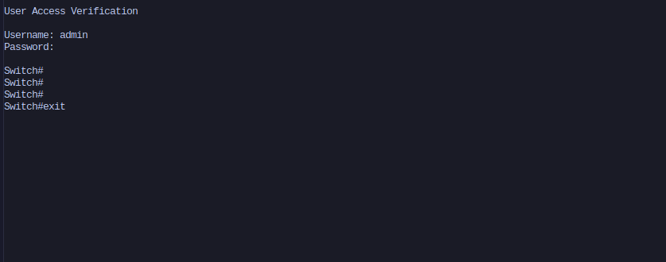
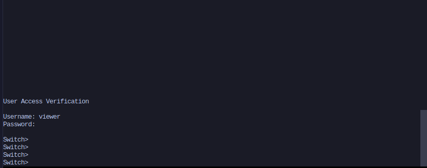
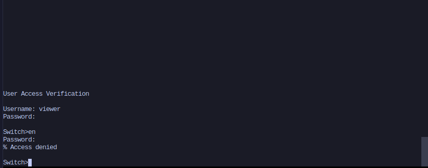
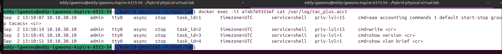
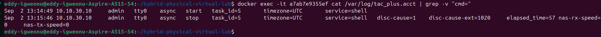

# 07 - TACACS+ AAA

Centralized authentication, authorization, and accounting (AAA) for the physical Catalyst 2950, using a self-hosted TACACS+ server running in GNS3 alongside the rest of the hybrid lab.

## Goal

Replace local-only login on the 2950 with centralized AAA. A single TACACS+ server should authenticate users, authorize their privilege level automatically on login, and eventually log what commands they run. The lab also needed to demonstrate real enforcement, not just a working login, so two users with different privilege levels were configured to show the split in practice.

## Topology

- New GNS3 project, `tacacs-aaa-lab`
- A Cloud node bound to the Acer's onboard NIC (`enp1s0`), the same bridge pattern used in `06-log-monitoring` to reach the 2950's management segment
- `tacacs-node`, a custom Docker container running `tac_plus`, wired to the Cloud node and self-addressing to `10.10.30.244/24` on boot
- Same subnet as the 2950's Vlan1 SVI (`10.10.30.10`) and the other management-segment nodes from the log-monitoring lab

`screenshot-topology.png`, the GNS3 canvas showing `tacacs-node` wired to `Cloud1`, which bridges out to the physical 2950 over `enp1s0`.



## Building the TACACS+ server

The `tacacs+` Ubuntu package no longer exists in the repos as of 20.04 and later, so `tac_plus` had to be compiled from source instead of installed with `apt`. A few build problems came up along the way:

- The upstream shrubbery.net source tarball is unreliable (returned a 404 during the build), so the source came from a GitHub mirror of the same codebase instead.
- The build failed at `./configure` with a linker error, `cannot find -lnsl`. `libnsl`, the old Network Services Library, was split out of glibc years ago and isn't installed by default on modern Ubuntu. Installing `libnsl-dev` fixed it.
- After a successful build, `tac_plus` failed to start with a shared library error, it couldn't find its own `libtacacs.so.1`, because `make install` puts libraries in `/usr/local/lib`, which isn't in the container's default linker search path. Running `ldconfig` after install fixed that.
- Once the binary ran, the container exited immediately every time. `tac_plus` daemonizes itself by default, meaning it forks into the background, and once it did that the container's foreground process (PID 1) exited and Docker tore the container down. The fix was the `-G` flag, which keeps `tac_plus` running in the foreground.

The entrypoint script follows the same self-addressing pattern used for `rsyslog-node` and `loki-node` in the previous lab: it waits for `eth0` to exist, assigns a static IP, then execs `tac_plus` as PID 1.

## Reaching the switch

Once `tacacs-node` was in the topology, the 2950 couldn't reach it at all, and the container couldn't reach the switch either, both directions failed with no interface-down symptoms. `show interfaces fa0/1 switchport` showed the answer: Fa0/1 was trunking, but VLAN 1 had never been added to the trunk's allowed VLAN list (only 10, 20, 30, and 40 were allowed, left over from the log-monitoring lab's routed segments). Since `tacacs-node` sends plain untagged frames, they were being silently dropped at the trunk. Adding VLAN 1 to the allowed list fixed reachability in both directions.

## AAA configuration on the 2950

```
tacacs-server host 10.10.30.244
tacacs-server key testing123
aaa new-model
aaa authentication login default group tacacs+ local
aaa authorization exec default group tacacs+ local
aaa authorization console
aaa authentication enable default enable
enable secret changeme123
username eddy secret changeme123
```

A few of these lines needed real troubleshooting to get to:

**Console authorization.** With just `aaa authorization exec default group tacacs+ local` in place, TACACS+ authentication worked, but logging in as `admin` still landed at `Switch>` instead of `Switch#`, even though the server was returning `priv-lvl = 15`. Cisco IOS exempts the console line from AAA authorization by default, as a built-in safeguard so admins can't accidentally lock themselves out of physical console access. The fix is `aaa authorization console`, a command that doesn't show up in `?` help on this IOS image but is still accepted if typed in full. Debug output confirmed the fix: a real TACACS+ authorization request went out, the server replied with `PASS_ADD` and `priv-lvl=15`, and the switch logged `Authorization successful`.

**The enable gap.** After the privilege split was working, testing the `viewer` account (priv-lvl 1) turned up a real security gap: running `enable` as `viewer` dropped straight into `Switch#` with no password prompt at all. The switch's enable secret had been erased earlier in the lab and never replaced, and without `aaa authentication enable default` configured, IOS falls back to checking a local enable password, and lets the request through unchallenged if none exists. The fix was two commands: setting a real `enable secret`, and adding `aaa authentication enable default enable` so the `enable` command is actually checked against it. Retesting confirmed `viewer` is now challenged and denied at `enable`, while `admin` is unaffected.

## The lockout

Partway through testing, a second TACACS+ user (`viewer`, priv-lvl 1) was added to `tac_plus.conf`, which required rebuilding the Docker image and recreating the GNS3 node to pick up the change. That recreation gave the container a new MAC address. The 2950 still had the old MAC cached from before, so every TACACS+ request it sent went nowhere, it looked exactly like a dead server. Since no local username had ever been configured on the switch (only an enable secret, which had also been erased for this lab), the `local` fallback in the authentication method list had nothing to check against either. Result: total lockout, no way into privileged exec through TACACS+ or through local fallback.

`tcpdump` on both the container's `eth0` and the host's `enp1s0` confirmed the actual cause: SYN packets from the switch were arriving, but addressed to the old, stale MAC rather than the container's current one. A power cycle of the 2950 cleared the stale ARP entry (ARP is dynamic and never touches the saved config), and TACACS+ auth worked again on the first login attempt after boot.

The real fix, done immediately after recovering access, was creating `username eddy secret changeme123` on the switch, so local fallback is now a genuine safety net rather than an empty method with nothing behind it.

## Verifying the privilege split

With both users configured and console authorization enabled, logging in as each account produces a visibly different result:

- `admin` / `adminpass` logs in and lands directly at `Switch#` (privileged exec), no `enable` needed. TACACS+ returns `priv-lvl = 15` and the switch applies it automatically on login.
- `viewer` / `viewerpass` logs in and lands at `Switch>` (user exec). Running `enable` from this session prompts for the local secret and is rejected, `% Access denied`, since `viewer` has no elevated rights in `tac_plus.conf` and doesn't know the local secret either.

Screenshots:

- `screenshot-admin-login.png`, `admin` landing directly at `Switch#`

  

- `screenshot-viewer-login.png`, `viewer` landing at `Switch>`

  

- `screenshot-viewer-enable-denied.png`, `viewer` challenged and rejected at `enable`

  

## Accounting

Once the privilege split was proven, added accounting so there's an actual record of who did what, not just who's allowed to do what.

```
aaa accounting exec default start-stop group tacacs+
aaa accounting commands 15 default start-stop group tacacs+
aaa accounting commands 1 default start-stop group tacacs+
```

Two kinds of records show up in `tac_plus.acct` once this is on. Command accounting logs each command as it runs, tagged with the username, source IP, and privilege level it ran at:

```
Sep 2 13:10:45 10.10.30.10 admin tty0 async stop task_id=3 ... priv-lvl=1 cmd=show version <cr>
Sep 2 13:10:51 10.10.30.10 admin tty0 async stop task_id=4 ... priv-lvl=1 cmd=show vlan brief <cr>
```

One thing that looked off at first but isn't: those two commands show `priv-lvl=1` even though they were run from an `admin` session at `Switch#`. That's normal, IOS treats basic `show` commands as privilege-level-1 commands by default regardless of who's running them, so they land under the `commands 1` accounting list. Commands like `write` or anything in config mode show up as `priv-lvl=15` instead. It's actually a good sign, it means the logging is tracking the command's real level, not just copying whatever level the session happens to be at.

Exec accounting logs the session itself, separate from any individual command:

```
Sep 2 13:14:49 10.10.30.10 admin tty0 async start task_id=5 ... service=shell
Sep 2 13:15:46 10.10.30.10 admin tty0 async stop task_id=5 ... elapsed_time=57
```

Same `task_id` on both lines ties the start and stop together, so this pair says: admin logged in at 13:14:49, logged out at 13:15:46, session lasted 57 seconds.

Screenshots:

- `screenshot-accounting-commands.png`, per-command accounting entries in `tac_plus.acct`

  

- `screenshot-accounting-exec.png`, the paired start/stop session record

  

Haven't wired this into the Loki/Grafana pipeline from `06-log-monitoring` yet, right now it's just sitting in the flat file on `tacacs-node`. That's still on the list.

## Current state

- `tacacs-node` built, running, and reachable from the 2950
- Authentication and authorization both working and confirmed with debug output
- Two privilege levels demonstrated and enforced, including at the `enable` boundary
- A real local fallback account now exists on the switch
- Accounting on, both session-level and per-command, confirmed in `tac_plus.acct`

## Next steps

- `aaa authorization commands`, to restrict which specific commands each privilege level can run, not just the starting prompt
- Wire accounting output into the syslog/Loki pipeline from `06-log-monitoring` instead of just reading the flat file
- Optionally, extend `tac_plus.conf` with a `$enab15$` user block so `enable` can be authorized through TACACS+ directly instead of relying only on the local secret
