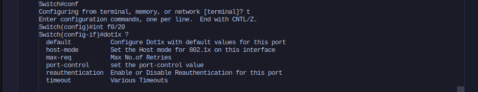
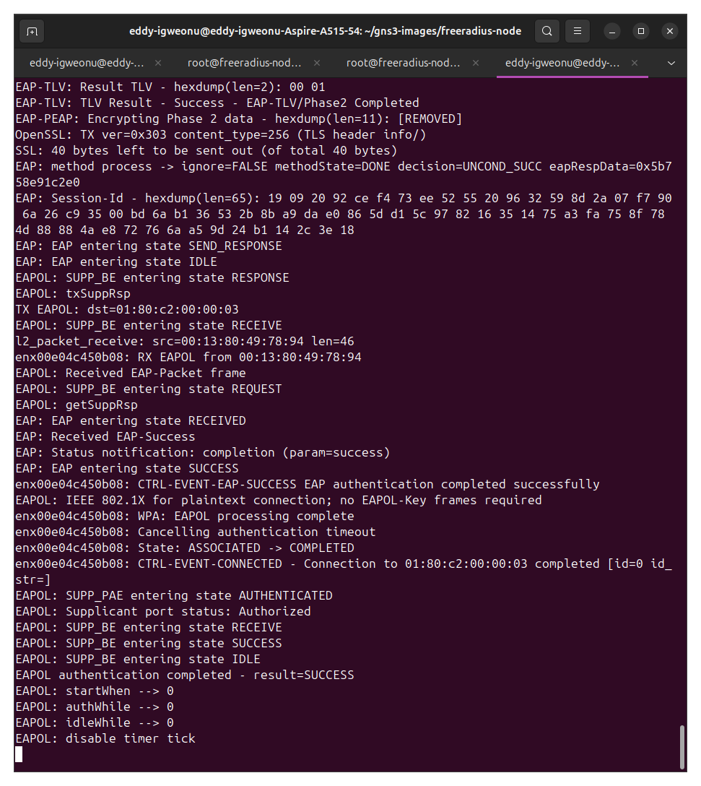
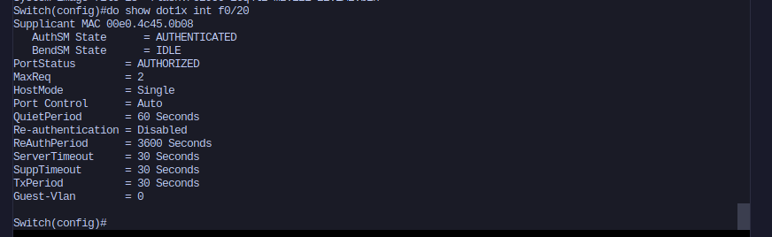
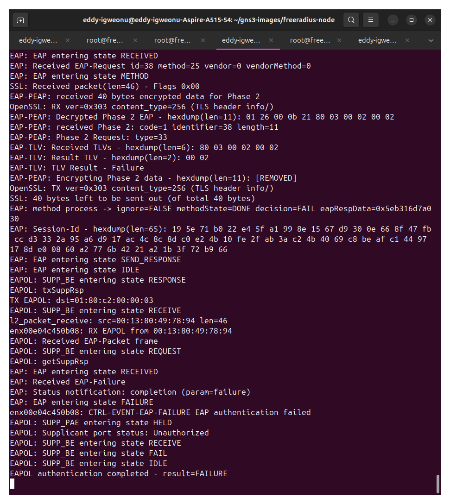
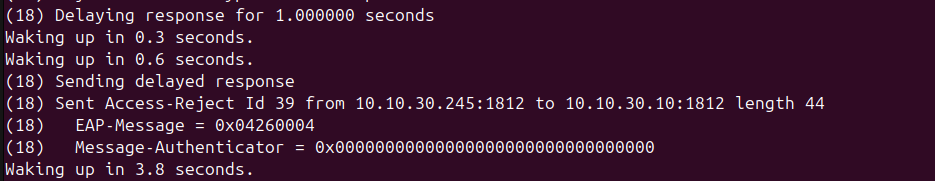
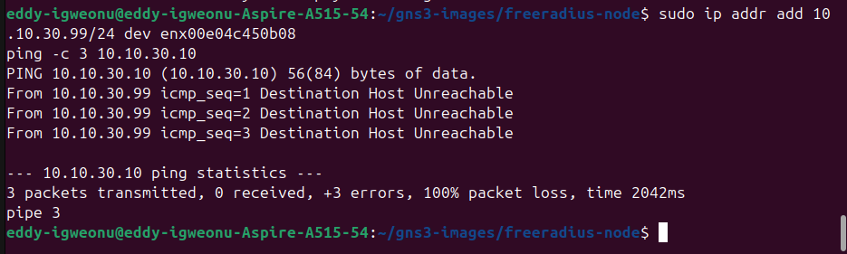
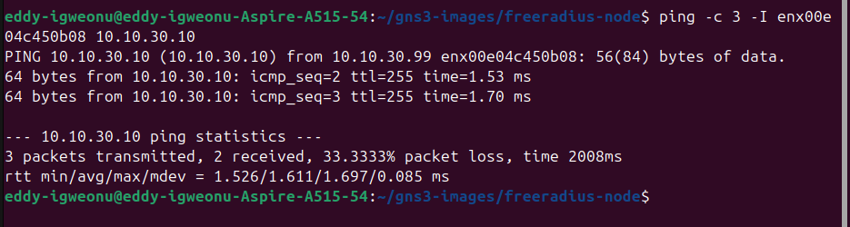
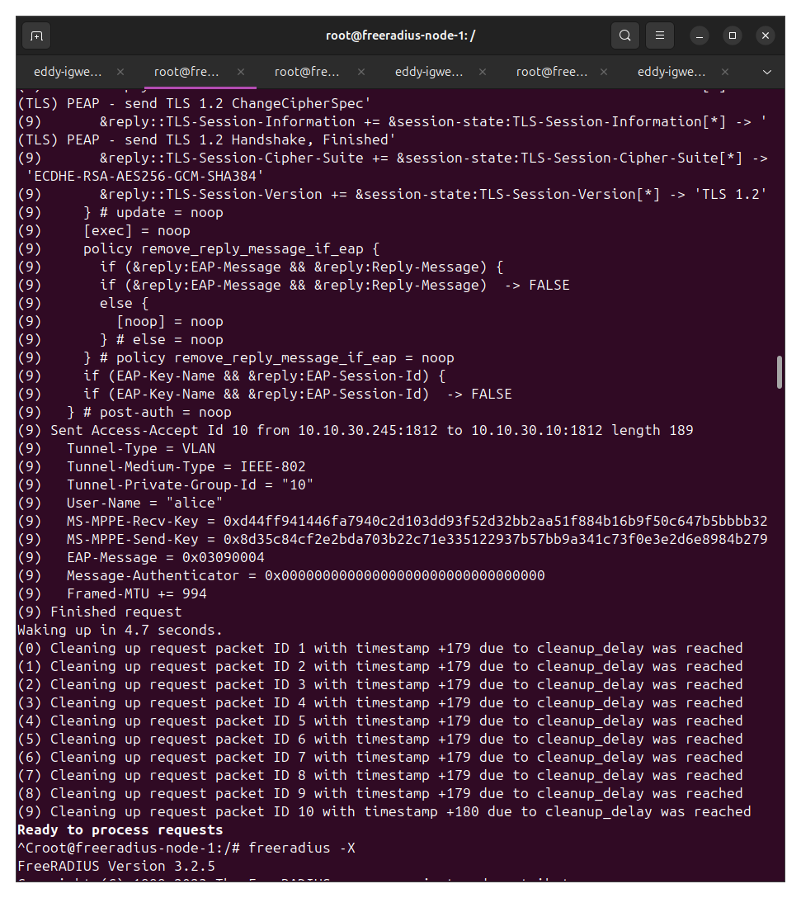
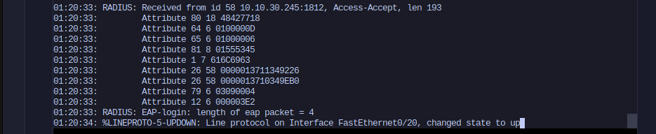
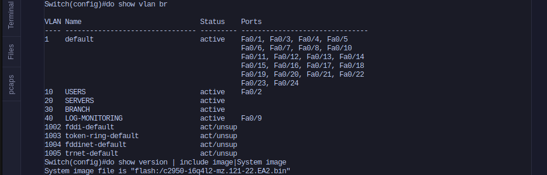

# 08 - 802.1X Port-Based Network Access Control with FreeRADIUS

Port-based network access control on a physical Cisco Catalyst 2950, with FreeRADIUS running as a containerized authentication server and a Linux host acting as the 802.1X supplicant.

This lab is the companion to `07-tacacs-aaa`. That one covered AAA for device administration, controlling who can log into the switch and what commands they can run. This one covers AAA for network access, controlling whether a device is allowed to pass traffic at all once it plugs into a port.

All credentials and shared secrets in this repo are placeholders from an isolated lab environment.

## What this demonstrates

- 802.1X authentication end to end across physical and virtual infrastructure
- FreeRADIUS server build, configuration, and troubleshooting
- PEAP with MSCHAPv2 as the EAP method
- Port-level enforcement, verified by traffic tests rather than just status output
- RADIUS attribute analysis at the protocol level, including RFC 2868 tunnel attribute tagging
- Identifying and documenting a real platform feature limitation

## Topology

```
Acer (Ubuntu 24.04)
  |
  |  USB-to-Ethernet adapter (enx00e04c450b08)
  |  running wpa_supplicant as the 802.1X supplicant
  |
  +--> Catalyst 2950  Fa0/20   [802.1X controlled port]
                        |
                      Fa0/17
                        |
                 GNS3 Cloud node (enp1s0)
                        |
                 freeradius-node  10.10.30.245/24
```

Three roles, mapped to the standard 802.1X model:

| Role | Device |
|---|---|
| Supplicant | Acer USB-to-Ethernet adapter running wpa_supplicant |
| Authenticator | Cisco Catalyst 2950, Fa0/20 |
| Authentication server | FreeRADIUS 3.2.5 in a GNS3 Docker node at 10.10.30.245 |

The management segment (10.10.30.0/24) and the switch SVI at 10.10.30.10 already existed from earlier labs in this repo. This build reuses them rather than standing up parallel infrastructure.

## Building the RADIUS server

The server runs as a custom Docker image based on Ubuntu 24.04 with `freeradius` and `freeradius-utils` installed. Unlike the TACACS+ lab, where the `tacacs+` package had been dropped from the Ubuntu repos and had to be compiled from source, FreeRADIUS is still packaged and installs cleanly.

Two decisions carried over from earlier labs in this repo:

**Config is baked into the image, not hand-edited in the container.** GNS3 Docker nodes lose manual changes when they are deleted and recreated, which has cost time in previous builds. `clients.conf` and the users file are copied in at build time, so recreating the node brings the config back with it.

**The entrypoint assigns its own IP.** Same pattern as `rsyslog-node` in the log monitoring lab. It waits for eth0 to attach, then sets the address and default route, so a restart does not mean re-IPing by hand.

`clients.conf` registers the switch as a RADIUS client:

```
client 2950 {
    ipaddr = 10.10.30.10
    secret = <shared-secret>
    shortname = cat2950
    nas_type = cisco
}
```

Two test users were defined, one with VLAN assignment attributes and one without:

```
alice   Cleartext-Password := "<password>"
        Tunnel-Type:1 = VLAN,
        Tunnel-Medium-Type:1 = IEEE-802,
        Tunnel-Private-Group-Id:1 = "10"

bob     Cleartext-Password := "<password>"
```

FreeRADIUS was run in foreground debug mode (`freeradius -X`) for the whole lab. The debug output prints every attribute in every request and reply, which is what made the tunnel attribute problem visible later.

### Verifying the server before involving the switch

Before touching any network gear, the server was tested standalone with `radtest` against loopback. Correct credentials returned Access-Accept with the tunnel attributes attached, wrong credentials returned Access-Reject. Isolating the server this way meant that when problems appeared later, they could be attributed to the switch or the wiring rather than the server config.

## Switch configuration

The 2950 already had a working TACACS+ setup from lab 07. RADIUS was added alongside it rather than replacing anything, so both AAA stacks coexist. Device administration continues to go to TACACS+, and 802.1X goes to RADIUS.

```
radius-server host 10.10.30.245 auth-port 1812 acct-port 1813 key <shared-secret>
aaa authentication dot1x default group radius
aaa authorization network default group radius
dot1x system-auth-control
!
interface FastEthernet0/20
 switchport mode access
 switchport access vlan 1
 dot1x port-control auto
```

Two things worth flagging:

`dot1x system-auth-control` is the global master switch. Without it the per-interface commands are accepted without complaint and do nothing, which is a confusing failure to diagnose because the config looks correct.

`aaa authorization network default group radius` is what allows the switch to act on authorization attributes returned by the server. Without it, authentication succeeds but any policy the server sends back is discarded.

The available 802.1X options on this platform are limited, which shapes the rest of the lab:



## Results

### Authentication succeeds

The supplicant was run in the foreground so the full EAP exchange was visible:

```
sudo wpa_supplicant -D wired -i enx00e04c450b08 -c /etc/wpa_supplicant/wired-8021x.conf -d
```

The PEAP tunnel established, MSCHAPv2 completed inside it, and the supplicant reported success:



On the switch, the port moved to AUTHORIZED with the supplicant MAC recorded:



### Authentication fails cleanly

With the supplicant password changed to an incorrect value, the exchange failed at the expected point. The PEAP tunnel still established, since that only requires the server certificate, but the inner MSCHAPv2 exchange returned a failure TLV:



FreeRADIUS logged the matching Access-Reject, and the port remained unauthorized:



### The port actually enforces

Status output showing AUTHORIZED is not by itself proof that anything is being blocked. The enforcement test was a ping from the supplicant interface to the switch SVI, run with an explicit source interface because the Acer has a second NIC in the same subnet and the kernel would otherwise route around the test.

Unauthorized:



Authorized:



Same interface, same source address, same target. The only variable is the 802.1X state.

## Problems hit and how they were solved

### Inner tunnel attributes were not reaching the switch

With PEAP, the real user authentication happens inside the encrypted tunnel. The outer identity is often anonymous, and FreeRADIUS by default builds its reply from the outer request. That means reply attributes defined against the inner user are dropped.

The fix is `use_tunneled_reply = yes` in the peap and ttls blocks of `mods-available/eap`. Without it, alice authenticated successfully and her VLAN attributes never left the server, which looks like a switch problem but is not one.

### Tunnel attributes were being sent untagged

After the tunneled reply fix, the switch received the attributes but logged:

```
RADIUS: EAP-login: radius didn't send any vlan
```

Reading the raw attribute values in the switch debug explained why:

```
Attribute 64 6 0000000D
Attribute 65 6 00000006
```

Attribute 64 is Tunnel-Type. The trailing `0D` is 13, which is the value for VLAN, so that part was correct. The leading `00` is the RFC 2868 tag byte. Tunnel attributes carry a tag so a server can group several tunnel definitions in one reply, and IOS expects that tag to be 1. With tag 0 the switch parsed the attributes but would not bind them to an assignment.

Adding `:1` to each attribute in the users file fixed the tagging, confirmed in the next debug output:

```
Attribute 64 6 0100000D
Attribute 65 6 01000006
```

The `didn't send any vlan` message stopped appearing after this change.

### No `test aaa` command on this platform

The usual way to verify the switch-to-server path before configuring any port is `test aaa group radius <user> <pass> legacy`. That command does not exist in this IOS train, so the first real RADIUS exchange had to be the actual authentication. `debug radius authentication` was used instead to observe the exchange as it happened.

## Platform limitations

The 2950 runs `c2950-i6q4l2-mz.121-22.EA2`. The `i6q4l2` designation identifies this as the Standard Image rather than the Enhanced Image, and several 802.1X features are absent as a result.

### Dynamic VLAN assignment does not work

This is the significant one. The server sends the assignment correctly, verified at both ends.

FreeRADIUS logs it going out, with all three tunnel attributes attached:



The switch logs it arriving, correctly tagged. Attributes 64 and 65 both carry the leading `01` tag byte, and attribute 81 carries the VLAN identifier:



The port then authenticates and stays in VLAN 1:



Both forms of the attribute were tried, the VLAN ID (`"10"`) and the VLAN name (`"USERS"`), since some older IOS trains only match on the name. The switch capture above is from the VLAN name run, which is why attribute 81 reads `01555345`, the tag byte followed by the start of "USERS" in ASCII. Neither form produced a VLAN change.

Notably, after the tags were corrected the switch stopped reporting an error at all. It accepts the attributes and silently does not act on them, which is a more precise description than saying it ignores them.

RADIUS-assigned VLAN is an Enhanced Image feature on this platform, so this is a hardware and image limitation rather than a configuration error. The server-side implementation is correct and would work against a switch that supports it.

### Other missing features

**No guest VLAN.** `show dot1x interface` displays a `Guest-Vlan` field and the debug output references guest VLAN evaluation, but there is no CLI command to configure one. The interface-level help shown earlier lists everything available.

**No MAC Authentication Bypass.** MAB is the standard fallback for devices with no supplicant, such as printers and IP phones, and is not available here. In a production deployment this would be a hard requirement.

**No auth-fail or restricted VLAN**, and no `details` keyword on `show dot1x interface`.

## What a production deployment would add

The gaps above are worth naming because they are exactly what separates a lab from a real rollout:

- MAB for devices that cannot run a supplicant
- Downloadable ACLs for per-user policy beyond VLAN placement
- Certificate-based EAP-TLS rather than password-based PEAP
- RADIUS accounting to track session start and stop, as configured for TACACS+ in lab 07
- A second RADIUS server for redundancy
- Periodic reauthentication, which is available on this platform but was left disabled to keep test cycles short

## Files

```
08-dot1x-nac/
├── README.md
├── Dockerfile
├── entrypoint.sh
├── clients.conf
├── authorize
├── wired-8021x.conf
└── screenshots/
```

## Screenshot index

| File | Shows |
|---|---|
| `supplicant-eap-success.png` | PEAP phase 2 completion and EAP-SUCCESS |
| `port-authorized.png` | Fa0/20 AUTHORIZED with supplicant MAC |
| `supplicant-eap-failure.png` | Bad credentials rejected at the supplicant |
| `freeradius-access-reject.png` | Matching Access-Reject on the server |
| `ping-blocked.png` | Traffic blocked while unauthorized |
| `ping-allowed.png` | Same ping succeeding once authorized |
| `freeradius-access-accept.png` | Server sending Access-Accept with tunnel attributes |
| `switch-debug-tagged-attributes.png` | Correctly tagged attributes arriving at the switch (VLAN name attempt) |
| `vlan-unchanged-and-image.png` | VLAN table unchanged, alongside the Standard Image string |
| `dot1x-interface-options.png` | Available 802.1X commands on this platform |
