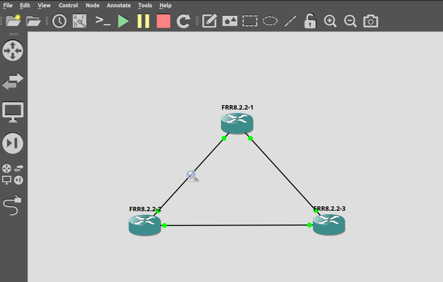
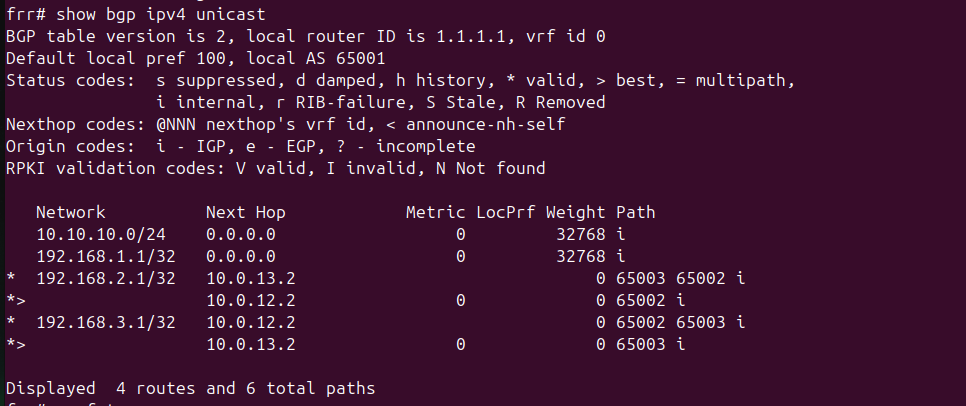
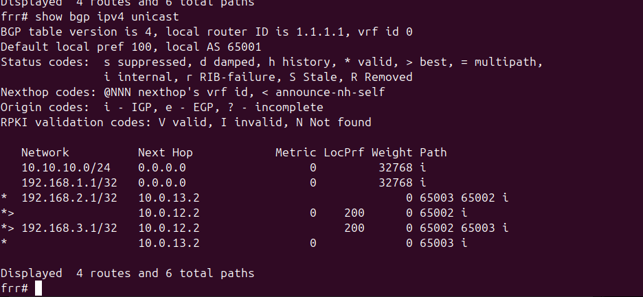
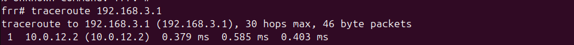
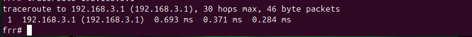
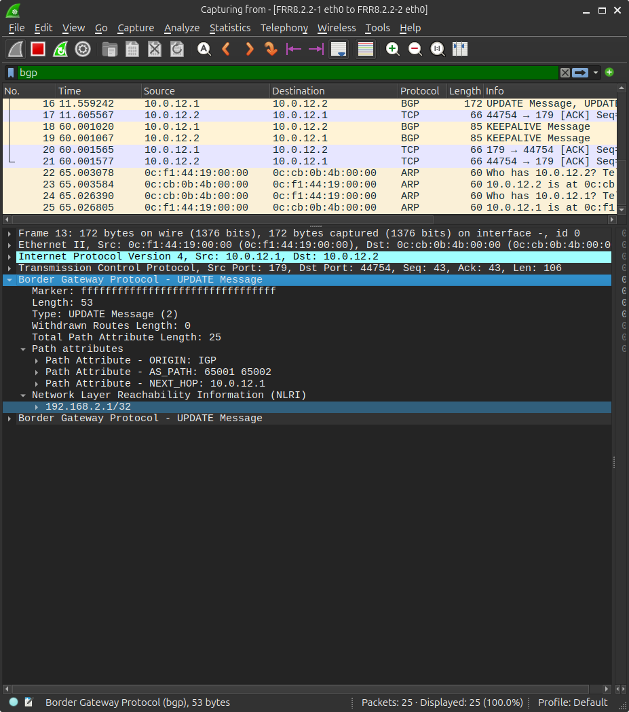

# 09 — eBGP Multi-AS Lab with LOCAL_PREF Path Manipulation

Three autonomous systems, a triangle topology, and a working demonstration of how BGP LOCAL_PREF actually shifts traffic between paths. Built in GNS3 using FRR 8.2.2 QEMU VMs.

---

## Topology

```
          Mac LAN
        10.10.10.0/24
              |
       R1 — AS65001
      /              \
10.0.12.0/30     10.0.13.0/30
    /                    \
R2 — AS65002 ——— R3 — AS65003
         10.0.23.0/30
```



R1 is the customer AS with a real LAN behind it (Mac connected via physical Cisco 2950). R2 is a transit ISP sitting in the middle. R3 is a second customer AS. The triangle gives R1 two real paths to R3 — direct or through transit — which is what makes the LOCAL_PREF demo meaningful.

**WAN links:**

| Link | Subnet |
|---|---|
| R1 eth0 — R2 eth0 | 10.0.12.0/30 |
| R1 eth1 — R3 eth1 | 10.0.13.0/30 |
| R2 eth1 — R3 eth0 | 10.0.23.0/30 |

**Loopbacks (advertised as customer prefixes):**

| Router | Loopback | AS |
|---|---|---|
| R1 | 192.168.1.1/32 | 65001 |
| R2 | 192.168.2.1/32 | 65002 |
| R3 | 192.168.3.1/32 | 65003 |

R1 also advertises the 10.10.10.0/24 LAN into BGP.

---

## Build Notes

All three routers run FRR 8.2.2 as QEMU VMs in GNS3. FRR 8.x ships with `bgp ebgp-requires-policy` enabled by default, which blocks all prefix exchange until explicit inbound/outbound policies are defined on every eBGP session. That behavior did not exist in older FRR versions and will catch you off guard if you're used to FRR 7.x or Cisco IOS. The fix is one command per router:

```
router bgp <asn>
 no bgp ebgp-requires-policy
```

After that, a `clear bgp ipv4 unicast * soft` on each router is needed to trigger fresh UPDATEs. The sessions will show `(Policy)` in `show bgp ipv4 unicast summary` until both steps are done.

---

## BGP Configuration

**R1 (AS65001):**
```
router bgp 65001
 bgp router-id 1.1.1.1
 no bgp ebgp-requires-policy
 neighbor 10.0.12.2 remote-as 65002
 neighbor 10.0.13.2 remote-as 65003
 !
 address-family ipv4 unicast
  network 192.168.1.1/32
  network 10.10.10.0/24
  neighbor 10.0.12.2 activate
  neighbor 10.0.13.2 activate
 exit-address-family
```

**R2 (AS65002):**
```
router bgp 65002
 bgp router-id 2.2.2.2
 no bgp ebgp-requires-policy
 neighbor 10.0.12.1 remote-as 65001
 neighbor 10.0.23.2 remote-as 65003
 !
 address-family ipv4 unicast
  network 192.168.2.1/32
  neighbor 10.0.12.1 activate
  neighbor 10.0.23.2 activate
 exit-address-family
```

**R3 (AS65003):**
```
router bgp 65003
 bgp router-id 3.3.3.3
 no bgp ebgp-requires-policy
 neighbor 10.0.23.1 remote-as 65002
 neighbor 10.0.13.1 remote-as 65001
 !
 address-family ipv4 unicast
  network 192.168.3.1/32
  neighbor 10.0.23.1 activate
  neighbor 10.0.13.1 activate
 exit-address-family
```

---

## Baseline BGP Table

With no policy applied, BGP selects best paths purely on AS-PATH length. R1's view of R3's prefix `192.168.3.1/32` shows two entries:

```
*  192.168.3.1/32   10.0.12.2                              0 65002 65003 i
*>                  10.0.13.2                0             0 65003 i
```

The direct path via `10.0.13.2` wins (`*>`) because its AS-PATH is one hop shorter (`65003` vs `65002 65003`). Both LOCAL_PREF values are at the default of 100, so AS-PATH length is the tiebreaker.



---

## LOCAL_PREF Demo

LOCAL_PREF is set inside your own AS on the router receiving a prefix from an eBGP peer. It is not sent to other ASes. Its job is to tell every router inside your AS which exit to prefer when multiple paths exist to the same destination. Higher value wins, default is 100.

To override the AS-PATH tiebreaker and force R1 to prefer the transit path through R2, a route-map is applied inbound on the R2 peering session:

```
route-map PREFER-TRANSIT permit 10
 set local-preference 200
!
router bgp 65001
 address-family ipv4 unicast
  neighbor 10.0.12.2 route-map PREFER-TRANSIT in
 exit-address-family
```

After a soft reset, the BGP table flips:

```
S> 192.168.3.1/32   10.0.12.2                     200      0 65002 65003 i
S                   10.0.13.2                0             0 65003 i
```

The transit path is now `*>` with `LocPrf 200`. The direct path is still valid but no longer selected.



---

## Traffic Plane Verification

Traceroute from R1 to R3's loopback with LOCAL_PREF 200 active:

```
traceroute to 192.168.3.1, 30 hops max
 1  10.0.12.2  0.688 ms        <-- transiting through R2
 2  ...
```

After reverting the route-map and resetting:

```
traceroute to 192.168.3.1, 30 hops max
 1  192.168.3.1  0.693 ms      <-- direct to R3 in one hop
```

The single-hop result is not a mistake. The direct link from R1 to R3 means the next hop is the destination itself, so traceroute resolves it immediately. The contrast between the two outputs confirms the forwarding plane is actually following the BGP decision, not just the BGP table.




---

## Wireshark Capture — BGP UPDATE

Captured on the R1-R2 link during a `clear bgp ipv4 unicast * soft`. The expanded packet shows the full UPDATE message contents:

- **Type: UPDATE Message (2)**
- **AS_PATH: 65001 65002** — path attribute confirming AS hops
- **NEXT_HOP: 10.0.12.1**
- **NLRI: 192.168.2.1/32** — the prefix being announced



This is what actually moves between BGP peers during a session reset or topology change. The NLRI field carries the prefix and mask. The path attributes travel alongside it in the same packet.

---

## Findings

FRR 8.x's `ebgp-requires-policy` default is a real gotcha that doesn't show up in most lab guides written against older software. The sessions come up fine but silently refuse to exchange prefixes until you either define explicit policies or disable the check. Worth knowing before you assume your peering config is broken.

The `(Policy)` state in `show bgp ipv4 unicast summary` is the tell. If you see that instead of a prefix count, this is the problem.

---

## Tools

- GNS3 2.x on bare-metal Ubuntu 24.04
- FRR 8.2.2 (QEMU VM)
- Wireshark (GNS3 per-link capture)
- Physical Cisco Catalyst 2950 (LAN segment, not in BGP plane)
