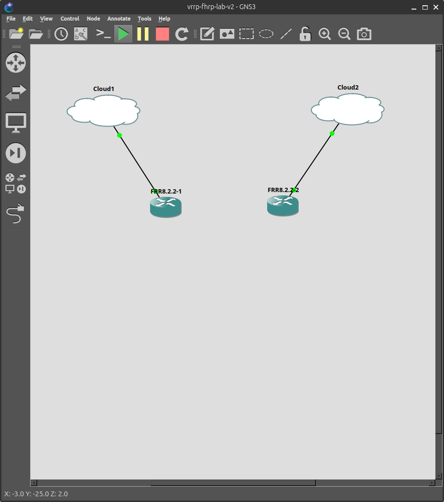
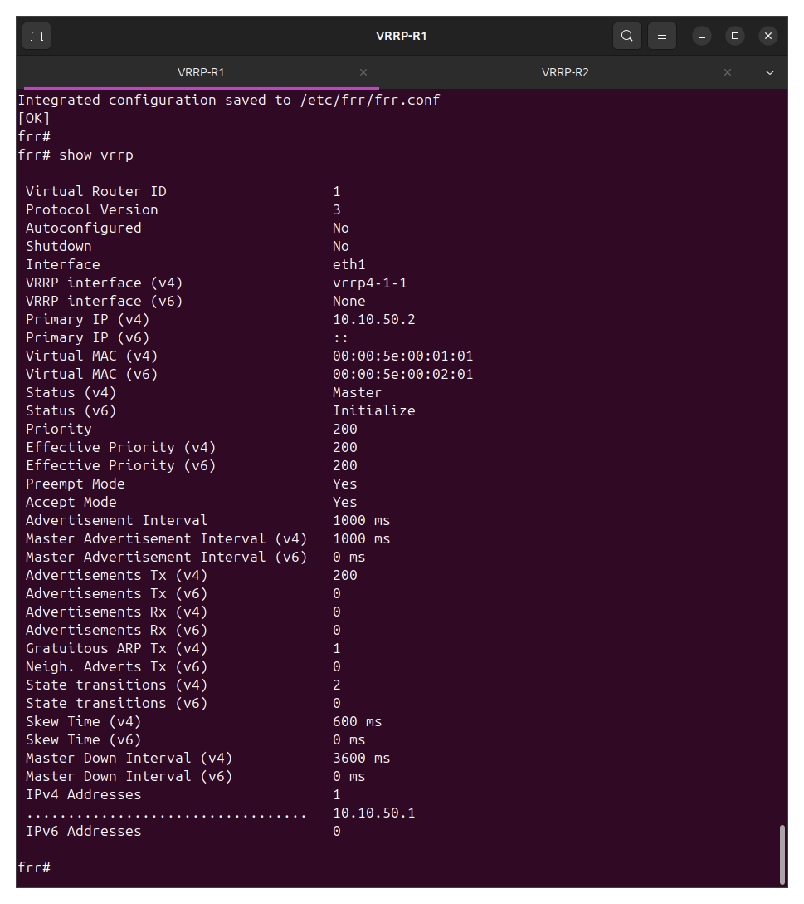
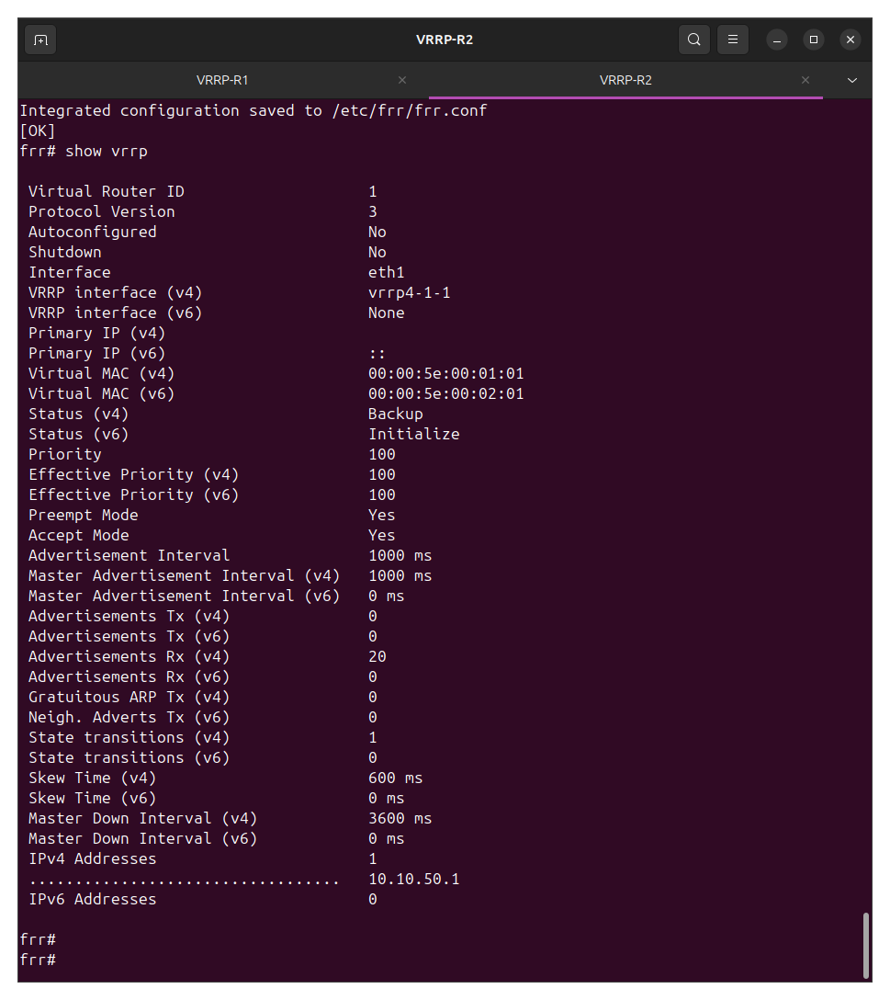
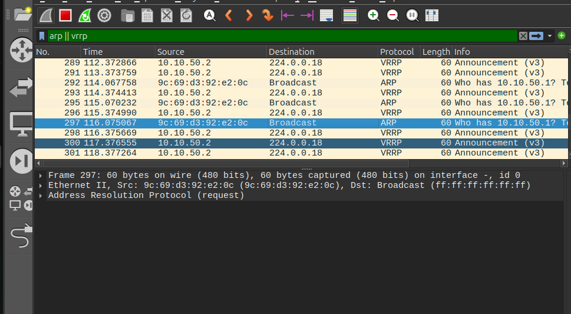

# 10-vrrp-fhrp

First hop redundancy on the lab segment using VRRPv3, run on FRR 8.2.2 routers inside GNS3 with a physical Cisco Catalyst 2950 carrying the LAN and a MacBook acting as the client.

This lab also closes out a blocker that had killed two earlier attempts at FHRP in this repo.

## What VRRP is doing here

A client with a single default gateway has a single point of failure. If that router dies, the client keeps ARPing for a gateway that no longer answers and stays offline until someone changes its config. VRRP fixes that by putting a virtual IP and a virtual MAC in front of two or more real routers. The client only ever knows about the virtual address. Whichever router currently holds the Master role answers for it, and if that router fails the Backup takes over the same IP and the same MAC, so the client never has to learn anything new.

The virtual MAC matters more than it looks. If failover only moved the IP, every client on the segment would keep sending frames to the old router's MAC until its ARP cache aged out, which can take minutes. Because the MAC moves too, and the new Master sends a gratuitous ARP the moment it takes over, the switch reprograms its MAC address table and traffic follows within a second or two.

## Topology

```
                 MacBook (client)
                 10.10.50.20/24
                        |
                      Fa0/7
               +----------------+
               | Catalyst 2950  |   all ports access VLAN 50
               +----------------+
                 Fa0/5     Fa0/6
                   |         |
              enp1s0 / USB adapter
                   |         |
              Cloud1       Cloud2
                   |         |
               VRRP-R1    VRRP-R2
             10.10.50.2  10.10.50.3
                 pri 200    pri 100
                   \         /
                 VIP 10.10.50.1
                 VMAC 00:00:5e:00:01:01
```



Both routers are FRR 8.2.2 QEMU nodes built from the same qcow2 image used elsewhere in this repo. VLAN 50 was created specifically for this lab so it does not collide with the VLANs used by the earlier firewall, TACACS+ and dot1x builds.

There is no direct link between R1 and R2. VRRP peers over the shared broadcast domain, which the 2950 already provides, so a router to router cable adds nothing except ambiguity about which interface the protocol is actually running on.

## Why this had to be rebuilt on QEMU

Earlier attempts at both VRRP and STP in this repo ran the daemons in GNS3 Docker nodes, and both stalled in the same way. vrrpd would start, sit in Initialize state forever, and write nothing useful to its log.

The cause is that FRR's vrrpd does not do its own packet rewriting. It relies on a macvlan sub-interface carrying the VRRP virtual MAC, and it brings that interface up when the router becomes Master and holds it down when it is Backup. Creating a macvlan requires the NET_ADMIN capability. GNS3's Docker node template has no field for Linux capabilities, so containers come up without it, and there is no configuration change inside GNS3 that can grant it.

A QEMU node runs a real kernel with a real root user, so the same commands that failed silently in the container just work. The alternative fix considered was moving the whole host to Proxmox for privileged LXC containers, which would have meant repartitioning the only working lab disk and splitting the environment across two boots. Swapping the node type was an evening of work instead of a weekend of migration, and it produced a better lab anyway, since it uses FRR's own vrrpd rather than a hand assembled container.

## Build

Each router needs three things that FRR itself does not create: an address on the LAN interface, the macvlan carrying the virtual MAC, and the virtual IP on that macvlan.

On R1:

```sh
ip link set dev eth1 up
ip addr add 10.10.50.2/24 dev eth1
ip link add vrrp4-1-1 link eth1 addr 00:00:5e:00:01:01 type macvlan mode bridge
ip addr add 10.10.50.1/24 dev vrrp4-1-1
```

R2 is identical except for `10.10.50.3/24` on eth1. The macvlan line is the same on both, including the MAC, because both routers share VRID 1 and therefore share the virtual MAC. The interface name is only a convention; FRR finds it by matching the MAC rather than the name.

None of that survives a node restart, since `ip` commands are not persistent. Each node has the four commands saved as `/root/vrrp-up.sh` so bringing the lab back up after a reboot is one command followed by an FRR restart rather than four commands and a guess about which one was missed.

Enable the daemon, which is off by default in the image:

```sh
sed -i 's/^vrrpd=no/vrrpd=yes/' /etc/frr/daemons
/usr/lib/frr/frrinit.sh stop
/usr/lib/frr/frrinit.sh start
```

Then the VRRP config itself, in vtysh:

```
conf t
interface eth1
 vrrp 1
 vrrp 1 ip 10.10.50.1
 vrrp 1 priority 200
 vrrp 1 advertisement-interval 1000
end
write memory
```

Priority 100 on R2. Everything else matches.

Switch side, just enough to give the three devices a common broadcast domain:

```
vlan 50
interface range fa0/5 - 7
 switchport mode access
 switchport access vlan 50
```

## Verification

`show vrrp` on R1 shows it as Master with priority 200, the macvlan attached as the VRRP interface, and advertisements going out once a second. R2 shows the same VRID and the same virtual MAC but sits as Backup at priority 100, with its advertisement receive counter climbing as it hears R1.





The clearest single piece of evidence is the state of the macvlan on each router. On the Master:

```
vrrp4-1-1@eth1: <BROADCAST,MULTICAST,UP,LOWER_UP> state UP
    link/ether 00:00:5e:00:01:01
    inet 10.10.50.1/24
```

On the Backup, the same interface with the same address and MAC exists, but:

```
vrrp4-1-1@eth1: <NO-CARRIER,BROADCAST,MULTICAST,UP> state LOWERLAYERDOWN
    link/ether 00:00:5e:00:01:01 protodown on
```

`protodown on` is vrrpd deliberately holding the interface down because this router is not Master. That is the whole mechanism in one line, and it is exactly the behaviour that never happened in the Docker build.

On the physical switch, the virtual MAC shows up as a normal dynamic entry on the Master's port:

```
Vlan    Mac Address       Type        Ports
  50    0000.5e00.0101    DYNAMIC     Fa0/5
```

A real Cisco switch learning a MAC address that was invented by a macvlan inside a virtual machine, and treating it like any other host, is a reasonable demonstration that the virtual and physical halves of this lab are genuinely joined.

A packet capture on the R1 link shows VRRPv3 advertisements sourced from 10.10.50.2 to the multicast group 224.0.0.18 at one second intervals, alongside the client's ARP broadcasts for the virtual IP.



## The IPv6 instance

`show vrrp` always reports both an IPv4 and an IPv6 instance per VRID, and the IPv6 half sits in Initialize throughout this lab. That is expected rather than broken. No IPv6 addresses are configured, so there is nothing for the v6 instance to do. Worth noting because the output looks alarming at first glance.

## Split brain

At one point both routers reported themselves as Master at the same time, each holding its macvlan up, both claiming 10.10.50.1 and both answering with 00:00:5e:00:01:01. On a switched segment that means two devices with the same MAC on different ports, and the switch reassigning that MAC back and forth between them.

The cause was mundane. The cables between the host NICs and the switch were not plugged in, so the two routers had no shared broadcast domain. Each one heard nothing from any peer, correctly concluded it was the highest priority router present, and promoted itself. The router with priority 100 becoming Master while a priority 200 router existed elsewhere is not a protocol bug, it is VRRP doing exactly what it should when the two cannot hear each other.

The diagnostic that made it obvious was the advertisement receive counter on R2 sitting frozen at the same number across several minutes while its transmit counter climbed. Priority only matters once the advertisements actually arrive.

## ARP behaviour on Linux routers, unresolved

During troubleshooting, the client's ARP request for the virtual IP was answered by the Backup router's real MAC rather than the virtual MAC. That is a plausible failure mode on Linux and worth understanding, though this build never confirmed it independently of the cabling problem above.

Linux uses a flat ARP model. By default a host will answer an ARP request for any IP configured anywhere on the box, out of any interface. Since the virtual IP is configured on the macvlan, the Backup's physical interface can end up answering for it even while vrrpd is holding the macvlan down. The result is a client that has cached the virtual IP against a specific physical router, which defeats the point of the virtual MAC entirely.

The usual mitigation is to scope `arp_ignore` to the physical interface only, leaving the macvlan free to answer:

```sh
sysctl -w net.ipv4.conf.all.arp_ignore=0
sysctl -w net.ipv4.conf.eth1.arp_ignore=1
```

The kernel takes the higher of the `all` value and the per interface value, so setting `all` to 1 suppresses replies from the macvlan as well and breaks the thing it is meant to fix.

This is listed as an open question rather than a solution. The tuning was applied while chasing a problem that turned out to be unplugged cables, so whether it is actually required in this topology has not been established.

## Known gaps

**Failover not yet demonstrated.** The election, the state machine and the virtual MAC on the physical switch are all verified, but a measured failover with a running ping and a MAC address table moving between ports has not been captured.

**Host to GNS3 frame forwarding.** Late in the build, frames stopped crossing between the GNS3 Cloud nodes and the physical NICs. The switch would learn the host NIC's own burned in MAC on the connected port but never any router MAC, on either the built in interface or the USB adapter. ubridge was running with the correct `cap_net_admin,cap_net_raw` capabilities and correct group ownership, and the behaviour survived a rebuild into a fresh project, so the usual causes are ruled out. Unresolved at time of writing, and it is the reason the failover test is outstanding.

**The `arp_ignore` question** described above.

## What this lab covers

VRRPv3 on Linux, virtual IP and virtual MAC behaviour, priority and preemption, the macvlan mechanism FRR uses to implement FHRP, split brain and how to recognise it from the advertisement counters, and Linux ARP behaviour on multi homed routers.

The Cisco equivalents are HSRP and GLBP. The concepts transfer directly, though Cisco handles the ARP and virtual MAC ownership internally rather than exposing it as a separate interface the way Linux does. Seeing the macvlan get held down and released is a clearer view of the mechanism than the Cisco implementation gives you.
