# 11 - Multi-Protocol Redistribution (EIGRP / OSPF / BGP)

## Overview

This lab builds a five router chain that runs three different routing protocols end to end, with redistribution happening at two boundary points. The goal was to see route redistribution actually working across real protocol boundaries, not just in isolation, and to catch the kind of subtle gaps that show up in real networks when EIGRP, OSPF, and BGP have to hand routes off to each other.

Topology:

```
R1 (EIGRP edge) -- R2 (EIGRP/OSPF boundary) -- R3 (OSPF core) -- R4 (OSPF/BGP boundary) -- R5 (eBGP peer, upstream ISP)
```

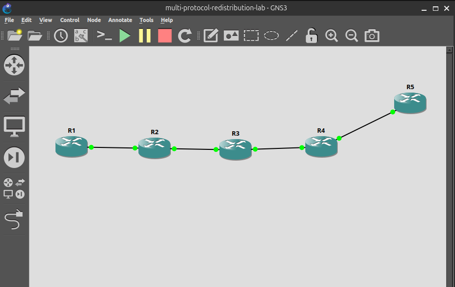

All five routers are Cisco c2691s running IOS (`c2691-adventerprisek9-mz.124-15.T14.image`), built in GNS3.

## Addressing

| Link | Subnet | Protocol |
|---|---|---|
| R1 Lo0 | 10.10.70.1/24 | EIGRP AS 100 |
| R1-R2 | 10.10.71.0/30 | EIGRP AS 100 |
| R2-R3 | 10.10.72.0/30 | OSPF area 0 |
| R3-R4 | 10.10.73.0/30 | OSPF area 0 |
| R4 Lo0 | 10.10.80.1/24 | OSPF area 0 |
| R4-R5 | 10.10.74.0/30 | eBGP, R4 AS 65004 / R5 AS 65005 |
| R5 Lo0 | 10.10.90.1/32 | BGP, advertised as the upstream "internet" prefix |

R2 redistributes between EIGRP 100 and OSPF 1. R4 redistributes between OSPF 1 and BGP 65004.

## Build and verification

Interfaces and point to point reachability were confirmed hop by hop before any routing protocol was configured. EIGRP was brought up between R1 and R2 first, then OSPF across R2, R3, and R4, then eBGP between R4 and R5, each confirmed independently before adding redistribution.

Redistribution was added one direction at a time rather than all at once, checking the routing table at each router after every change to isolate which redistribution point produced which route.

Routing tables at each boundary, once redistribution was in place:

**R1, EIGRP table:**

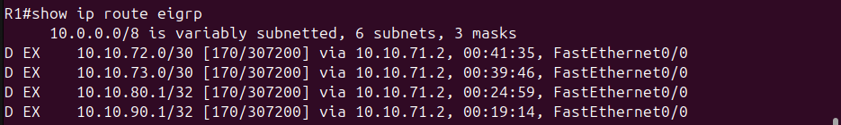

**R2, combined table (EIGRP-native and OSPF-native routes both present):**

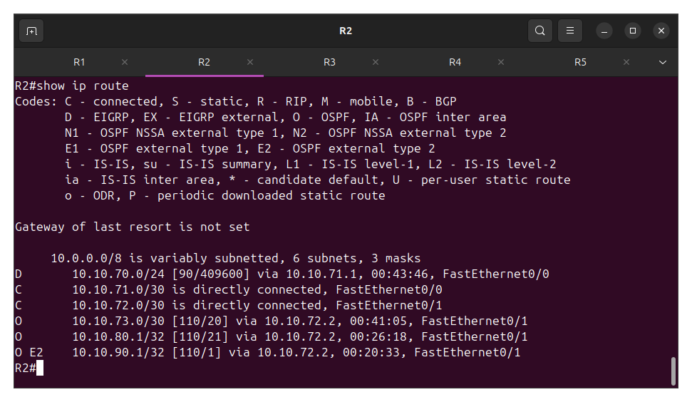

**R3, OSPF table:**

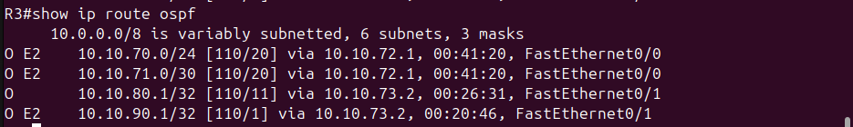

**R5, BGP table:**

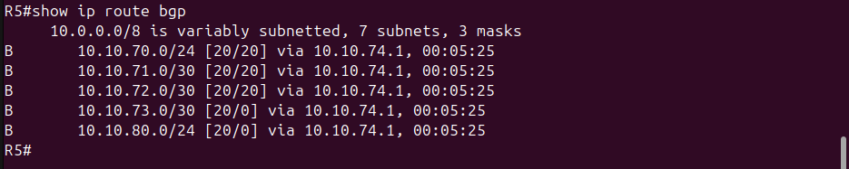

**R4, eBGP session to R5 established:**

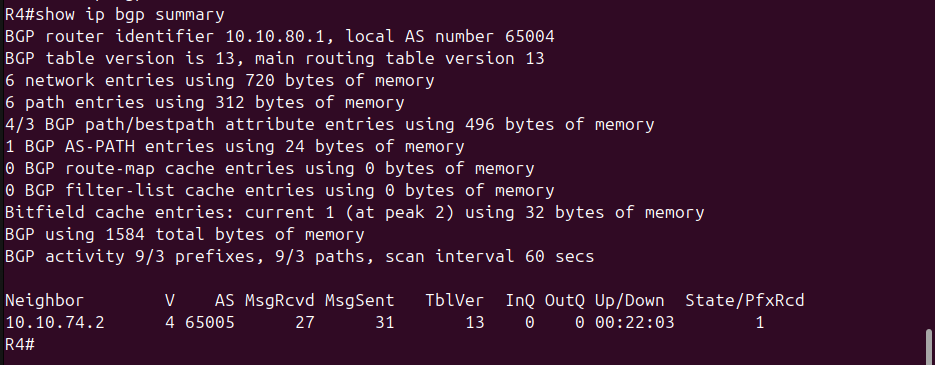

Both boundary routers running their two protocols side by side, redistribute statements included:

**R2:**

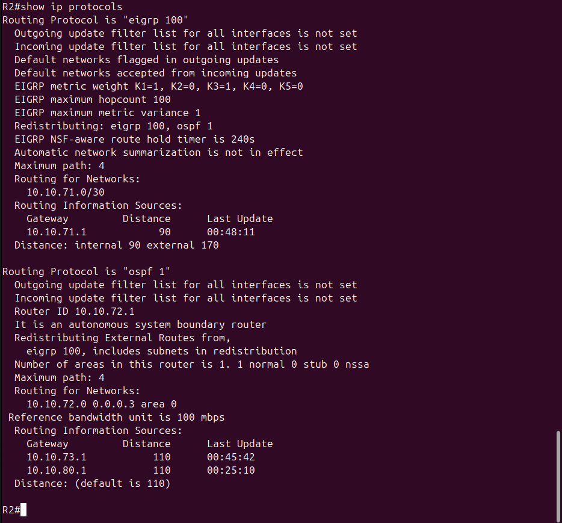

**R4:**

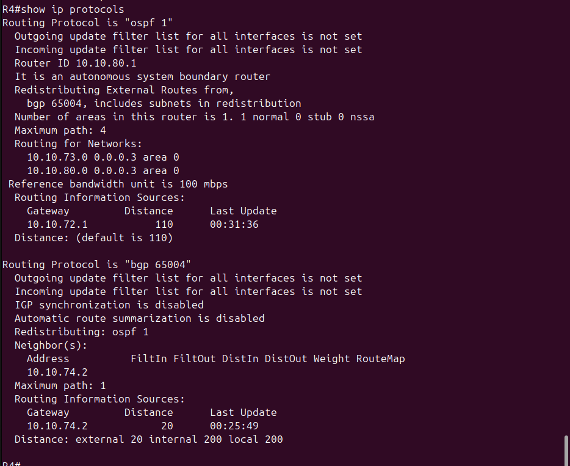

## Findings

**1. BGP redistribution from OSPF only picks up internal routes by default**

After redistributing EIGRP into OSPF on R2 and OSPF into BGP on R4, R1's loopback (10.10.70.0/24) showed up correctly in R4's OSPF table as an O E2 route:

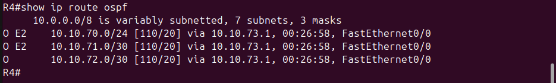

It did not show up in R4's advertised BGP routes to R5:

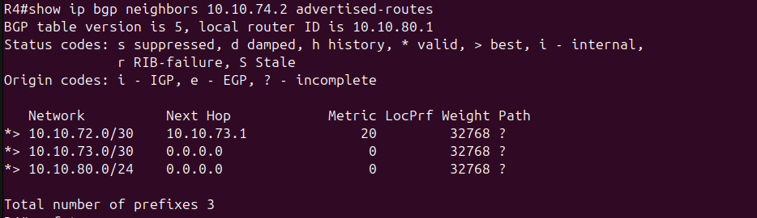

The cause is IOS's default behavior for `redistribute ospf` under a BGP process: it only redistributes OSPF-internal routes (intra-area and inter-area) unless told otherwise. Since 10.10.70.0/24 reached R4 as an OSPF external route (it originated from EIGRP redistribution at R2), it fell outside that default and was silently excluded.

Fix, on R4:

```
router bgp 65004
 redistribute ospf 1 match internal external 1 external 2
```

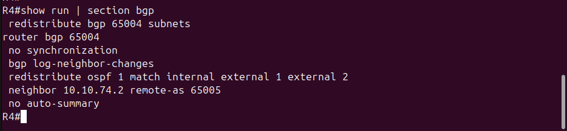

After the fix, all five prefixes are advertised:

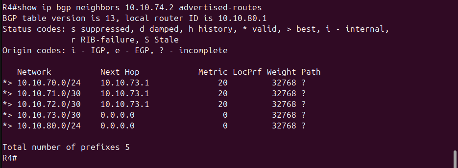

**2. The boundary router's own transit link needs to be advertised separately**

Once redistribution was working in both directions, R1 could traceroute cleanly to R5's loopback, but R5 could not ping R1's loopback using a non-loopback source address. The redistributed prefixes (R1's loopback, the EIGRP and OSPF transit links) were all reachable, but the R4-R5 link itself (10.10.74.0/30) was never included in OSPF or redistributed into it.

When R5 pinged using its physical interface as the source (the default behavior for a ping with no explicit source), the reply needed a route back to 10.10.74.2, and nothing in the IGP had that subnet:

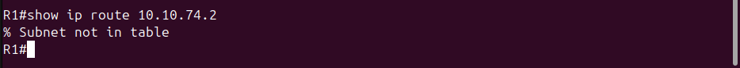

The fix was adding the transit link to OSPF directly on R4 rather than relying on redistribution to cover it:

```
router ospf 1
 network 10.10.74.0 0.0.0.3 area 0
```

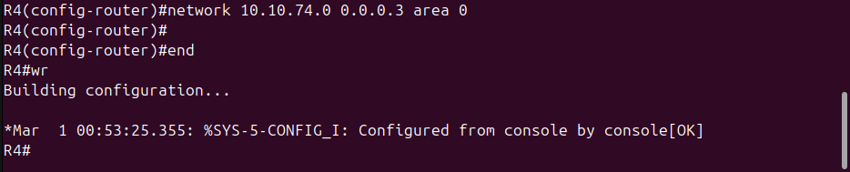

After the fix, R1 has a route to the transit link:

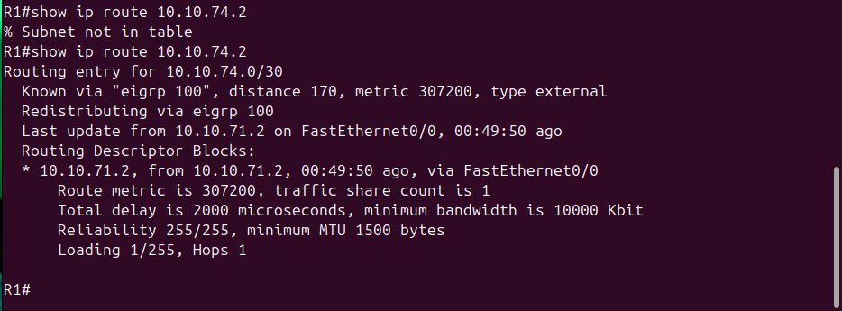

This is worth remembering as a general pattern: redistributing learned routes at a boundary does not automatically cover the boundary router's own directly connected transit subnet on the other protocol's side. That subnet has to be explicitly included.

## Verification

With both fixes in place, traceroute was confirmed clean in both directions.

R1 to R5:

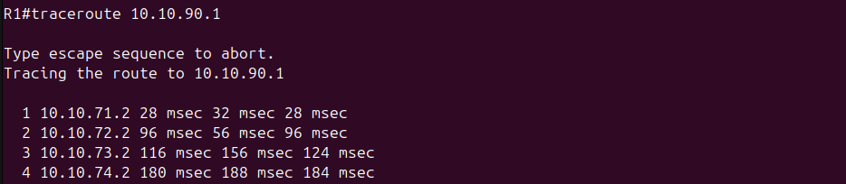

R5 to R1:

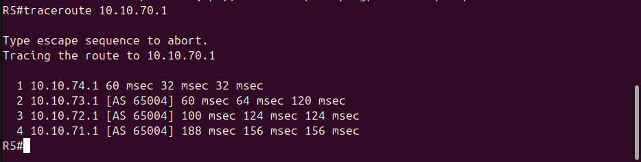

A Wireshark capture on the R3-R4 link, taken while forcing an OSPF re-flood with `clear ip ospf process` on R4, shows the redistributed route arriving as a Type-5 AS-External-LSA, advertising router 10.10.80.1 (R4), for network 10.10.90.1:

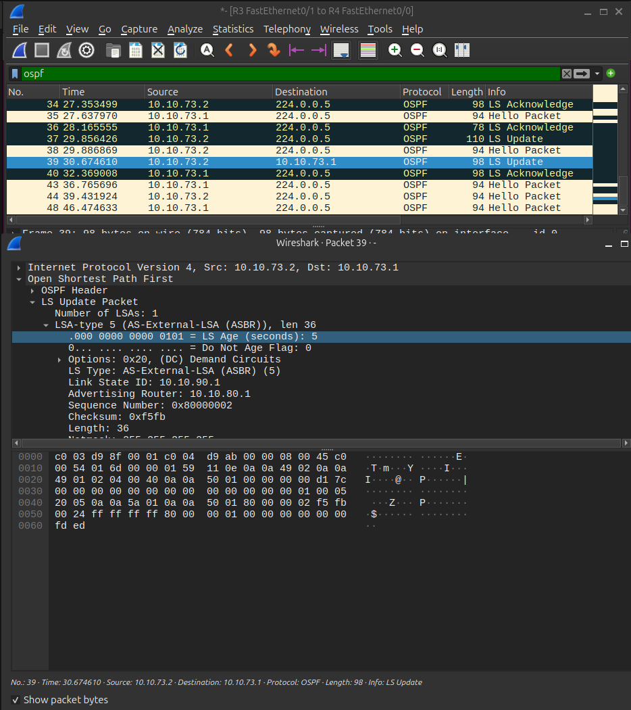
