# IPv6 Dual-Stack and OSPFv3 (R2-R3-R4)

## Overview

This lab extends the existing multi-protocol redistribution topology (EIGRP/OSPF/BGP across a five-router c2691 chain) by adding IPv6 to the OSPF core. R2, R3, and R4 now run dual-stack, with IPv6 reachability handled by OSPFv3 alongside the existing OSPFv2 process. R1 (EIGRP edge) and R5 (BGP peer) stay IPv4-only for this phase. Extending IPv6 out to those two, via EIGRPv6 on R1 and the BGP IPv6 address family on R5, is a logical next step but wasn't in scope here.

The goal was to see how OSPFv3 differs from OSPFv2 in practice, not just on paper: how addressing and process configuration are structured differently, what the neighbor and routing tables look like, and what the Hello exchange looks like on the wire.


## Addressing

| Link | IPv4 | IPv6 |
|---|---|---|
| R2-R3 | 10.10.72.0/30 | 2001:db8:72::/64 |
| R3-R4 | 10.10.73.0/30 | 2001:db8:73::/64 |
| R2 Loopback0 | 2.2.2.2/32 | 2001:db8:2::2/128 |
| R3 Loopback0 | 3.3.3.3/32 | 2001:db8:3::3/128 |
| R4 Loopback0 | 4.4.4.4/32 | 2001:db8:4::4/128 |

The IPv6 side mirrors the existing IPv4 scheme link for link, just swapped onto the documentation prefix (2001:db8::/32) instead of the private 10.10.x.x range, so the two are easy to line up side by side.

## Configuration

IPv6 is enabled globally per router, then addressed per interface, same pattern as IPv4 but with its own command tree:

```
ipv6 unicast-routing
interface FastEthernet0/1
 ipv6 address 2001:db8:72::2/64
 ipv6 ospf 1 area 0
```

OSPFv3 doesn't use network statements. Area membership is set directly on the interface with `ipv6 ospf <process> area <area>`, and the process itself just needs a router-id:

```
ipv6 router ospf 1
 router-id 2.2.2.2
```

This was applied on all three routers, with loopbacks getting the same treatment so they'd show up in the OSPFv3 routing table.

## Verification

Adjacency came up Full on both segments:

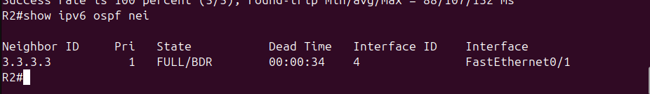
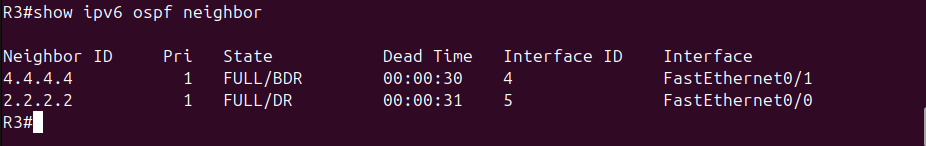
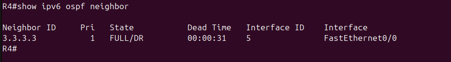

Interface addressing confirmed on all three routers, link-local plus the assigned global address:

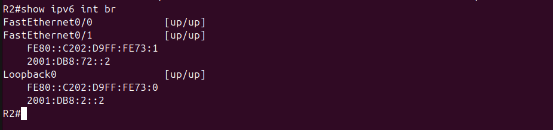
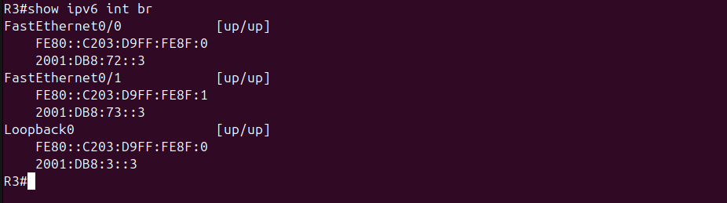
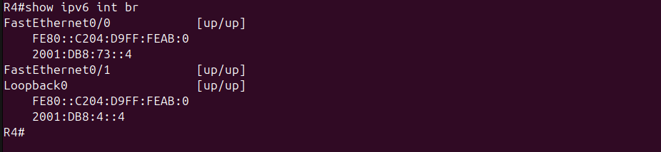

The routing tables on R2 and R4 show each other's loopback learned via OSPFv3 (O flag), confirming adjacency actually turned into usable routes:

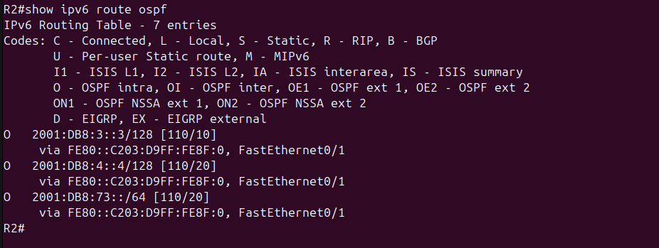
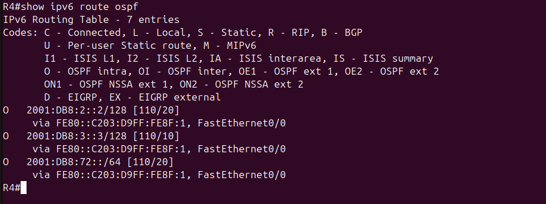

End-to-end reachability, pinging loopback to loopback across the OSPF core in both directions:

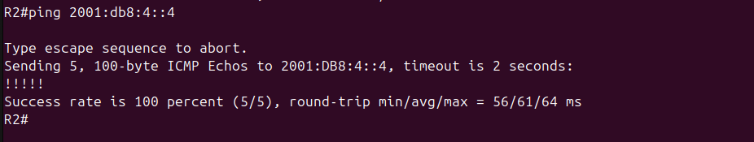
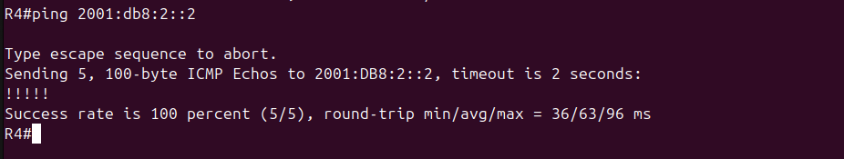

R3, sitting in the middle with both OSPFv3-enabled interfaces, gives a clean single-screen summary of the whole setup:

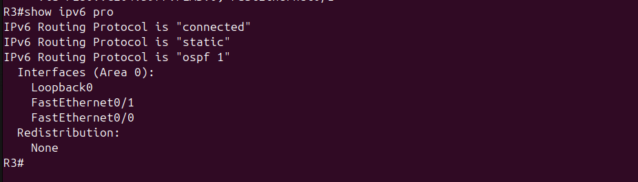

## Wireshark

Captured on the R2-R3 link. The Hello packet is sourced from R2's link-local address, destined to ff02::5 (the OSPFv3 AllSPFRouters multicast group), and shows the DR/BDR fields already populated:

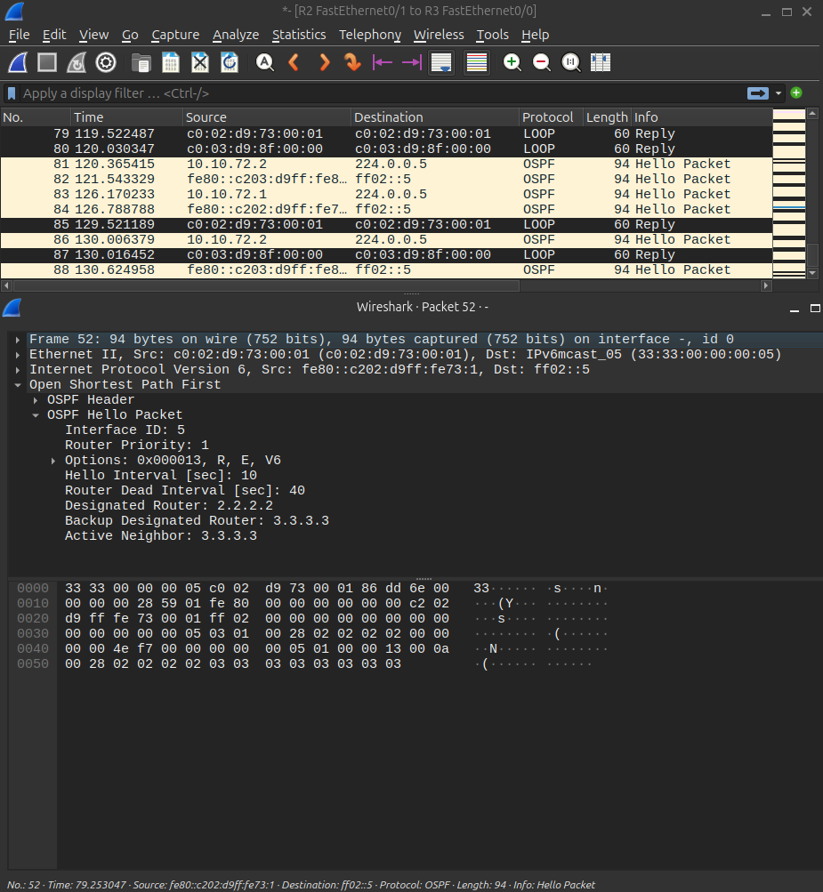

Worth noting since it's the clearest difference from OSPFv2 at the packet level: no more IPv4-style broadcast to 224.0.0.5 off a router's own address, IPv6 neighbor discovery runs entirely on link-local addresses and a separate multicast group.

## Things that went wrong

Two issues came up while building this, both worth documenting since they're the kind of thing that actually happens in real OSPFv3 deployments, not just lab mistakes to hide.

**Router-id mismatch on R4.** The `router-id 4.4.4.4` command didn't take, and OSPFv3 fell back to auto-selecting an ID from an existing IPv4 address on the box instead. R3's neighbor table showed R4 as `10.10.80.1`, not `4.4.4.4`. This didn't break adjacency (OSPFv3 doesn't care what the router-id looks like, only that it's unique), but it's inconsistent with the router-id convention used everywhere else in this topology, so it got corrected:

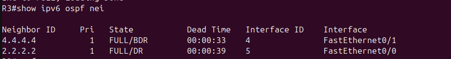

**Accidentally deleted the OSPFv3 process on R3.** While configuring the router-id, `no ipv6 router ospf 1` got typed instead of the intended command, tearing down the process entirely. The adjacency to R2 dropped immediately (`FULL to DOWN, Neighbor Down: Interface down or detached`) as a direct result:

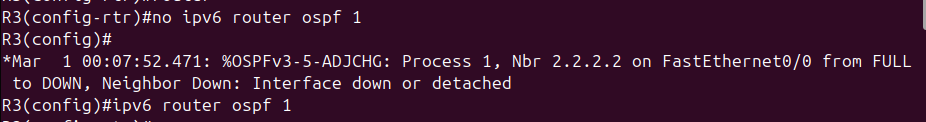

Recreating the process with `ipv6 router ospf 1` brought the process back, but not the area assignments on the interfaces, those had to be reapplied by hand on both Fa0/0 and Fa0/1 before the adjacency reformed:

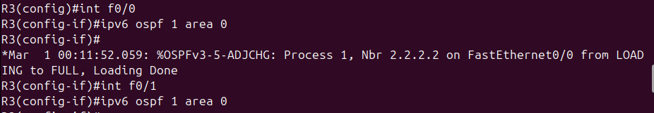

The takeaway: deleting and recreating an OSPFv3 process doesn't restore interface-level area membership automatically, unlike some other config that survives a process bounce. Worth remembering if this happens again on a live network instead of a lab.

## Next steps

Extending IPv6 out to R1 (EIGRPv6) and R5 (BGP IPv6 address family) would complete the dual-stack picture across the whole five-router chain, following the same redistribution logic already proven out on the IPv4 side.
