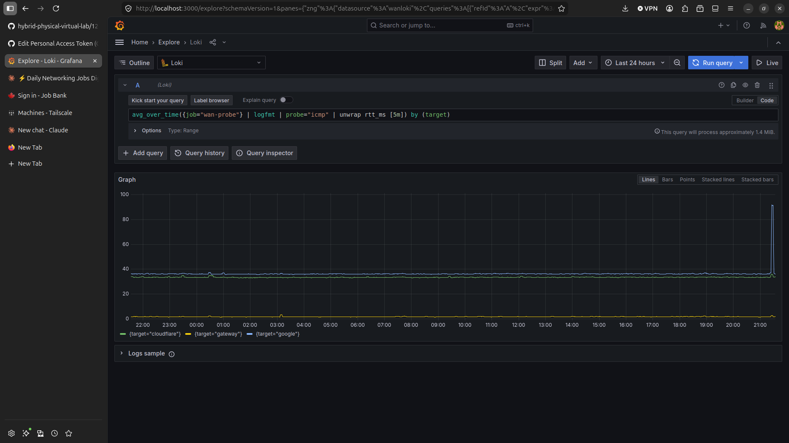

# 13-wan-monitoring

Synthetic WAN monitoring from a single host on a home network. A probe
container measures latency and packet loss to three targets every 30
seconds, ships the results to Loki via Promtail, and graphs them in
Grafana. The point of the lab is not the stack. It is being able to look
at a degradation event and say whether the problem is local or upstream,
and to trust the numbers enough to make that call.

Run period: 2026-09-12 to 2026-09-21, roughly nine days of continuous
collection. The first seven days were analysed in detail. The last two
were added after the initial writeup and changed one of its conclusions.

All timestamps in the logs are UTC. The dashboard renders in NDT, which
is UTC-2:30. Subtract two and a half hours from a log timestamp to find
it on a graph.

## Results

### Event rate varies by an order of magnitude between days

Degraded samples per UTC day:

| Date | Count | Note |
|---|---|---|
| 2026-09-12 | 31 | partial day, run started 20:20Z |
| 2026-09-13 | 37 | |
| 2026-09-14 | 10 | |
| 2026-09-15 | 15 | |
| 2026-09-16 | 87 | invalid, see limitations |
| 2026-09-17 | 42 | includes deliberate config changes |
| 2026-09-18 | 105 | |
| 2026-09-19 | 44 | |
| 2026-09-20 | 28 | |
| 2026-09-21 | 18 | partial day |

Total 417 degraded samples.

A quiet day produces 10 to 15 events. A busy day produces 100 or more.
This is the single most practical reason to monitor for a week rather
than an afternoon. Any one day would give a badly misleading picture of
what normal looks like on this connection.

### Events clustered in the evening during the first week

Degraded samples bucketed by hour for the first seven days (371 samples,
2026-09-12 through 2026-09-19 UTC):

| UTC hour | Local | Count |
|---|---|---|
| 19:00 | 16:30 | 26 |
| 20:00 | 17:30 | 16 |
| 21:00 | 18:30 | 37 |
| 22:00 | 19:30 | 30 |
| 23:00 | 20:30 | 66 |
| 00:00 | 21:30 | 29 |

Those six hours hold 204 of 371 events, about 55 percent of everything
recorded, in a quarter of the day. The 20:30 local hour alone accounts
for 66.

The days that followed did not repeat it. On 2026-09-20 and 2026-09-21
the evening window was as quiet as the rest of the day, and 2026-09-21
ran flat from start to finish apart from a single upstream event. The
clustering is real for the first week but is not established as a
lasting daily feature of this connection.

The overnight period is correspondingly quiet. The seven hours from 00:30
to 07:30 local hold 52 events in total, and 24 of those came from a
single burst on one night. Excluding that burst leaves 28 events across
seven hours of seven nights.

### Baseline and path characteristics



A full 24 hours of the connection behaving normally. Gateway flat at 1
to 2 ms, Cloudflare around 34 ms, Google around 36 ms. The only event is
at the right edge, where Google rises alone to about 92 ms while the
gateway and Cloudflare stay flat. That is the upstream signature
described in the triage section below.

Steady state on this connection:

- Gateway (192.168.2.1): 2.5 ms, one wireless hop
- Cloudflare (1.1.1.1): 33 to 35 ms
- Google (8.8.8.8): 36 to 38 ms

Traceroute shows 12 hops to 1.1.1.1 and 13 to 8.8.8.8. Hop 1 is the
router at 4.5 ms and hop 2 is Bell's first router at 14.7 ms. Hop 3
jumps to 44 ms and every subsequent hop plateaus in the mid 30s to mid
40s without climbing further. So roughly 30 ms of fixed latency is added
inside the provider network between hop 2 and hop 3, and the rest of the
path costs almost nothing on top.

Both destinations land in the same range over entirely different
networks, which makes this a property of egress from this area rather
than anything specific to either provider. Whois on hop 2
(142.124.47.77) returns BELL-ICNEN21, Bell Canada.

Hop 2 returns 100 percent loss when pinged directly while forwarding
traffic normally. Carrier routers commonly answer TTL-expired for
traceroute but drop or rate-limit ICMP echo aimed at themselves. This is
worth knowing before treating it as a fault.

## Triage method

Three targets, with the gateway acting as a control. The gateway leg
never leaves the building, so nothing upstream can affect it. That makes
the combination of which targets moved diagnostic.

**All three degrade together, gateway included, gateway usually worst.**
Local. The delay is being added before traffic leaves the house.

Example, 2026-09-12 22:12:37Z. Gateway 807 ms with 80 percent loss,
cloudflare 178 ms with 20 percent, google 145 ms with 80 percent, all
within three seconds of each other. Radio state at the time was -84 dBm
with TX rate collapsed to MCS 0.

**One target degrades while the gateway stays flat.** Upstream.

Example, 2026-09-12 around 20:28Z. Cloudflare at 543 ms average and 753
ms max with zero packet loss, while the gateway held at 2 ms and google
at 38 ms. Recovered within about 90 seconds. A traceroute taken after
recovery showed an identical 12-hop path to the baseline, so the route
did not change. Latency without loss and without a path change points at
transient queuing on an existing link rather than a fault or a reroute.

**Loss without latency.** A third case worth separating.

Example, 2026-09-18 02:37 and 02:48. Gateway at 5.1 ms and 2.8 ms, both
entirely normal, with 20 percent packet loss. On wireless this usually
means interference rather than congestion, and it is invisible to any
classifier that only watches latency.

**A gap that aligns with a probe=startup marker is the host, not the
network.** The probe writes a startup line every time it launches, so
restarts are self-documenting and can be excluded.

## Instrument problems found during the run

This is the part of the lab with the most transferable value. Every one
of these would have corrupted the dataset, and none of them was visible
in the data itself.

**The host was associated to a range extender.** For the first part of
setup the measurement host was connected to a bridged TP-Link extender
rather than the router. Because a bridged extender does not route, the
gateway address and subnet were identical either way and the routing
table could not reveal it. Found by comparing the gateway's ARP MAC
against the BSSIDs in a wireless scan.

**The parser was recording max RTT instead of average.** The ping summary
line reads `rtt min/avg/max/mdev = a/b/c/d`. Splitting on the forward
slash puts the numbers and their labels on opposite sides of the equals
sign, so field 5 lands on max rather than average. Gateway latency was
reported as roughly 20 ms when hand-measured pings showed 2.5 ms. Fixed
by taking the third token of field 4. Both average and max are now
recorded, and keeping max turned out to be useful in its own right for
spotting retransmission on a marginal link.

**The classifier was blind to latency.** Status was derived from packet
loss alone, so a sample showing 1464 ms average round trip to the local
router was recorded as `status=ok`. Fixed by adding a latency threshold,
compared with awk since the shell cannot compare decimals.

**The host roamed onto a mesh node mid-run.** On 2026-09-16 the client
moved from the router to a Google mesh node on the same network. The
mesh routes rather than bridges, so the host landed in 192.168.86.0/24
behind a second layer of NAT, and the probe spent 14 hours pinging a
gateway address that no longer existed on its path. Visible in
retrospect as a clean step change with every target gaining a few
milliseconds at once.

**Duplicate NetworkManager profiles.** Several connection attempts had
created two profiles per SSID with the same name. The active profile had
autoconnect priority 0 and no BSSID pin, while every setting applied
during troubleshooting had gone onto an inactive duplicate. This is why
pinning appeared not to work. Resolved by deleting all but the active
profile.

**The PSK was stored in the user keyring.** After deleting the duplicate
profiles, the surviving profile held its password as a user secret,
which locks with the login session. Every screen lock dropped the Wi-Fi
and required manual reauthentication. Fixed by setting
`802-11-wireless-security.psk-flags` to 0 so the secret is owned by the
system rather than the session.

## Association comparison

Four options were measured from the same host position with the same
probe. Signal strength and latency stability turned out to be different
properties.

| Association | Signal | Avg RTT to gateway | mdev |
|---|---|---|---|
| BELL116 5 GHz (0e:ac:8a:f0:79:cb) | -80 dBm | 2.46 ms | 0.66 |
| BELL116 2.4 GHz (0c:ac:8a:f0:79:c9) | -71 dBm | 29.6 ms | 46.8 |
| BELLX mesh 2.4 GHz (08:b4:b1:88:b2:ae) | -56 dBm | 202 ms | 210 |
| TP-Link extender | not measured | rejected on topology | |

The weakest signal gave the best latency by a wide margin, and the
strongest gave the worst by two orders of magnitude. Every stronger
option was either on the contended 2.4 GHz band or sat behind a wireless
backhaul. The extender was rejected without measuring because it adds a
backhaul hop for the same reason the mesh node does.

The 5 GHz association was chosen and pinned. A repeat measurement on the
same BSSID five days later gave 5.72 ms average and 2.33 mdev, so
conditions on that radio degraded mid-week. By 2026-09-21 the signal had
improved to -78 dBm and the gateway line was back at 1 to 2 ms, with no
change to host position or configuration.

## A hypothesis that kept changing

An evening congestion pattern was proposed early, after a disturbed
Saturday night. It was rejected two days later when the following two
evenings were clean, on the reasonable grounds that one bad evening is
not a pattern.

Seven days of data bucketed by hour then showed it clearly, with 55
percent of all events falling in the six-hour evening window. That looked
like confirmation. Two more days of collection, run after the first
writeup, did not repeat it, and the most recent evening was completely
quiet.

The honest position is that evening clustering happened during the first
week and has not been shown to be lasting. Each stage was a reasonable
reading of the data available at the time, and each was revised when
more data arrived. That sequence is a better argument for long
collection windows than any single finding in this lab.

A second hypothesis did not survive. Early cumulative totals suggested
the path to Cloudflare degraded more often than the path to Google. That
reading came almost entirely from one disturbed period, and the quiet
days that followed showed gateway and google contributing as much or
more. Not supported.

## Limitations

**The measurement host sits on a marginal wireless link.** At -80 to -82
dBm, the host itself generates a meaningful share of the recorded
events. The gateway leg therefore doubles as a Wi-Fi health check. This
is a real constraint on the conclusions, though it also provides the
control that makes the local versus upstream distinction possible.

**2026-09-16 is not a valid network measurement.** The host was on the
mesh node for most of that day.

**2026-09-17 includes deliberate changes.** Association tests, a gateway
target change and back, and two probe restarts.

**Daily counts were originally misbucketed.** Running totals were taken
at whatever local time the check happened, against a log written in UTC,
so early per-day deltas were wrong. The table above is computed in a
single pass bucketed by UTC date and supersedes them.

**One Grafana panel will not render a window despite the data being
present.** The region between roughly 13:20 and 16:15 local on
2026-09-18 draws as blank. The probe log holds continuous entries
throughout, Promtail reported no errors, and a direct Loki API query for
that window returns the expected ICMP samples. This is a rendering
problem in the visualisation layer, not missing data.

**One unexplained host reboot.** On 2026-09-12 the machine went down
abruptly, about 90 seconds of downtime, with no clean shutdown sequence
in the journal and no thermal, MCE or hardware errors logged. It did not
recur over the remaining six days. All four containers restarted on
their own via `restart: unless-stopped`.

**Scope.** The probe measures ICMP round trip, DNS resolution time and a
single HTTP fetch. It does not measure throughput, jitter distribution
beyond min/avg/max/mdev, or anything above the transport layer. It is a
single vantage point.

## Method notes

Two habits that were learned the hard way and are worth carrying
forward.

**The dashboard finds events, the log characterises them.** The five
minute averaging window smears paired events into what looks like a
single target moving alone, and it continues showing an event for
several minutes after recovery. Every event classification in this
writeup was confirmed against raw log lines. Reading the graph alone
produced the wrong answer four separate times during the run.

**An apparent gap is not evidence of missing data.** Check the log file
and the Loki API before recording a gap as an outage. One gap in this run
was the right-hand edge of the time axis misread against the timezone
offset, and another was a rendering failure with the data intact in
storage.

**Check the association before trusting the numbers.** The logs cannot
tell you which access point the host is using. A two-second `iw dev
<iface> link` in the daily check would have caught three of the six
instrument problems above.

## Stack

Four containers via Docker Compose on the measurement host.

- `wan-probe`, built from ubuntu:24.04, runs the probe loop
- `promtail` 2.9.8, tails the log file and ships to Loki
- `loki` 2.9.8, single binary with filesystem storage and a tsdb schema
- `grafana` 11.1.0, with the Loki datasource provisioned from a config
  file at a fixed UID

The datasource UID is pinned in provisioning. Without it Grafana
generates a new UID on each provisioning run and saved dashboard
references go stale.

The probe writes logfmt, one line per measurement, which is what makes
`| logfmt | unwrap rtt_ms` work in LogQL.

Every 30 seconds it runs:

- ICMP, 5 packets, to the gateway, 1.1.1.1 and 8.8.8.8
- DNS resolution timing against the gateway and 1.1.1.1
- One HTTP fetch of a 204 endpoint

## Queries

The panel query, which is the core of the lab:

```
avg_over_time({job="wan-probe"} | logfmt | probe="icmp" | unwrap rtt_ms [5m]) by (target)
```

The trailing `by (target)` is essential. Without it, `logfmt` promotes
the per-line timestamp to a label, every sample becomes its own series,
and the graph renders as disconnected points instead of lines.

Analysis run against the log file directly:

```bash
# degraded samples per UTC day
grep -a 'status=degraded' logs/wan-probe.log | awk '{print substr($1,4,10)}' | sort | uniq -c

# degraded samples by UTC hour across the whole run
grep -a 'status=degraded' logs/wan-probe.log | awk '{print substr($1,15,2)}' | sort | uniq -c | sort -k2

# split by target
grep -a 'status=degraded' logs/wan-probe.log | awk '{print $4}' | sort | uniq -c | sort -rn

# every restart boundary
grep -a 'probe=startup' logs/wan-probe.log
```

`grep -a` is needed because an unclean shutdown early in the run wrote
null bytes into the log, after which grep treats the file as binary.

## Files

- `docker-compose.yml`
- `probe/probe.sh`, `probe/Dockerfile`
- `loki/loki-config.yaml`
- `promtail/promtail-config.yaml`
- `grafana/provisioning/datasources/loki.yaml`
- `BASELINE.md`, conditions and the association comparison as measured
- `INCIDENTS.md`, the running log kept during the run, including
  corrections made as later data arrived
- `images/baseline-24h.png`, the 24 hour baseline screenshot

`logs/` is gitignored.
