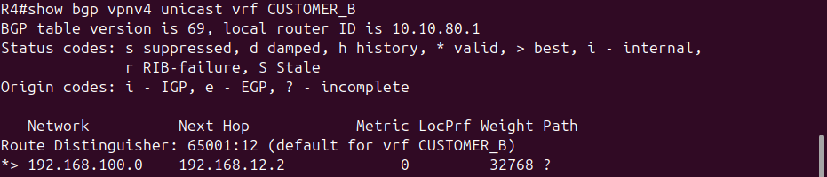
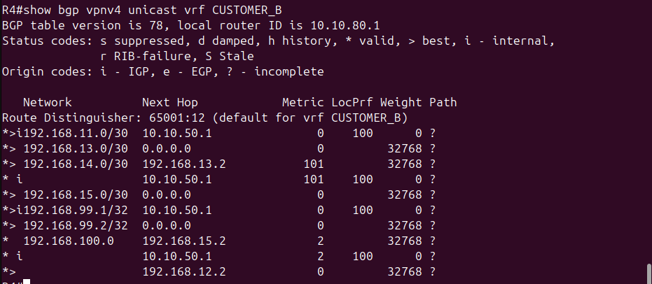

# MPLS L3VPN with OSPF Sham-Link and Dual-Homed CE Failover

*Command output next to a screenshot is a real capture from the build. Config blocks without one were typed in during the session but weren't screenshotted separately.*

## Overview

This lab builds an MPLS L3VPN on top of the existing R2-R3-R4 OSPF core from the multi-protocol redistribution lab. Two simulated customers (CustomerA and CustomerB) share the same physical provider infrastructure while staying completely isolated from each other, and they use overlapping private address space on purpose to prove it.

It goes a bit further than a bare-bones L3VPN build in three ways:

1. CustomerA gets two sites (Site1 on R2, Site2 on R4) connected by OSPF as the PE-CE routing protocol, which runs into a classic real-world problem: give a customer a backdoor link between sites and OSPF will prefer it over the provider's MPLS path, even when the MPLS path is supposed to be primary. Fixed with an OSPF sham-link.
2. CustomerA's Site1 is dual-homed to both PE routers (R2 and R4), so there's automatic failover if the primary PE connection drops.
3. Route target import/export gets tested directly instead of just assumed to work, by temporarily misconfiguring an import, watching the route cross the isolation boundary, and reverting it.

Why bother: actually configuring an MPLS L3VPN isn't something a NOC tech or junior admin usually touches, that's normally carrier/MSP senior-engineering territory. But MSP, energy, and telecom shops run MPLS as core WAN transport constantly, and not understanding what's going on underneath a ticket that mentions a VRF or a label-switching issue is a real gap. This lab was about closing that gap.

## Topology


R1 through R5 form the core, with R2 and R4 as PEs and R3 as the P router. CE-A-Site1 hangs directly off R2, CE-A-Site2 and CE-B share Switch1 on separate VLANs into R4, and the direct diagonal link between CE-A-Site1 and CE-A-Site2 is the backdoor path discussed in Phase 6. CE-A-Site1's second connection into Switch1 (added in Phase 7) is the dual-homed failover path.

- R1, R5: outside the MPLS domain (EIGRP edge and eBGP edge respectively)
- R2, R4: Provider Edge (PE) routers, VRF-aware
- R3: Provider (P) router, label-switching only, no VRF awareness
- CE-A-Site1, CE-A-Site2: CustomerA's two sites
- CE-B: CustomerB's single site

## Addressing

| Link | Subnet |
|---|---|
| R2 to CE-A-Site1 | 192.168.11.0/30 |
| R4 to CE-B (VLAN 12, via Switch1) | 192.168.12.0/30 |
| R4 to CE-A-Site2 (VLAN 13, via Switch1) | 192.168.13.0/30 |
| CE-A-Site1 to CE-A-Site2 (backdoor) | 192.168.14.0/30 |
| R4 to CE-A-Site1 (VLAN 15, via Switch1, dual-homed link) | 192.168.15.0/30 |
| CustomerA LAN behind CE-A-Site1 | 192.168.100.0/24 (loopback, OSPF network type set to point-to-point so the /24 gets advertised instead of the usual /32 loopback host route) |
| CustomerB LAN behind CE-B | 192.168.100.0/24 (loopback, reached via a static route on R4 redistributed into BGP — deliberately the same subnet as CustomerA's) |
| Sham-link loopbacks (in VRF CUSTOMER_A) | R2: 192.168.99.1/32, R4: 192.168.99.2/32 |

VRF plan:

| VRF | Router | RD | RT export/import |
|---|---|---|---|
| CUSTOMER_A | R2 | 65001:11 | 100:1 |
| CUSTOMER_A | R4 | 65001:14 | 100:1 |
| CUSTOMER_B | R4 | 65001:12 | 200:1 |

CustomerA uses a distinct RD per PE (65001:11 on R2, 65001:14 on R4), which is the correct pattern since RD only needs to be unique per PE per VRF, not identical across PEs carrying the same customer. Matching RT values (100:1) on both is what allows the two sites' routes to import into each other's VRF table.

## Phase 1: MPLS core (LDP)

Enabled on R2, R3, and R4, on the core-facing interfaces only (not on any PE-CE interface):

```
interface <core-facing interface>
 mpls ip
 mpls label protocol ldp
```

Verified with `show mpls ldp neighbor` (Operational state on both R2-R3 and R3-R4) and `show mpls forwarding-table`.

One thing worth being careful about: `mpls ip` should only ever sit on P-P and P-PE links. Enabling it on a PE-CE interface blurs the line between provider backbone and customer access, and it's the mechanism that keeps the customer-facing side as a plain VRF-lookup interface rather than a label-switched one. Tested this directly during the build — briefly applied `mpls ip` to a CE-facing interface, confirmed it was harmless (LDP just sent unanswered hellos toward the CE since the CE isn't running LDP, no adjacency formed), then pulled it back off.

## Phase 2 and 3: VRFs and PE-CE connectivity

VRFs were created on R2 and R4 per the table above, and CE-facing interfaces were bound into them with `ip vrf forwarding <vrf>`. IOS clears an interface's IP address the moment VRF forwarding is enabled, so the address has to be re-applied afterward — easy to forget the first time it bites you.

CustomerB and the initial CustomerA-Site1 link used static PE-CE routes before later being converted to OSPF (CustomerA only, see Phase 6).

R4's CE-facing interfaces are carried as 802.1Q subinterfaces off a single trunk to Switch1, since the c2691 platform only has two onboard FastEthernet ports and both were already committed to the R3 and R5 core links:

```
interface FastEthernet1/0
 no ip address
 no shutdown
!
interface FastEthernet1/0.12
 encapsulation dot1Q 12
 ip vrf forwarding CUSTOMER_B
 ip address 192.168.12.1 255.255.255.252
!
interface FastEthernet1/0.13
 encapsulation dot1Q 13
 ip vrf forwarding CUSTOMER_A
 ip address 192.168.13.1 255.255.255.252
```

Switch1 carries the trunk to R4 and separate access ports per VLAN toward each CE, keeping CustomerA and CustomerB's traffic separated at Layer 2 in addition to the VRF separation at Layer 3.

## Phase 4: MP-BGP VPNv4

R2 and R4 peer as iBGP neighbors (AS 65004) using their loopbacks, with the VPNv4 address family activated and extended communities enabled to carry route targets:

```
router bgp 65004
 neighbor <peer-loopback> remote-as 65004
 neighbor <peer-loopback> update-source Loopback0
 !
 address-family vpnv4
  neighbor <peer-loopback> activate
  neighbor <peer-loopback> send-community extended
 exit-address-family
 !
 address-family ipv4 vrf CUSTOMER_A
  redistribute static
 exit-address-family
```

R4 also carries a pre-existing eBGP session to R5 (AS 65005) and OSPF-into-BGP redistribution for the global table, unrelated to and unaffected by the VPNv4 work since VRF routes live in entirely separate tables.


R2's VRF table, showing CUSTOMER_A bound to both the PE-CE interface (Fa1/0) and the sham-link loopback (Lo1):


## Phase 5: Isolation, verified two ways

Each customer's LAN is simulated with a loopback: `192.168.100.1/24` on CE-A-Site1, advertised into OSPF with `ip ospf network point-to-point` set on the loopback so it carries its real /24 mask instead of the /32 host route OSPF normally forces onto loopbacks, and the same address behind CE-B, reached through a static route on R4 that feeds into VRF CUSTOMER_B's `redistribute static`. Same subnet, two unrelated customers — that's the point.

Worth being precise about what actually demonstrates isolation here. `show bgp vpnv4 unicast all` on a PE lists every VPNv4 prefix it's received over the MP-iBGP session, tagged by RD, regardless of whether the local RT import policy would ever let it into a VRF — and PfxRcd on the neighbor summary counts that same raw receive total. Neither one tells you anything about isolation; they'll show a normal, nonzero number either way. What actually reflects the RT filtering is the VRF-scoped view, `show bgp vpnv4 unicast vrf CUSTOMER_B`, which only shows what that VRF's import statement lets through.

With RTs scoped correctly (CUSTOMER_A importing/exporting only 100:1, CUSTOMER_B only 200:1), that view on R4 shows exactly one route, CustomerB's own:



Nothing from CustomerA shows up, not because the two happen to stay out of each other's way, but because CUSTOMER_B's import policy has no reason to pull in anything tagged 100:1.

To confirm that's actually the mechanism doing the work and not something else keeping the two apart, CUSTOMER_B's VRF was given a second, incorrect import statement matching CustomerA's RT:

```
ip vrf CUSTOMER_B
 route-target import 100:1
```

followed by `clear ip bgp * soft`, since a route-target change doesn't get re-evaluated against paths already in the table on its own. The same show command right after tells a very different story:



Every CustomerA route is now sitting inside CUSTOMER_B's table, including two competing paths to the overlapping 192.168.100.0/24: CustomerB's own static path and an iBGP-learned path from R2 carrying CustomerA's RD. That's the leak, reproduced on demand rather than assumed. The import statement was removed and the session soft-cleared again afterward, back to the single-route baseline above.

## Phase 6: OSPF PE-CE and the sham-link problem

To exercise a more realistic PE-CE setup, CustomerA's routing was converted from static to OSPF, and a second CustomerA site (Site2) was added off R4. Site1 (on R2) and Site2 (on R4) were also given a direct link between them, representing a legacy or backdoor WAN connection a real customer might still have between two of their own sites.

OSPF inside a VRF needs its own process number, separate from any global OSPF process already running on the PE, since a process number is tied to one routing table only. R2's global OSPF process was already using 1, so the VRF instance used 10:

```
router ospf 10 vrf CUSTOMER_A
 router-id <PE-CE interface IP>
 network <PE-CE subnet> area 0
 redistribute bgp 65004 subnets
```

An explicit router-id was required on both R2 and R4, since IOS couldn't always auto-allocate one for a second OSPF process without colliding with the global process's own router-id. Using the PE-CE interface's own IP as the router-id avoided that.

With OSPF running on both PE-CE links and the CE-A-Site1-to-Site2 backdoor, the problem showed up right away:

```
CE-A-Site1#traceroute 192.168.13.2

Type escape sequence to abort.
Tracing the route to 192.168.13.2

  1 192.168.14.2 24 msec 36 msec 32 msec
```

Traffic between the two CustomerA sites took the direct backdoor link in a single hop instead of crossing the MPLS core, even though the MPLS path is the intended, provider-engineered route. That's because OSPF strongly prefers intra-area routes over externally redistributed ones — the MPLS-core path shows up at each CE as a BGP-redistributed external route — regardless of actual cost.


### The fix: OSPF sham-link

A sham-link makes the MPLS backbone path appear to OSPF as a real intra-area link between the two PEs, so it can compete on cost instead of automatically losing as an external route. It needs a dedicated /32 loopback in the VRF on each PE, reachable across the core via MP-BGP:

```
interface Loopback1
 ip vrf forwarding CUSTOMER_A
 ip address <local sham-link address> 255.255.255.255
!
router ospf 10 vrf CUSTOMER_A
 area 0 sham-link <local address> <remote address>
```

Two things tripped things up building this:

- The sham-link command takes the local router's own address first and the remote router's address second. It's not symmetric between the two routers — each one lists itself first — which is easy to get backwards by copying the same line to both ends.
- The VRF loopback needs `redistribute connected` added under the VRF's BGP address-family so its /32 actually crosses MP-BGP to the other PE. Skip that and the sham-link's own endpoint is unreachable, so it stays down no matter how correct the addressing is. Related trap: `ip vrf forwarding` has to go on the loopback interface before it shows up in the VRF's routing table at all — miss that step and the loopback quietly sits in the global table instead.

Once both loopbacks were correctly bound into the VRF and redistributed, `show ip ospf sham-links` showed State: Up on both PEs:


### Cost tuning: the sham-link alone isn't enough

Bringing the sham-link up made the MPLS path eligible to compete with the backdoor, but didn't automatically make it win. The backdoor link had a default OSPF cost of 1, cheaper than the CE-to-PE link's cost of 10 before even accounting for the rest of the path. The traceroute still showed the single-hop backdoor path after the sham-link came up.

The fix was to raise the backdoor's OSPF cost above the full end-to-end cost of the MPLS path:

```
! CE-A-Site1
interface FastEthernet1/0
 ip ospf cost 100
!
! CE-A-Site2
interface FastEthernet0/0
 ip ospf cost 100
```

applied on CE-A-Site1's backdoor interface (FastEthernet1/0) and CE-A-Site2's backdoor interface (FastEthernet0/0) — the two ends of the same physical link land on different interface numbers since each CE has a different number of other interfaces already in use. With that in place, the path shifted to the intended route:


The two-label MPLS stack visible in hop 2 (the LDP transport label and the inner VPN label) shows label switching actually happening across the P router, not just plain IP routing.

A sham-link only makes the correct path a candidate for best-path selection. Cost is what actually decides which path wins, same as it would in a real deployment.

## Phase 7: Dual-homed CE and failover

CE-A-Site1 was given a second, independent path into the VPN by connecting it to Switch1 on a new VLAN (15), trunked into a new subinterface on R4:

```
interface FastEthernet1/0.15
 encapsulation dot1Q 15
 ip vrf forwarding CUSTOMER_A
 ip address 192.168.15.1 255.255.255.252
```

with a matching OSPF network statement added to R4's VRF OSPF process and to CE-A-Site1's own OSPF process.

By default this new direct path (cost 10 at the first hop, one hop total to R4) ended up cheaper than the full multi-hop path through R2 and the MPLS core, making it the OSPF-preferred route instead of a backup. Since the goal was a dual-homed design with R2 as primary and R4 as failover, CE-A-Site1's interface toward the new link was given a higher cost:

```
interface FastEthernet0/1
 ip ospf cost 50
```

With that in place, the primary path returned to R2 by default. Failover was then tested directly:

**Primary path confirmed (via R2):** the same fixed-path traceroute shown in Phase 6 applies here as the baseline, four hops via 192.168.11.1 with visible MPLS labels.

**R2 link shut down to simulate failure:**
```
CE-A-Site1(config)#interface FastEthernet0/0
CE-A-Site1(config-if)#shutdown
```

**Traffic automatically shifts to the direct R4 path:**


**R2 link restored, traffic reverts to the primary path with no further intervention**, confirmed by re-running the traceroute and seeing the four-hop MPLS path with labels return.

No manual route changes were needed anywhere in this sequence — OSPF reconverged on its own in both directions off the cost difference already in place.

## Summary

| Piece | Result |
|---|---|
| MPLS core (LDP) | Up between R2-R3 and R3-R4, confirmed via label forwarding table |
| VRF isolation | CUSTOMER_B's VRF-scoped BGP table shows only its own route by default; a deliberate RT-import misconfiguration pulled in every CustomerA route until reverted |
| Overlapping addressing | CustomerA and CustomerB both use 192.168.100.0/24 internally with no conflict, proving VRF-level separation |
| OSPF PE-CE backdoor problem | Reproduced: traffic took a single-hop customer backdoor link instead of the MPLS core |
| Sham-link fix | Makes the MPLS path OSPF-eligible; confirmed Up on both PEs |
| Cost tuning | Required in addition to the sham-link; without it the backdoor still wins on cost |
| Dual-homed failover | CE-A-Site1 automatically shifted to a backup path via R4 when its primary link to R2 was shut down, and reverted automatically once restored |

## Notes on the build process

A GNS3 project was lost partway through an earlier lab from building new work inside an existing project instead of starting fresh, which is why this lab is filed under its own numbered folder rather than extended inside a prior one. A few mid-restart configuration losses also happened during this build (MPLS on core interfaces, VRF subinterfaces, BGP VPNv4 peering, and CE router IP addresses all needed to be reapplied at different points after node reloads), all recoverable since the commands and reasoning behind them were already worked out. Lesson for next time: `write memory` after every meaningful change instead of batching saves at the end of a session.
