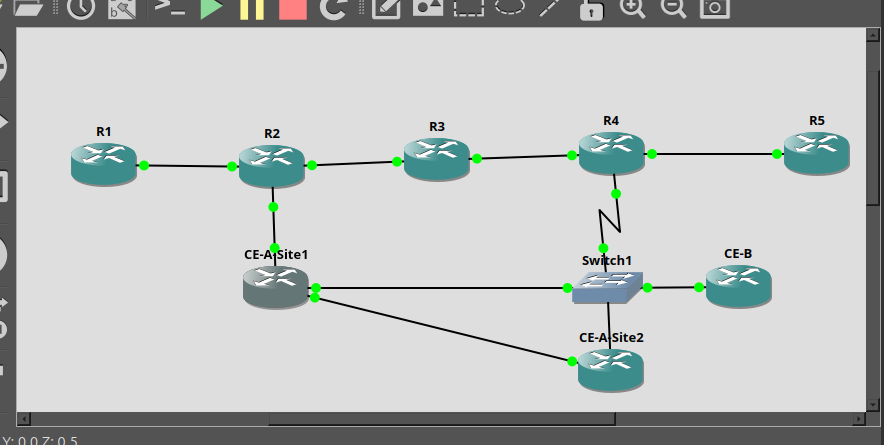
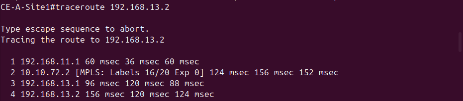
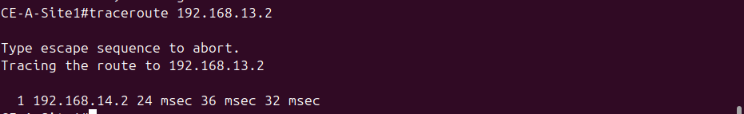
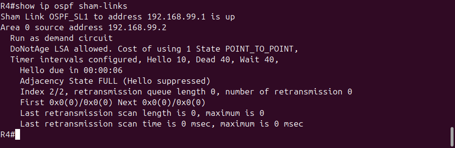
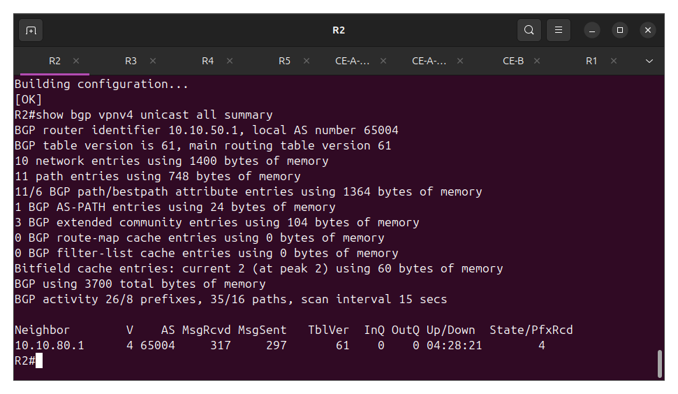

# MPLS L3VPN with OSPF Sham-Link and Dual-Homed CE Failover

*All command output below is from real screenshots of the build. The remaining text-only blocks are config that was typed in during the session, not command output, so they're left as plain code for readability.*

## Overview

This lab builds an MPLS L3VPN on top of the existing R2-R3-R4 OSPF core from the multi-protocol redistribution lab. Two simulated customers (CustomerA and CustomerB) share the same physical provider infrastructure while staying completely isolated from each other, including using overlapping private address space to prove that isolation.

The lab goes beyond a basic L3VPN build in three ways:

1. CustomerA is given two sites (Site1 on R2, Site2 on R4) connected by OSPF as the PE-CE routing protocol, which surfaces a well-known real-world problem: when a customer has a backdoor link between sites, OSPF prefers it over the provider's MPLS path even when the MPLS path is the intended primary route. This is fixed with an OSPF sham-link.
2. CustomerA's Site1 is dual-homed to both PE routers (R2 and R4), demonstrating automatic failover if the primary PE connection is lost.
3. Route target import/export is tested directly, not just assumed to work, by temporarily misconfiguring an import and observing the route cross the isolation boundary, then reverting.

Why build this: MPLS L3VPN configuration itself isn't something a NOC Technician or Junior Network Administrator would typically touch, that work usually sits with a carrier or MSP's senior engineering team. But MSP, energy, and telecom environments run MPLS as core WAN transport constantly, and understanding what is actually happening underneath a ticket that references a VRF or a label-switching issue is a real, practical skill gap this lab was meant to close.

## Topology



R1 through R5 form the core, with R2 and R4 as PEs and R3 as the P router. CE-A-Site1 hangs directly off R2, CE-A-Site2 and CE-B share Switch1 on separate VLANs into R4, and the direct diagonal link between CE-A-Site1 and CE-A-Site2 is the backdoor path discussed in Phase 6. CE-A-Site1's second connection into Switch1 (added in Phase 7) is the dual-homed failover path.

- R1, R5: outside the MPLS domain (EIGRP edge and eBGP edge respectively)
- R2, R4: Provider Edge (PE) routers, VRF-aware
- R3: Provider (P) router, label-switching only, no VRF awareness
- CE-A-Site1, CE-A-Site2: CustomerA's two sites
- CE-B: CustomerB's single site

## Addressing

| Link | Subnet |
|---|---|
| R2 to CE-A-Site1 | 192.168.11.0/30 |
| R4 to CE-B (VLAN 12, via Switch1) | 192.168.12.0/30 |
| R4 to CE-A-Site2 (VLAN 13, via Switch1) | 192.168.13.0/30 |
| CE-A-Site1 to CE-A-Site2 (backdoor) | 192.168.14.0/30 |
| R4 to CE-A-Site1 (VLAN 15, via Switch1, dual-homed link) | 192.168.15.0/30 |
| CustomerA LAN behind CE-A-Site1 | 192.168.100.0/24 |
| CustomerB LAN behind CE-B | 192.168.100.0/24 (deliberately overlapping with CustomerA) |
| Sham-link loopbacks (in VRF CUSTOMER_A) | R2: 192.168.99.1/32, R4: 192.168.99.2/32 |

VRF plan:

| VRF | Router | RD | RT export/import |
|---|---|---|---|
| CUSTOMER_A | R2 | 65001:11 | 100:1 |
| CUSTOMER_A | R4 | 65001:14 | 100:1 |
| CUSTOMER_B | R4 | 65001:12 | 200:1 |

CustomerA uses a distinct RD per PE (65001:11 on R2, 65001:14 on R4), which is the correct pattern since RD only needs to be unique per PE per VRF, not identical across PEs carrying the same customer. Matching RT values (100:1) on both is what allows the two sites' routes to import into each other's VRF table.

## Phase 1: MPLS core (LDP)

Enabled on R2, R3, and R4, on the core-facing interfaces only (not on any PE-CE interface):

```
interface <core-facing interface>
 mpls ip
 mpls label protocol ldp
```

Verified with `show mpls ldp neighbor` (Operational state on both R2-R3 and R3-R4) and `show mpls forwarding-table`.

A boundary worth calling out: `mpls ip` should only ever sit on P-P and P-PE links. Enabling it on a PE-CE interface blurs the line between provider backbone and customer access, and it is the mechanism that keeps the customer-facing side as a plain VRF-lookup interface rather than a label-switched one. This was tested directly during the build: `mpls ip` was briefly applied to a CE-facing interface, confirmed harmless (LDP just sent unanswered hellos toward the CE, no adjacency formed since the CE isn't running LDP), then removed to keep the boundary clean.

## Phase 2 and 3: VRFs and PE-CE connectivity

VRFs were created on R2 and R4 per the table above, and CE-facing interfaces were bound into them with `ip vrf forwarding <vrf>`. Note that IOS clears an interface's IP address the moment VRF forwarding is enabled, so the address has to be re-applied afterward.

CustomerB and the initial CustomerA-Site1 link used static PE-CE routes before later being converted to OSPF (CustomerA only, see Phase 6).

R4's CE-facing interfaces are carried as 802.1Q subinterfaces off a single trunk to Switch1, since the c2691 platform only has two onboard FastEthernet ports and both were already committed to the R3 and R5 core links:

```
interface FastEthernet1/0
 no ip address
 no shutdown
!
interface FastEthernet1/0.12
 encapsulation dot1Q 12
 ip vrf forwarding CUSTOMER_B
 ip address 192.168.12.1 255.255.255.252
!
interface FastEthernet1/0.13
 encapsulation dot1Q 13
 ip vrf forwarding CUSTOMER_A
 ip address 192.168.13.1 255.255.255.252
```

Switch1 carries the trunk to R4 and separate access ports per VLAN toward each CE, keeping CustomerA and CustomerB's traffic separated at Layer 2 in addition to the VRF separation at Layer 3.

## Phase 4: MP-BGP VPNv4

R2 and R4 peer as iBGP neighbors (AS 65004) using their loopbacks, with the VPNv4 address family activated and extended communities enabled to carry route targets:

```
router bgp 65004
 neighbor <peer-loopback> remote-as 65004
 neighbor <peer-loopback> update-source Loopback0
 !
 address-family vpnv4
  neighbor <peer-loopback> activate
  neighbor <peer-loopback> send-community extended
 exit-address-family
 !
 address-family ipv4 vrf CUSTOMER_A
  redistribute static
 exit-address-family
```

R4 also carries a pre-existing eBGP session to R5 (AS 65005) and OSPF-into-BGP redistribution for the global table, unrelated to and unaffected by the VPNv4 work, since VRF routes live in entirely separate tables.


R2's VRF table, showing CUSTOMER_A bound to both the PE-CE interface (Fa1/0) and the sham-link loopback (Lo1):



## Phase 5: Isolation, verified two ways

With RTs correctly scoped (CUSTOMER_A importing/exporting only 100:1, CUSTOMER_B only 200:1), each router's own VPNv4 table shows only its own local route, and `PfxRcd` between R2 and R4 sits at 0 in both directions. This is not a bug, it is the isolation boundary working as intended: neither customer's RT matches the other's, so there is nothing to import.

To confirm the mechanism itself actually functions rather than just assuming zero PfxRcd means "working", CUSTOMER_B's VRF on R4 was temporarily given a second import statement matching CustomerA's RT:

```
ip vrf CUSTOMER_B
 route-target import 100:1
```

`show bgp vpnv4 unicast vrf CUSTOMER_B` then showed two paths to 192.168.100.0/24, the locally connected CE-B path (best) and an iBGP-learned path from R2 tagged with CustomerA's RD, confirming the RT import mechanism genuinely pulls in a matching route when configured to. The import was then reverted:

```
ip vrf CUSTOMER_B
 no route-target import 100:1
```

restoring the clean, isolated baseline.

## Phase 6: OSPF PE-CE and the sham-link problem

To exercise a more realistic PE-CE setup, CustomerA's routing was converted from static to OSPF, and a second CustomerA site (Site2) was added off R4. Site1 (on R2) and Site2 (on R4) were also given a direct link between them, representing a legacy or backdoor WAN connection a real customer might still have between two of their own sites.

OSPF inside a VRF needs its own process number, separate from any global OSPF process already running on the PE, since a process number is tied to one routing table only. R2's global OSPF process was already using 1, so the VRF instance used 10:

```
router ospf 10 vrf CUSTOMER_A
 router-id <PE-CE interface IP>
 network <PE-CE subnet> area 0
 redistribute bgp 65004 subnets
```

An explicit router-id was required on both R2 and R4, since IOS could not always auto-allocate one for a second OSPF process without a collision against the global process's own router-id. Using the PE-CE interface's own IP as the router-id avoided this.

With OSPF running on both PE-CE links and on the CE-A-Site1-to-Site2 backdoor, the expected real-world problem appeared immediately:

```
CE-A-Site1#traceroute 192.168.13.2

Type escape sequence to abort.
Tracing the route to 192.168.13.2

  1 192.168.14.2 24 msec 36 msec 32 msec
```

Traffic between the two CustomerA sites took the direct backdoor link in a single hop rather than crossing the MPLS core, even though the MPLS path is the intended, provider-engineered route. This happens because OSPF strongly prefers intra-area routes over externally redistributed routes (the MPLS-core path arrives at each CE as a BGP-redistributed external route), regardless of actual cost.



### The fix: OSPF sham-link

A sham-link makes the MPLS backbone path appear to OSPF as a real intra-area link between the two PEs, so it can compete on cost rather than losing automatically as an external route. This requires a dedicated /32 loopback in the VRF on each PE, reachable across the core via MP-BGP:

```
interface Loopback1
 ip vrf forwarding CUSTOMER_A
 ip address <local sham-link address> 255.255.255.255
!
router ospf 10 vrf CUSTOMER_A
 area 0 sham-link <local address> <remote address>
```

Two configuration issues came up building this:

- The sham-link command takes the local router's own address first and the remote router's address second. This is not symmetric between the two routers, each lists itself first, which is easy to get backwards by copying the same line to both ends.
- The VRF loopback needs `redistribute connected` added under the VRF's BGP address-family so its /32 actually crosses MP-BGP to the other PE. Without this, the sham-link's own endpoint is unreachable and it stays down regardless of correct addressing. A related and easy mistake: `ip vrf forwarding` must be applied to the loopback interface before it will show up in the VRF's routing table at all, if it is skipped, the loopback silently sits in the global table instead.

Once both loopbacks were correctly bound into the VRF and redistributed, `show ip ospf sham-links` showed State: Up on both PEs:




### Cost tuning: the sham-link alone is not enough

Bringing the sham-link up made the MPLS path eligible to compete with the backdoor, but did not automatically make it win. The backdoor link had a default OSPF cost of 1, cheaper than the CE-to-PE link's cost of 10 before even accounting for the rest of the path. The traceroute still showed the single-hop backdoor path after the sham-link came up.

The fix was to raise the backdoor's OSPF cost above the full end-to-end cost of the MPLS path:

```
! CE-A-Site1
interface FastEthernet1/0
 ip ospf cost 100
!
! CE-A-Site2
interface FastEthernet0/0
 ip ospf cost 100
```

applied on CE-A-Site1's backdoor interface (FastEthernet1/0) and CE-A-Site2's backdoor interface (FastEthernet0/0) — the two ends of the same physical link happen to land on different interface numbers since each CE has a different number of other interfaces already in use. With that in place, the path shifted to the intended route:


The two-label MPLS stack visible in hop 2 (the LDP transport label and the inner VPN label) is direct evidence of label switching across the P router, not just ordinary IP routing.

The practical lesson: a sham-link only makes the correct path a candidate. Cost engineering is what actually decides which path gets used, and that is consistent with how this gets handled in real deployments.

## Phase 7: Dual-homed CE and failover

CE-A-Site1 was given a second, independent path into the VPN by connecting it to Switch1 on a new VLAN (15), trunked into a new subinterface on R4:

```
interface FastEthernet1/0.15
 encapsulation dot1Q 15
 ip vrf forwarding CUSTOMER_A
 ip address 192.168.15.1 255.255.255.252
```

with a matching OSPF network statement added to R4's VRF OSPF process and to CE-A-Site1's own OSPF process.

By default this new direct path (cost 10 at the first hop, one hop total to R4) ended up cheaper than the full multi-hop path through R2 and the MPLS core, making it the OSPF-preferred route rather than a backup. Since the goal was a dual-homed design with R2 as primary and R4 as failover, CE-A-Site1's interface toward the new link was given a higher cost:

```
interface FastEthernet0/1
 ip ospf cost 50
```

With that in place, the primary path returned to R2 by default. Failover was then tested directly:

**Primary path confirmed (via R2):** the same fixed-path traceroute shown in Phase 6 applies here as the baseline, four hops via 192.168.11.1 with visible MPLS labels.

**R2 link shut down to simulate failure:**
```
CE-A-Site1(config)#interface FastEthernet0/0
CE-A-Site1(config-if)#shutdown
```

**Traffic automatically shifts to the direct R4 path:**



**R2 link restored, traffic reverts to the primary path without any further intervention**, confirmed by re-running the traceroute and seeing the four-hop MPLS path with labels return.

No manual route changes were needed at any point in this sequence, OSPF reconverged on its own in both directions based on the cost difference already in place.

## Summary

| Piece | Result |
|---|---|
| MPLS core (LDP) | Up between R2-R3 and R3-R4, confirmed via label forwarding table |
| VRF isolation | CustomerA and CustomerB cannot reach each other, confirmed both by default (PfxRcd 0) and by a deliberate temporary RT-import test |
| Overlapping addressing | CustomerA and CustomerB both use 192.168.100.0/24 internally with no conflict, proving VRF-level separation |
| OSPF PE-CE backdoor problem | Reproduced: traffic took a single-hop customer backdoor link instead of the MPLS core |
| Sham-link fix | Makes the MPLS path OSPF-eligible; confirmed Up on both PEs |
| Cost tuning | Required in addition to the sham-link; without it the backdoor still wins on cost |
| Dual-homed failover | CE-A-Site1 automatically shifted to a backup path via R4 when its primary link to R2 was shut down, and reverted automatically once restored |

## Notes on the build process

A GNS3 project was lost partway through an earlier lab due to building new work inside an existing project rather than starting fresh, which is the reason this lab is filed under its own numbered folder rather than extended inside a prior one. Several mid-restart configuration losses also happened during this build (MPLS on core interfaces, VRF subinterfaces, BGP VPNv4 peering, and CE router IP addresses all needed to be reapplied at different points after node reloads), all recovered from since the actual commands and reasoning were already known. The practical fix going forward is `write memory` immediately after each meaningful change rather than batching saves at the end of a session.
