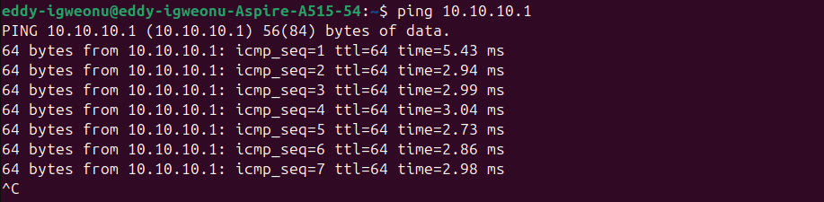
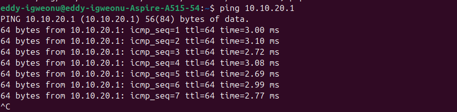
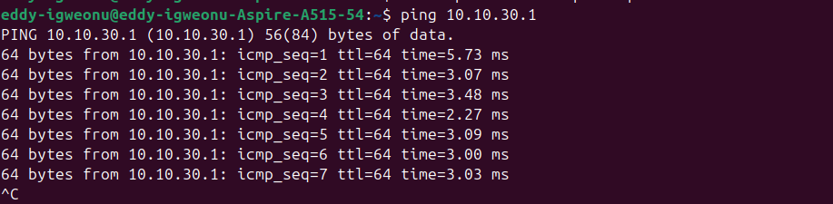
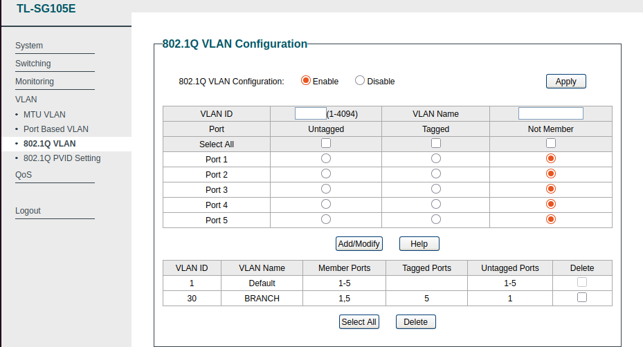
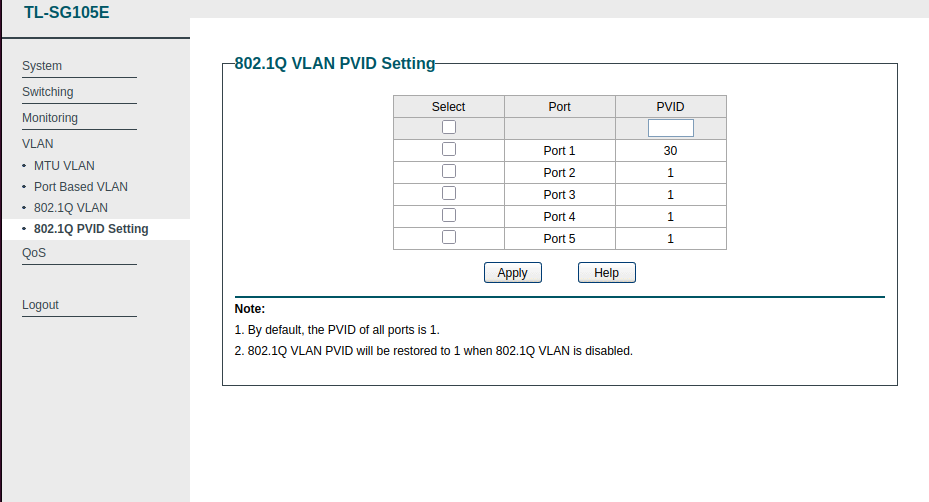
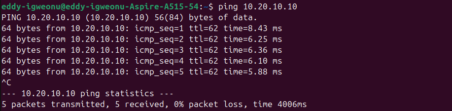

# Hybrid Physical/Virtual Enterprise Lab

A multi-vendor, multi-VLAN enterprise network built by bridging real Cisco and TP-Link switching hardware into a GNS3 virtual routing setup. It simulates a two-site enterprise (HQ + Branch) with inter-VLAN routing and OSPF tying the sites together.

Most portfolio labs stop at Packet Tracer. This one uses actual switching hardware (Cisco Catalyst 2950, TP-Link SG105E) bridged through a Linux host into virtual FRR routers in GNS3, so the Layer 2 trunking and mixed-vendor interoperability are real, not simulated, and the dynamic routing sits on top of that.

## Why this lab

- Real hardware, real cabling, real console access, not just simulated devices
- Mixed-vendor trunking (Cisco IOS talking to a TP-Link web-managed switch), which is the kind of integration headache you actually run into in the field
- A physical-to-virtual bridge (Linux host NIC into a GNS3 Cloud node) connecting the hardware to the virtual routers
- A full OSPF multi-site design, built to match a broader 4-site Calgary enterprise topology I put together in Packet Tracer ([link to that repo])

## Topology

```
                    [R1 - HQ]                        [R2 - BRANCH]
                   FRR Router                          FRR Router
                        |                                   |
              eth0 (802.1Q trunk)              eth1 (WAN, 192.168.100.0/30)
                        |                                   |
                        |___________________________________|
                        |                                   |
                  [GNS3 Cloud Node]                     eth2 (LAN)
                   (USB NIC bridge)                          |
                        |                              [VPCS Client]
                   Fa0/24 (trunk)                      10.20.10.10/24
                        |
              [Catalyst 2950-CORE]
               VLAN 10 - DATA
               VLAN 20 - VOICE
               VLAN 30 - BRANCH
                        |
               Fa0/23 (trunk, VLAN 30)
                        |
                [TP-Link SG105E]
              Port 5 (tagged) --- Port 1 (untagged, VLAN 30)
```

## IP addressing

| Segment | Subnet | Gateway |
|---|---|---|
| VLAN 10 - DATA | 10.10.10.0/24 | 10.10.10.1 (R1) |
| VLAN 20 - VOICE | 10.10.20.0/24 | 10.10.20.1 (R1) |
| VLAN 30 - BRANCH | 10.10.30.0/24 | 10.10.30.1 (R1) |
| R1-R2 WAN link | 192.168.100.0/30 | — |
| R2 Branch LAN | 10.20.10.0/24 | 10.20.10.1 (R2) |

## Hardware & software

- Cisco Catalyst 2950-24 (IOS 12.1(22)EA2)
- TP-Link SG105E (hardware v5, web-managed easy smart switch)
- Acer Aspire A515-54 running Ubuntu 24.04 LTS, as GNS3 host + physical bridge
- GNS3 with FRRouting (FRR 8.2.2) virtual routers
- USB-to-Ethernet adapter, used as the physical/virtual bridge NIC

## Build stages

1. Physical setup: console cable to the 2950, Cat6 trunk between the switches
2. Terminal access: serial console over `screen`, sorted out dialout group permissions
3. Cisco config: hostname, VLANs, trunk ports on the 2950
4. TP-Link config: 802.1Q VLAN + PVID setup on the SG105E
5. GNS3 bridge: Cloud node bound to a USB NIC to bring the real hardware into the virtual topology
6. Router-on-a-stick: 802.1Q subinterfaces on R1 for inter-VLAN routing
7. OSPF: single-area (Area 0) adjacency between R1 and R2, tying HQ and Branch together
8. End-to-end verification: physical host pinging across VLANs and across OSPF to the branch site

## Verification

**VLAN 10 (DATA) gateway reachability** — physical host → 2950 Fa0/1 (access) → R1 eth0.10.


**VLAN 20 (VOICE) gateway reachability** — physical host → 2950 Fa0/2 (access) → R1 eth0.20.


**VLAN 30 (BRANCH) gateway reachability** — physical host → TP-Link port 1 (access) → TP-Link port 5 (trunk) → 2950 Fa0/23 (trunk) → R1 eth0.30.


**TP-Link 802.1Q VLAN configuration** — VLAN 30 created, port 5 tagged (trunk to the 2950), port 1 untagged (access).


**TP-Link PVID setting** — port 1 set to PVID 30, matching its untagged VLAN membership.


**OSPF adjacency between R1 and R2** — Full/DR state, confirming a stable neighbor relationship over the WAN link (192.168.100.0/30).


**Full end-to-end verification** — physical host → TP-Link/2950 switching → GNS3 bridge → OSPF (R1↔R2) → branch VPCS. TTL=62 confirms two router hops traversed.


## Troubleshooting log

These are the actual issues I hit and worked through during the build. Diagnosing them mattered as much as getting the end state working, so I kept them here instead of cleaning them out.

| Symptom | Root cause | Resolution |
|---|---|---|
| `dmesg: read kernel buffer failed: Operation not permitted` | Unprivileged user reading the kernel ring buffer | Used `ls /dev/ttyUSB*` or `sudo dmesg` instead |
| Permission denied opening `/dev/ttyUSB0` | User wasn't in the dialout group | `sudo usermod -aG dialout $USER`, applied with `newgrp dialout` |
| `show interfaces trunk` returned no output for a configured trunk port | That command only lists ports with an active link partner | Verified config instead with `show interfaces <port> switchport`, which shows administrative state regardless of link |
| VLAN 30 traffic failed to cross from TP-Link into GNS3 | Fa0/24 (2950 → GNS3 trunk) didn't have VLAN 30 in its allowed list, it was only added when VLAN 30 was created and the trunk was never updated | `switchport trunk allowed vlan add 30` (using `add`, not a full replace, so VLANs 10/20 didn't get dropped) |
| Ping to branch LAN (10.20.10.10) returned "Destination Net Unreachable" from a public IP | Two default routes existed on the Linux host (Wi-Fi + lab NIC); the lower-metric Wi-Fi route won for any subnet that wasn't directly local | Added an explicit static route for the target subnet via the lab NIC's gateway |
| Ping briefly failed with "Destination Host Unreachable" from the host's own IP right after adding the route | ARP/L2 convergence delay | Resolved on its own after a few seconds, confirmed with `ip neigh show` and switch port status before assuming it was a config problem |
| TP-Link web UI became unreachable after re-cabling, despite ping succeeding | Browser-level issue (cache/cert), not a network fault | Confirmed reachability with `curl -v http://<ip>` first, then cleared the browser cache |
| GNS3 Cloud node didn't list a newly connected USB NIC | GNS3 only enumerates host interfaces that were present at application launch | Restarted GNS3 after bringing the NIC up |
| After closing and reopening GNS3, pings across VLANs and to the branch site failed again even though the routers showed "started" | Live interface config (VLAN subinterfaces, IPs on the router/VPCS nodes) is applied directly through Linux shell commands and doesn't persist across a node restart, only FRR routing config saved with `write memory` survives | Recreated the `ip link`/`ip addr` commands on R1, R2, and VPCS after every GNS3 restart before retesting |

## GNS3 project file

The `.gns3` topology file is in `/gns3-project`. Open it in GNS3 to see the exact node layout, links, and the Cloud node's NIC binding used in this build. Router disk images aren't included, so you'll need your own FRR appliance image to run the topology yourself.

## Configs

Full device configs are in `/configs`:

- `2950-core-config.txt` — Catalyst 2950 running-config
- `tplink-sg105e-vlan-settings.md` — TP-Link VLAN/PVID settings (screenshot-based, no CLI export available)
- `r1-hq-config.txt` — R1 interface + OSPF config
- `r2-branch-config.txt` — R2 interface + OSPF config

## Related

- Calgary Multi-Site OSPF WAN Lab — the 4-site Packet Tracer design this lab's OSPF area structure is modeled on
- Campus Topology Lab — HSRP/VLAN/STP campus design (Packet Tracer)
