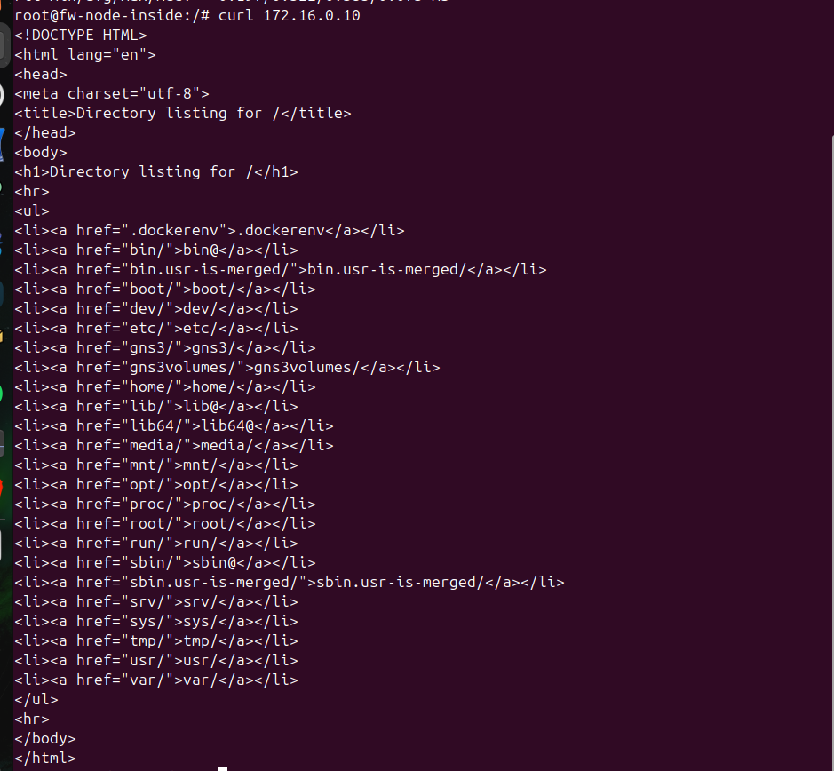
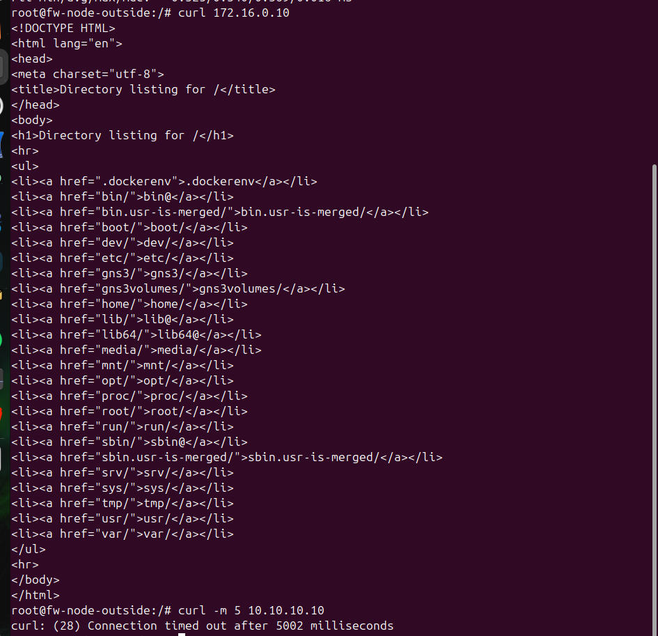
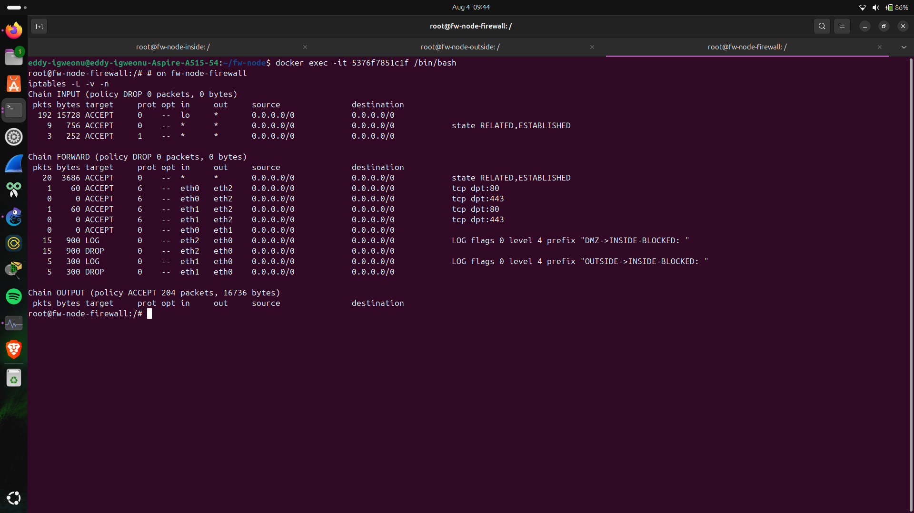
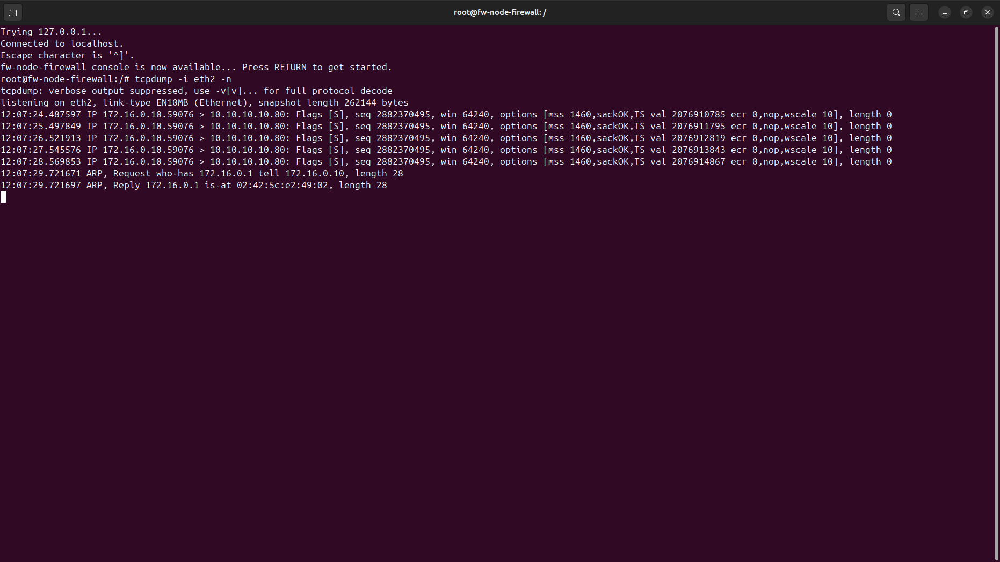
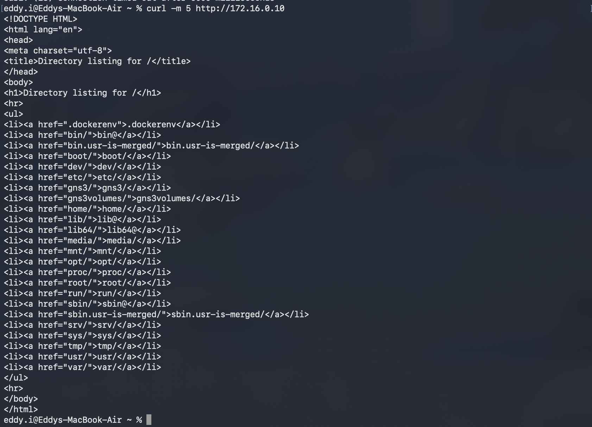

# Three-legged firewall / NAT security lab

A GNS3 lab implementing a classic three-zone firewall design (inside, DMZ, outside), enforced with iptables on a custom Docker node. Built first as an all-virtual topology, then extended to a hybrid build using real switches and a physical test host for the inside leg.

## Design

The firewall sits between three zones, each with a different trust level and a different default posture:

- **Inside** (10.10.10.0/24): trusted network. Free egress to the outside, limited access into the DMZ.
- **DMZ** (172.16.0.0/24): semi-trusted, public-facing services. Reachable from both inside and outside, but only on specific ports.
- **Outside** (203.0.113.0/24): untrusted. Represents the WAN/internet in this lab.

The core rule, and the actual point of the design, is that the DMZ can never reach inside, and outside can never reach inside directly. Any path into the trusted zone has to go through the DMZ's own access controls, not around them. That's the property the test matrix below verifies.

### Topology

```
   Inside network -----> Firewall / NAT node <----- Outside network
   (10.10.10.0/24)       (Docker, iptables,          (203.0.113.0/24)
                           3 interfaces)
                                |
                                v
                          DMZ web server
                        (172.16.0.0/24)
```

| Zone | Firewall interface | Subnet | Gateway |
|---|---|---|---|
| Inside | eth0 | 10.10.10.0/24 | 10.10.10.1 |
| Outside | eth1 | 203.0.113.0/24 | 203.0.113.10 |
| DMZ | eth2 | 172.16.0.0/24 | 172.16.0.1 |

## Firewall node

Custom Docker image (fw-node), built specifically for this lab:

```dockerfile
FROM ubuntu:24.04
RUN apt-get update && apt-get install -y \
    iptables iproute2 iputils-ping tcpdump curl net-tools python3 \
    && rm -rf /var/lib/apt/lists/*
COPY fw-rules.sh /root/fw-rules.sh
RUN chmod +x /root/fw-rules.sh
CMD ["/bin/bash"]
```

The same image runs on all four nodes (firewall, inside, outside, DMZ). Only the firewall actually runs the ruleset, but reusing one image kept the build simple.

### Ruleset (fw-rules.sh)

```bash
#!/bin/bash

IN=eth0    # inside, 10.10.10.0/24
OUT=eth1   # outside, 203.0.113.0/24
DMZ=eth2   # dmz, 172.16.0.0/24

iptables -F
iptables -X
iptables -t nat -F

# default deny
iptables -P INPUT DROP
iptables -P FORWARD DROP
iptables -P OUTPUT ACCEPT

# allow traffic to/from the firewall itself (lab convenience: ping/curl testing)
iptables -A INPUT -i lo -j ACCEPT
iptables -A INPUT -m state --state RELATED,ESTABLISHED -j ACCEPT
iptables -A INPUT -p icmp -j ACCEPT

# established/related traffic passes back through in both directions
iptables -A FORWARD -m state --state ESTABLISHED,RELATED -j ACCEPT

# NAT: inside and dmz masquerade out the WAN leg
iptables -t nat -A POSTROUTING -o $OUT -s 10.10.10.0/24 -j MASQUERADE
iptables -t nat -A POSTROUTING -o $OUT -s 172.16.0.0/24 -j MASQUERADE

# inside -> dmz: web ports only
iptables -A FORWARD -i $IN -o $DMZ -p tcp --dport 80  -j ACCEPT
iptables -A FORWARD -i $IN -o $DMZ -p tcp --dport 443 -j ACCEPT

# outside -> dmz: web ports only (the public-facing service rule)
iptables -A FORWARD -i $OUT -o $DMZ -p tcp --dport 80  -j ACCEPT
iptables -A FORWARD -i $OUT -o $DMZ -p tcp --dport 443 -j ACCEPT

# inside -> outside: general egress
iptables -A FORWARD -i $IN -o $OUT -j ACCEPT

# dmz -> inside: explicitly denied and logged
iptables -A FORWARD -i $DMZ -o $IN -j LOG --log-prefix "DMZ->INSIDE-BLOCKED: " --log-level 4
iptables -A FORWARD -i $DMZ -o $IN -j DROP

# outside -> inside: explicitly denied and logged
iptables -A FORWARD -i $OUT -o $IN -j LOG --log-prefix "OUTSIDE->INSIDE-BLOCKED: " --log-level 4
iptables -A FORWARD -i $OUT -o $IN -j DROP

echo "Rules applied."
iptables -L -v -n
```

## Verification: test matrix

Ran a real HTTP server on the DMZ host (python3 -m http.server 80) and tested every zone pair with curl.

| From | To | Port | Expected | Result |
|---|---|---|---|---|
| Inside | DMZ | 80 | Allow | Success, server log shows source 10.10.10.10 |
| Outside | DMZ | 80 | Allow | Success, server log shows source 203.0.113.20 |
| DMZ | Inside | any | Deny | curl timed out, iptables DROP counter incremented |
| Outside | Inside | any | Deny | curl timed out, iptables DROP counter incremented |

**Inside to DMZ, allowed:**



**Outside to DMZ, allowed:**



**Ruleset after the full test run.** Nonzero packet counts confirm every rule was actually exercised by live traffic, not just correctly configured. Note the two ACCEPT rules on tcp dpt:80 (1 packet each, the inside and outside DMZ tests) and the two DROP rules (15 and 5 packets, from repeated testing during troubleshooting):



**Packet-level proof of a blocked connection.** A tcpdump capture on the DMZ interface during a blocked DMZ-to-inside attempt shows five SYN retransmissions from the DMZ host with no reply of any kind. The connection is silently dropped, not rejected:



## Hybrid extension: real hardware in the loop

To go beyond an all-virtual build, the inside and outside legs were swapped from Docker containers to real switches, bridged into GNS3 via Cloud nodes:

- Inside leg: Acer's onboard NIC (enp1s0) to a Cisco Catalyst 2950 to a GNS3 Cloud node to firewall eth0
- Outside leg: USB-to-Ethernet adapter (enx00e04c450b08) to a TP-Link SG105E to a GNS3 Cloud node to firewall eth1
- DMZ stayed virtual

A MacBook, connected to the 2950 and assigned 10.10.10.20/24, served as the physical inside test host. The result: a real machine on real switch hardware, through a real cable, into a virtualized firewall enforcing NAT and access control, out to a virtualized DMZ service. Full round trip confirmed with a successful curl:



The outside leg (SG105E) is wired and topologically complete but wasn't tested with a dedicated physical host. No second USB-to-Ethernet adapter was available at the time to put another device on that segment.

## Troubleshooting log

The build wasn't clean end to end, and most of the real learning happened here.

**Stale veth pairs after container restarts.** GNS3 doesn't always recreate the virtual link cleanly after a Docker node restart, even though the topology still shows it connected. Symptom: correct IP config on both ends, but ARP never resolves. Fix: delete and redraw the link in the GNS3 canvas.

**INPUT chain losing manually-added rules.** Adding ICMP/loopback/established ACCEPT rules to INPUT by hand, then re-running fw-rules.sh for an unrelated fix, silently wiped them, since the script's iptables -F flush doesn't discriminate. Fix: fold every rule, including the "lab convenience" ones, into the script itself so a re-run is always a clean, complete, reproducible state.

**Host vs. container shell confusion.** Several commands were accidentally run on the Acer host instead of inside the target container, most notably trying to bind port 80 as a non-root user (PermissionError) when the intent was to run the web server inside the DMZ container. docker exec -it <container_id> /bin/bash turned out to be a more reliable way into a node than GNS3's telnet console, which occasionally hung or garbled large pastes.

**Ephemeral container state.** Recreating a node (for example, to rebuild from an updated image) resets everything: IPs, routes, and any files written directly into the running container rather than baked into the image. Lesson applied going forward: bake reusable config like fw-rules.sh into the Dockerfile via COPY, rather than relying on docker cp into a container that might get recreated.

**STP forwarding delay on real hardware.** After physically connecting the Acer to the 2950, ARP requests went unanswered for the first 30 to 50 seconds while the switch port cycled through STP's listening/learning states before reaching forwarding. Confirmed via show spanning-tree interface, resolved either by waiting it out or applying spanning-tree portfast on the access port.

**Garbled serial console.** A USB-to-RJ45 console session to the 2950 occasionally produced corrupted output, unrelated to switch configuration. Resolved by unplugging and reseating the console cable.

## Takeaways

A default-deny FORWARD policy plus explicit, logged DROP rules gives both enforcement and visibility. The packet counters and LOG entries turned "I configured this" into "I can prove this works."

Ephemeral container state is the single biggest source of confusing, hard-to-diagnose failures in a Docker-based GNS3 lab. Baking config into the image rather than applying it live avoids most of it.

docker exec is a more dependable way to reach a GNS3 Docker node's shell than the built-in console, when the console itself becomes unreliable.

Mixing real hardware into an otherwise-virtual lab surfaces failure modes a pure-virtual build never will, like STP timing and console cable issues. That's exactly the kind of practical troubleshooting a NOC or junior network admin role involves.
